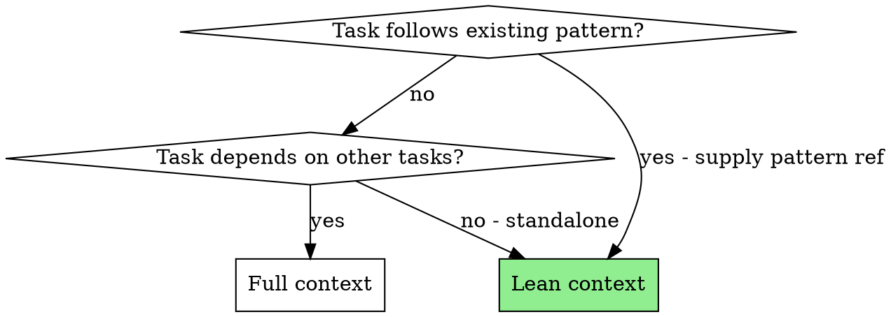
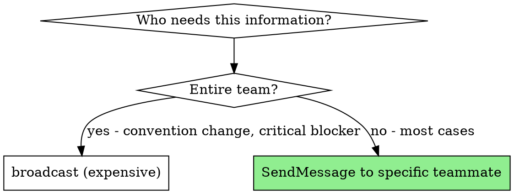
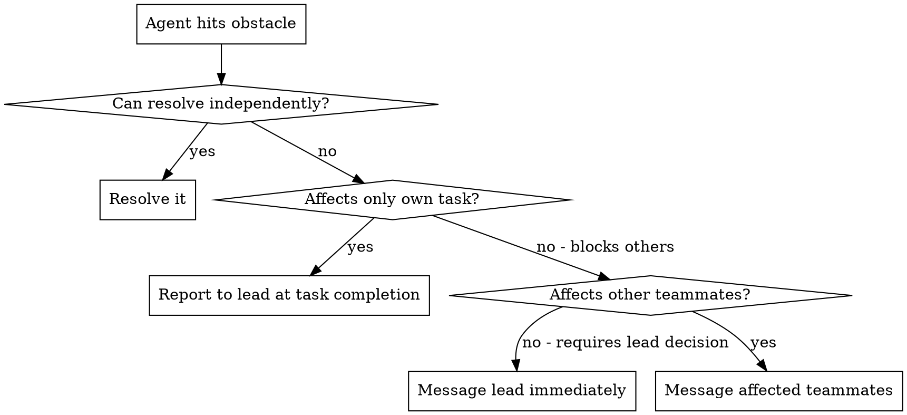

# Agent Messaging

## Overview

Defective inter-agent communication is the root cause of most multi-agent breakdowns: bloated context drowns focus, imprecise prompts yield incorrect results, and sloppy handoffs lose critical data.

**Core principle:** Supply agents with exactly the context they require — nothing more, nothing less. Structure every message for the recipient, not the sender.

## The Prime Directive

```
NO AGENT DISPATCH WITHOUT A STRUCTURED BRIEF
```

If you have not organized the context, the agent will burn tokens deciphering your intent.

## When to Use

**Apply to:**
- Composing prompts for subagents (Agent tool dispatches)
- Sending messages to team members (SendMessage)
- Structuring reports back to callers or team leads
- Handing off work between agents (implementer to reviewer, researcher to lead)
- Deciding what context to include or exclude

**Complements:**
- **ascension:delegated-execution** — Prompt design for implementer/reviewer subagents
- **ascension:parallel-execution** — Prompt design for concurrent investigations
- **ascension:team-orchestration** — Message design for team coordination

## The Entry Protocol

```
BEFORE dispatching any agent or sending any message:

1. RECIPIENT: Who receives this? (subagent, teammate, team lead)
2. OBJECTIVE: What must they DO? (implement, investigate, review, report)
3. CONTEXT: What must they KNOW? (only what is relevant to their task)
4. DELIVERABLE: What must they RETURN? (format, content, detail level)
5. CONSTRAINTS: What must they NOT do? (scope limits, file restrictions)

Skip any step = unfocused agent, wasted tokens
```

## Subagent Prompt Design

### The Lean Context Principle

Subagents get distracted by irrelevant context. More context is not better context.



**Lean context (default for independent tasks):**

```
You are implementing: [1-2 sentence description]

File to modify: [exact path]
Pattern to follow: [reference to existing function/test]
What to implement: [specific requirement]
Verification: [exact command to run]
```

**Full context (for dependent or complex tasks):**

```
You are implementing Task N: [task name]

## Task Description
[FULL TEXT of task - paste it, do not make the subagent read a file]

## Context
[Where this fits, what preceded it, architectural decisions]
```

**Never make a subagent read a plan file.** Paste the relevant content directly. Reading files wastes tokens and attention on irrelevant sections.

### Subagent Brief Template

Every subagent brief should contain these sections:

| Section | Purpose | Required |
|---------|---------|----------|
| **Role** | What the agent is doing | Yes |
| **Task** | Specific work to perform | Yes |
| **Context** | Only what is needed to understand the task | Yes |
| **Files** | Exact paths to work with | Yes |
| **Constraints** | What NOT to do, scope boundaries | Yes |
| **Verification** | How to confirm success | Yes |
| **Deliverable format** | What to report back | Yes |
| **Questions** | Permission to ask before starting | Recommended |

### Effective vs Ineffective Briefs

**Ineffective — too vague, no structure:**
```
Fix the tests in the auth module. They're failing.
```

**Ineffective — too much context:**
```
[Paste entire 500-line plan file]
Your task is Task 7, which is about auth tests.
```

**Effective — structured and focused:**
```
You are resolving 3 failing tests in src/auth/session.test.ts.

Failures:
1. "should reject expired sessions" - expects 401, gets 200
2. "should renew valid sessions" - timeout after 5s
3. "should handle concurrent sessions" - race condition

Context: Session management was refactored in commit def456.
The validateSession() function now returns a Promise instead of sync.

Files:
- Fix: src/auth/session.test.ts
- Reference: src/auth/session-manager.ts (the refactored code)
- Do NOT modify: src/auth/session.ts (production code is correct)

Verification: npm test -- --testPathPattern=session.test

Report: Root cause per test, what you changed, test results.
```

## Team Message Design

### Peer-to-Peer Messages

Use SendMessage with type "message" for direct coordination.

**Structure messages as:**

```
[WHAT] - One line summary of the point
[DETAIL] - Supporting information (if needed)
[ACTION] - What you need from the recipient (if anything)
```

**Effective:**
```
SendMessage -> backend teammate:
"The profile API needs a PUT /profile/preferences endpoint.
Frontend needs to update preferences without replacing the full profile.
Can you add this to the contract before implementing?"
```

**Ineffective:**
```
SendMessage -> backend teammate:
"Hey, I was working on the frontend and I noticed we need
some changes. The profile page has this preferences feature where
users can update without replacing everything and I think we need
a new endpoint for that. What do you think? Also I noticed..."
```

### Broadcast vs Direct Message



**Broadcast only when:**
- Convention or pattern change that affects every teammate
- Critical blocker that halts all progress
- Shared resource conflict

**Direct message for everything else** (status reports, questions, findings, coordination).

### Reporting to Team Lead

When completing a task, report:

```
COMPLETED: [task name]
RESULT: [one-line summary]
FILES CHANGED: [list]
FINDINGS: [anything the lead or other teammates should know]
CONCERNS: [anything that might affect other tasks]
```

## Handoff Formats

### Implementer to Reviewer

```
## What Was Built
[Summary - what changed and why]

## Files Changed
[Exact paths, one per line]

## Test Results
[Pass/fail counts, any notable results]

## Self-Review Notes
[Issues found and resolved during self-review]
[Remaining concerns]

## Verification Command
[Exact command to run]
```

### Reviewer to Implementer (Fix Request)

```
## Issues Identified
[List each issue with file:line reference]

## Priority
- Blocking: [must resolve before approval]
- Important: [should resolve]
- Suggestion: [consider for improvement]

## Scope Boundaries
[Do not refactor while fixing — stay focused]
```

### Investigator to Lead (Debug/Research)

```
## Hypothesis Under Test
[What was being investigated]

## Evidence
- Supporting: [evidence favoring the hypothesis]
- Contradicting: [evidence against the hypothesis]

## Confidence
[High/Medium/Low with reasoning]

## Recommendation
[Next steps based on findings]

## Cross-Cutting Discoveries
[Anything that affects other investigations]
```

## Context Management

### What to Include

- Exact file paths (always absolute, never approximate)
- Error messages verbatim (do not paraphrase)
- Relevant code snippets (not entire files)
- Specific line numbers for references
- Verification commands ready to copy-paste
- Dependencies and prerequisites

### What to Exclude

- Complete plan files (paste only the relevant task)
- Completed task details (unless they are dependencies)
- Project history irrelevant to the task
- Alternative approaches that were rejected
- Verbose explanations of obvious patterns

### The Context Budget Guideline

| Agent Type | Target Context | Rationale |
|------------|---------------|-----------|
| Implementer | Task + pattern + files | Focus on building |
| Reviewer | Spec + diff + checklist | Focus on verifying |
| Investigator | Hypothesis + evidence locations | Focus on discovering |
| Teammate message | Action needed + minimal context | Respect their context window |

## Error Escalation

When an agent encounters an unresolvable problem:



**Escalation message format:**
```
BLOCKED: [what is blocked]
CAUSE: [why it is blocked]
ATTEMPTED: [what was tried]
NEED: [what would unblock - decision, information, or fix]
```

## Cognitive Traps

| Rationalization | Truth |
|-----------------|-------|
| "More context is always helpful" | More context = more distraction. Lean context produces better results for independent tasks. |
| "They can figure out what's relevant" | Agents waste tokens parsing irrelevant content. Curate context for them. |
| "Just read the plan file" | Plan files contain all tasks. The agent gets distracted by other tasks. Paste only the relevant portion. |
| "I'll explain informally, no structure needed" | Unstructured prompts produce unstructured results. Use the template. |
| "Short messages seem curt" | Concise messages respect the recipient's context window. |
| "I'll report everything I found" | Report what is actionable. Filter noise before sending. |

## Guardrails

**Prohibited:**
- Making subagents read plan files (paste content instead)
- Sending unstructured prompts ("fix the tests")
- Including irrelevant context ("here's the full history...")
- Using broadcast for routine updates
- Omitting the deliverable format section (agents will not know what to report)
- Escalating without stating what was already attempted

**Mandatory:**
- Structure every prompt with role, task, context, constraints, deliverable
- Paste content directly instead of referencing files
- Include verification commands in implementation prompts
- Use direct messages over broadcast
- Include file paths in every handoff
- Report cross-cutting discoveries to affected parties

## Integration

**Consumed by:**
- **ascension:delegated-execution** — Implementer and reviewer prompts
- **ascension:parallel-execution** — Concurrent agent prompts
- **ascension:team-orchestration** — Team communication patterns

**Complements:**
- **ascension:fault-diagnosis** — Structure for debug investigation reports
- **ascension:quality-gate** — Structure for review requests
- **ascension:completion-gate** — Structure for completion reports
