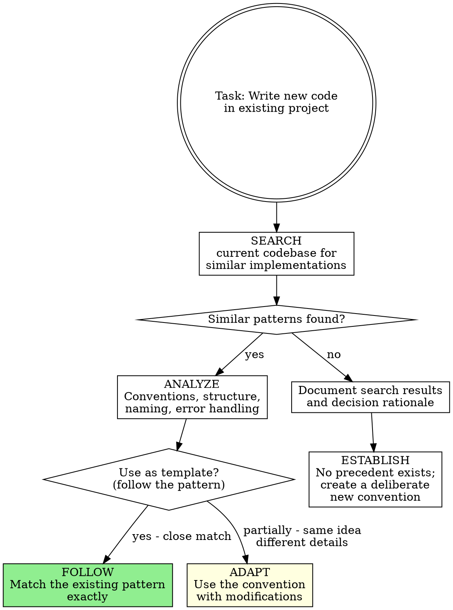

# Codebase Research

## Overview

Before writing new code in an existing project, understand what already exists inside it. The codebase itself is the most authoritative reference for how things should be built. Every project accumulates conventions, patterns, and implicit standards that new code must respect.

**Core principle:** Search the current codebase before coding. Find similar files, functions, and patterns. Match existing conventions exactly. Never introduce a second way of doing something when a first way already exists.

**No exceptions. No workarounds. No shortcuts.**

## The Prime Directive

```
NO NEW CODE WITHOUT UNDERSTANDING THE EXISTING CODE FIRST
```

If you have not searched the current codebase for prior implementations of the same pattern, you are risking inconsistency. Found nothing similar? Document what you searched. Then build, establishing the convention deliberately.

**No excuses:**
- Do not "just start coding and check conventions later"
- Do not assume your preferred pattern is the project's pattern
- Do not introduce new libraries when the project already uses an equivalent
- Do not create a new file structure that contradicts the existing one
- "I know the best way to do this" is irrelevant if the project already does it a different way consistently

## When to Use

**Mandatory when:**
- Adding a new feature to an existing codebase
- Creating a new file, component, module, or service
- Implementing a pattern that likely exists elsewhere in the project
- Writing tests for existing functionality
- Adding error handling, logging, or validation logic

**Particularly valuable when:**
- The project has established architectural patterns (MVC, hexagonal, etc.)
- There are existing files similar to what you need to create
- The codebase has custom utilities, helpers, or shared modules
- The project uses specific naming conventions or code organization rules
- There are existing tests that demonstrate the expected testing approach

## The Entry Protocol



**BEFORE writing new code in an existing project:**

1. **SEARCH** -- Query the codebase for similar files, functions, patterns, and conventions
2. **ANALYZE** -- Study how existing code handles the same concerns
3. **MATCH** -- Align your new code with established conventions
4. **ONLY THEN** -- Begin writing

## Search Methodology

### What to Search For

When about to create something new, search the codebase for each of these:

| Search Target | Why | How |
|---|---|---|
| **Similar files** | Find the template to follow | Glob for files with similar names or in similar directories |
| **Similar functions** | Match function signatures and patterns | Grep for functions that do analogous work |
| **Imports and dependencies** | Use what the project already uses | Grep for import statements to find established libraries |
| **Error handling** | Match the project's error patterns | Grep for try/catch, Result types, error classes |
| **Naming conventions** | Use the same casing and terminology | Read adjacent files, check for camelCase vs snake_case vs kebab-case |
| **File organization** | Place new files where they belong | List directory structures, find where similar code lives |
| **Test patterns** | Write tests the way the project writes tests | Find test files for similar modules, match their structure |
| **Configuration patterns** | Match config approaches | Search for .env usage, config files, constants |

### Search Techniques

**Structured search sequence** -- Follow this order for thorough coverage:

```
1. DIRECTORY SCAN: List files in the relevant directories
   -> Understand the project's file organization

2. SIMILAR FILE SEARCH: Glob for files with similar names or purposes
   -> Find the closest existing template for what you need to build

3. PATTERN GREP: Search for specific patterns you plan to use
   -> Confirm the project's approach to that pattern

4. IMPORT ANALYSIS: Check what libraries and utilities are already imported
   -> Use existing dependencies rather than introducing new ones

5. TEST FILE REVIEW: Find tests for similar functionality
   -> Match the testing approach, assertion style, and setup patterns
```

**Minimum threshold before writing new code:** Review at least 2 similar files in the codebase.

## Convention Matching

### The Consistency Principle

When the codebase does something one way, you do it the same way. Personal preference is irrelevant. Project consistency outweighs individual opinion.

| Dimension | Match Exactly |
|---|---|
| **Naming** | Variable names, function names, file names, class names |
| **Structure** | File layout, directory organization, module boundaries |
| **Patterns** | How the project handles state, errors, async, validation |
| **Style** | Formatting, comment style, documentation approach |
| **Dependencies** | Use the project's existing libraries, not alternatives |
| **Testing** | Test framework, assertion library, setup/teardown approach |
| **Error handling** | Throw vs return, error types, error messages |

### Common Convention Signals

```
LOOK FOR these indicators of established conventions:

- Linter/formatter config (.eslintrc, .prettierrc, rustfmt.toml, etc.)
  -> These are explicit rules. Follow them exactly.

- Shared utility files (utils/, helpers/, lib/, common/)
  -> These are the project's building blocks. Use them.

- Base classes or interfaces (BaseController, AbstractService)
  -> These define the inheritance/composition pattern. Extend them.

- Barrel files (index.ts, __init__.py, mod.rs)
  -> These define the export pattern. Add to them.

- Test helpers (test/helpers/, fixtures/, factories/)
  -> These are the testing infrastructure. Build on them.
```

## Analysis Checklist

When you find similar code in the codebase, extract answers to these questions:

```
1. FILE PLACEMENT: Where does this type of file live?
   -> Same directory? Nested by feature? Grouped by type?

2. FILE NAMING: What naming pattern does the file follow?
   -> ComponentName.tsx? component-name.ts? component_name.py?

3. EXPORTS: How are things exported?
   -> Default export? Named exports? Re-exported from barrel?

4. FUNCTION SIGNATURES: What do similar function signatures look like?
   -> Parameter ordering, return types, async vs sync

5. ERROR HANDLING: How does this part of the codebase handle errors?
   -> Try/catch? Result types? Error callbacks? Thrown exceptions?

6. LOGGING: Does the project have a logging pattern?
   -> Logger instance? Console methods? Structured logging?

7. VALIDATION: How does the project validate input?
   -> Zod? Joi? Manual checks? Type guards?

8. STATE MANAGEMENT: How is state handled?
   -> Redux? Zustand? Context? Signals? Local state?

9. TESTING APPROACH: What do tests for similar code look like?
   -> Unit tests? Integration? What assertion library?

10. DOCUMENTATION: Are there JSDoc comments, docstrings, or inline docs?
    -> Match the existing documentation density and style.
```

## When No Precedent Exists

Sometimes you are genuinely building something the codebase has never done before. In that case:

1. **Confirm absence** -- Search at least 3 different ways to be sure no precedent exists
2. **Check adjacent projects** -- If this is a monorepo, check sibling packages
3. **Consult external sources** -- Use ascension:github-search to find patterns from public repositories
4. **Establish deliberately** -- When creating a new convention, make it consistent with the spirit of the existing codebase
5. **Document the decision** -- Note why a new pattern was introduced

## Integration with Other Skills

### During Intent Discovery

When ascension:intent-discovery is exploring the project landscape:

1. **Search the codebase** for existing implementations related to the proposed feature
2. **Report conventions** that the new feature must follow
3. **Identify reusable code** -- utilities, components, and services that already solve part of the problem

### During Implementation

When writing code after design approval:

1. **Find the template file** -- the closest existing file to what you need to create
2. **Copy the structure** -- match the template's organization exactly
3. **Swap the specifics** -- replace domain details while preserving the pattern
4. **Verify consistency** -- compare your new file against the template to catch deviations

## Cognitive Traps

| Rationalization | Truth |
|---|---|
| "My approach is cleaner than what the project uses" | Consistency across a project is worth more than local perfection. Two patterns are worse than one adequate pattern. |
| "I will refactor the existing code to match my style" | Refactoring is a separate task. Match the existing style now. Propose a refactor later if warranted. |
| "The project does not have a pattern for this" | Did you search thoroughly? Check 3+ similar files. If truly no precedent, establish one deliberately. |
| "I do not need to check -- this is a new module" | New modules still live inside the existing project. They must respect its conventions. |
| "The existing pattern is outdated" | Outdated but consistent is better than modern but inconsistent. Propose a migration, do not create a fork. |
| "Checking conventions slows me down" | Writing code that fails review or introduces inconsistency slows you down more. |
| "It is just a small utility function" | Small utilities are the most reused code. Getting their pattern wrong affects everything that depends on them. |

## Guardrails

**Prohibited actions:**
- Writing new code without searching the codebase for similar implementations
- Introducing a new library when the project already uses an equivalent
- Creating a file structure that contradicts the existing organization
- Using a naming convention different from the project's established one
- Skipping test pattern matching ("I will write tests my way")

**Required actions:**
- Search the codebase for at least 2 similar files before writing new code
- Match the naming conventions of the surrounding code exactly
- Use existing shared utilities and helpers instead of creating duplicates
- Follow the established testing patterns for the project
- Document your findings when no precedent exists in the codebase

## Quick Reference

```
SEARCH -> ANALYZE -> MATCH -> BUILD

Search: Find 2+ similar files, grep for patterns, check imports
Analyze: Extract conventions for naming, structure, error handling, testing
Match: Align your new code with every convention you found
Build: Write code that looks like it belongs in the project
```

## Integration

**Invoked during:**
- **ascension:intent-discovery** -- Search codebase during "Survey project landscape" phase
- **ascension:reference-engine** -- Routed here for internal code pattern research
- **ascension:task-planning** -- Verify conventions before each implementation task
- **ascension:quality-enforcement** -- Consistency checks against codebase patterns

**Complementary skills:**
- **ascension:github-search** -- For searching EXTERNAL repositories, GitHub, and package registries for open-source implementations, libraries, and patterns to study or adopt
- **ascension:pattern-matching** -- Deeper pattern analysis within the codebase
- **ascension:specification-first** -- Feeds codebase conventions into formal specifications
- **ascension:project-bootstrap** -- When starting a new project (no existing codebase to research)
