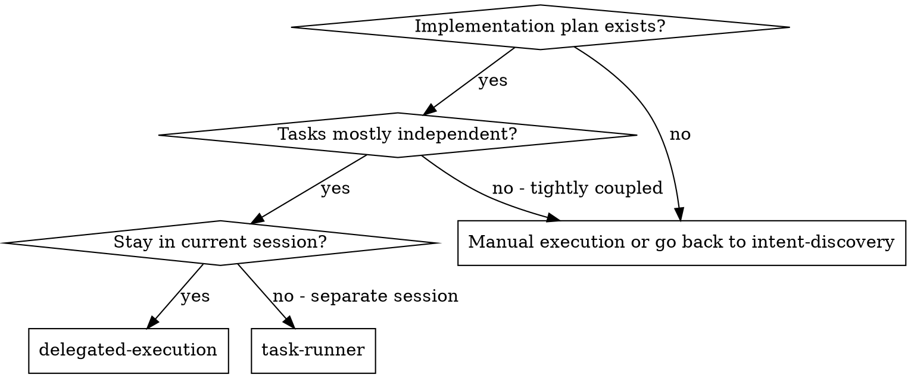
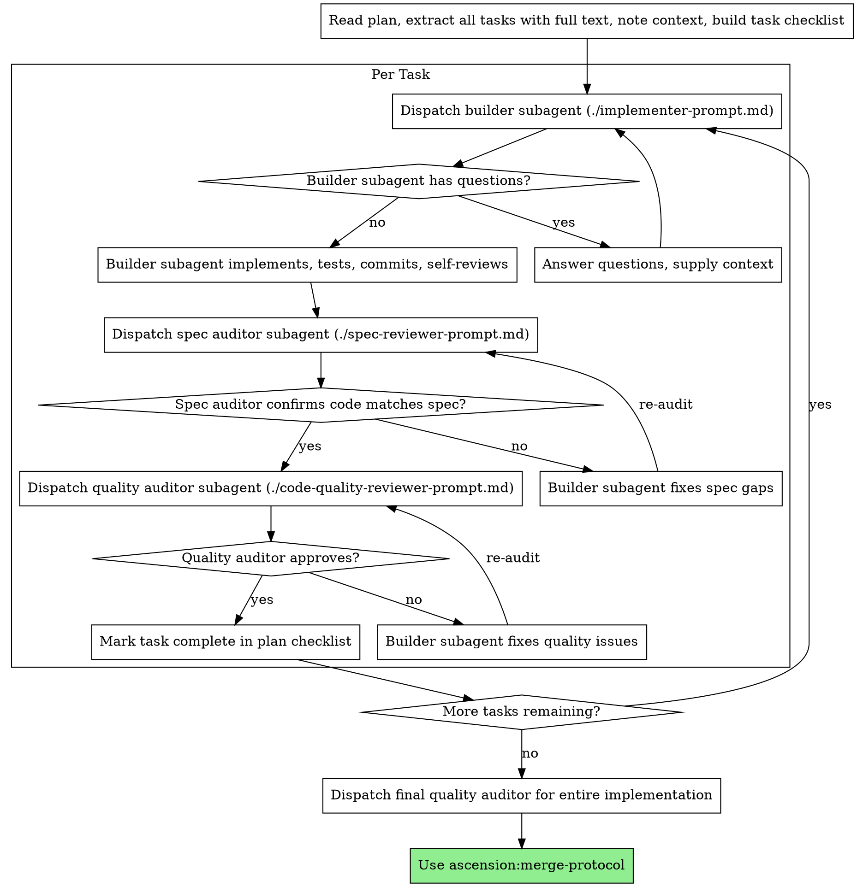

# Delegated Execution

Execute a plan by dispatching a fresh subagent per task, with two-stage review after each: specification compliance first, then code quality.

**Core principle:** Fresh subagent per task + two-stage review (spec then quality) = high quality, fast iteration

**Why subagents:** You delegate tasks to specialized agents with isolated context. By precisely crafting their instructions and the context you hand them, you keep them focused. They should never inherit your session's history — you construct exactly what they need. This also preserves your own context for coordination work.

**Continuous execution:** Do not pause to check in between tasks. Execute all tasks from the plan without stopping. The only reasons to stop are: a BLOCKED status you cannot resolve, ambiguity that genuinely prevents progress, or all tasks complete. "Should I continue?" prompts and progress summaries waste your human partner's time — they asked you to execute the plan, so execute it.

## When to Use



**vs. Task Runner (separate session):**
- Same session (no context switch)
- Fresh subagent per task (no context contamination)
- Two-stage review after each task: spec compliance first, then code quality
- Faster iteration (no human-in-loop between tasks)

## The Process



## Pre-Flight Plan Review

Before dispatching Task 1, scan the plan once for conflicts:

- tasks that contradict each other or the plan's global constraints
- anything the plan explicitly mandates that a reviewer would treat as a defect (a test that asserts nothing, verbatim duplication of a logic block)

Present everything you find to your human partner as one batched question — each finding beside the plan text that mandates it, asking which governs — before execution begins, not one interrupt per discovery mid-plan. If the scan is clean, proceed without comment. The review loop remains the net for conflicts that only emerge from implementation.

## Model Selection

Use the least powerful model that can handle each role to conserve cost and increase speed.

- **Mechanical tasks** (isolated functions, clear specs, 1-2 files, or the plan text contains the complete code to write): use a fast, cheap model — this is transcription plus testing.
- **Integration and judgment tasks** (multi-file coordination, pattern matching, debugging): use a standard model.
- **Architecture/design tasks and the final whole-implementation audit**: use the most capable available model.
- **Review tasks**: match the model to the diff's size, complexity, and risk. A small mechanical diff does not need the most capable model; a subtle concurrency change does.

**Always specify the model explicitly when dispatching a subagent.** An omitted model inherits your session's model — often the most capable and most expensive — which silently defeats this section.

**Turn count beats token price.** Wall-clock and context cost scale with how many turns a subagent takes, and the cheapest models routinely take 2-3× the turns on multi-step work. Use a mid-tier model as the floor for auditors and for builders working from prose descriptions.

## Handling Builder Status

Builder subagents report one of four statuses. Handle each appropriately:

- **DONE:** Generate the review package (`scripts/review-package BASE HEAD`, from this skill's directory — BASE is the commit you recorded before dispatching the builder, never `HEAD~1`, which silently drops all but the last commit of a multi-commit task), then dispatch the spec auditor with the printed path.
- **DONE_WITH_CONCERNS:** The builder completed the work but flagged doubts. Read them first. If they concern correctness or scope, address them before review; if they are observations, note them and proceed.
- **NEEDS_CONTEXT:** Provide the missing context and re-dispatch.
- **BLOCKED:** Assess the blocker — (1) context problem → provide more context, same model; (2) needs more reasoning → re-dispatch with a more capable model; (3) task too large → break it into smaller pieces; (4) plan itself is wrong → escalate to your human partner. **Never** ignore an escalation or force the same model to retry without changes.

## File Handoffs

Everything you paste into a dispatch prompt — and everything a subagent prints back — stays resident in your context for the rest of the session and is re-read on every later turn. A real session's dispatch hit 42k chars of which 99% was pasted history. Hand artifacts over as files instead:

- **Task brief:** before dispatching a builder, run this skill's `scripts/task-brief PLAN_FILE N` — it extracts the task's full text to a uniquely named file and prints the path. Your dispatch should contain: (1) one line on where this task fits in the project; (2) the brief path, introduced as "read this first — it is your requirements, with the exact values to use verbatim"; (3) interfaces and decisions from earlier tasks that the brief cannot know; (4) your resolution of any ambiguity you noticed; (5) the report-file path and report contract. Exact values (numbers, magic strings, signatures, test cases) appear only in the brief — do not paraphrase them into the prompt.
- **Report file:** name the builder's report file after the brief (`…/task-N-brief.md` → `…/task-N-report.md`) and put it in the dispatch prompt. The builder writes the full report there and returns only status, commits, a one-line test summary, and concerns.
- **Auditor inputs:** each auditor gets paths — the same brief file, the report file, and the review package (`scripts/review-package BASE HEAD`) — plus the global constraints that bind the task. The output never enters your own context; the auditor reads the commit list, stat summary, and full diff in one Read call.
- Fix dispatches append their fix report (with test results) to the same report file and return a short summary; re-audits read the updated file.
- A dispatch prompt describes one task, not the session's history. Do not paste accumulated prior-task summaries into later dispatches.

## Constructing Auditor Prompts

- Copy the plan's binding requirements verbatim into the auditor's constraints block — exact values, exact formats, stated relationships ("same layout as X", "matches Y"). That block is its attention lens.
- Do not pre-judge findings. Never instruct an auditor to ignore or not flag an issue, or to pre-rate a finding's severity ("at most Minor", "the plan chose this"). If you think a finding would be a false positive, let the auditor raise it and adjudicate it in the review loop.
- A finding that conflicts with what the plan mandates is your human partner's decision: present the finding beside the plan text and ask which governs. Do not dispatch a fix that contradicts the plan without asking.
- Dispatch fix subagents for Critical/Important findings. Record Minor findings in the ledger and point the final whole-implementation audit at that list. Every fix dispatch carries the builder contract: re-run the tests covering its change and report the command and output. If the final audit returns findings, dispatch ONE fix subagent with the complete list — not one fixer per finding.

## Durable Progress

Conversation memory does not survive compaction. In real sessions, controllers that lost their place have re-dispatched entire completed task sequences — the single most expensive failure observed. Track progress in a ledger file, not only in a checklist.

- At skill start, check for a ledger: `cat "$(git rev-parse --show-toplevel)/.ascension/sdd/progress.md"`. Tasks listed there as complete are DONE — do not re-dispatch them; resume at the first task not marked complete.
- When a task's audit comes back clean, append one line to the ledger: `Task N: complete (commits <base7>..<head7>, review clean)`.
- The ledger is your recovery map: the commits it names exist in git even when your context no longer remembers creating them. After compaction, trust the ledger and `git log` over your own recollection.
- `git clean -fdx` will destroy the ledger (it's git-ignored scratch); if that happens, recover from `git log`.

## Prompt Templates

- `./implementer-prompt.md` - Dispatch builder subagent
- `./spec-reviewer-prompt.md` - Dispatch spec compliance auditor subagent
- `./code-quality-reviewer-prompt.md` - Dispatch code quality auditor subagent

Hand each subagent its inputs as file paths (see **File Handoffs**), not pasted text.

## Example Workflow

```
You: I'm using Delegated Execution to implement this plan.

[Read plan file once: docs/plans/feature-plan.md]
[Extract all 5 tasks with full text and context]
[Build task checklist from all tasks]

Task 1: Hook installation script

[Get Task 1 text and context (already extracted)]
[Dispatch builder subagent with full task text + context]

Builder: "Before I start - should the hook install at user level or system level?"

You: "User level (~/.config/ascension/hooks/)"

Builder: "Understood. Implementing now..."
[Later] Builder:
  - Implemented install-hook command
  - Added tests, 5/5 passing
  - Self-review: Noticed I missed --force flag, added it
  - Committed

[Dispatch spec compliance auditor]
Spec auditor: PASS - All requirements met, nothing extraneous

[Get git SHAs, dispatch quality auditor]
Quality auditor: Strengths: Good test coverage, clean code. Issues: None. Approved.

[Mark Task 1 complete]

Task 2: Recovery modes

[Get Task 2 text and context (already extracted)]
[Dispatch builder subagent with full task text + context]

Builder: [No questions, proceeds]
Builder:
  - Added verify/repair modes
  - 8/8 tests passing
  - Self-review: All good
  - Committed

[Dispatch spec compliance auditor]
Spec auditor: FAIL - Issues:
  - Missing: Progress reporting (spec says "report every 100 items")
  - Extra: Added --json flag (not requested)

[Builder fixes issues]
Builder: Removed --json flag, added progress reporting

[Spec auditor re-audits]
Spec auditor: PASS - Spec compliant now

[Dispatch quality auditor]
Quality auditor: Strengths: Solid. Issues (Important): Magic number (100)

[Builder fixes]
Builder: Extracted PROGRESS_INTERVAL constant

[Quality auditor re-audits]
Quality auditor: Approved

[Mark Task 2 complete]

...

[After all tasks]
[Dispatch final quality auditor]
Final auditor: All requirements met, ready to merge

Done!
```

## Advantages

**vs. Manual execution:**
- Subagents follow test-first naturally
- Fresh context per task (no confusion)
- Parallel-safe (subagents do not interfere)
- Subagent can ask questions (before AND during work)

**vs. Task Runner:**
- Same session (no handoff)
- Continuous progress (no waiting)
- Review checkpoints are automatic

**Efficiency gains:**
- No file reading overhead (controller provides full text)
- Controller curates exactly what context is needed
- Subagent receives complete information upfront
- Questions surfaced before work begins (not after)

**Quality gates:**
- Self-review catches issues before handoff
- Two-stage review: spec compliance, then code quality
- Review loops ensure fixes actually work
- Spec compliance prevents over/under-building
- Code quality ensures implementation is well-crafted

**Cost:**
- More subagent invocations (builder + 2 auditors per task)
- Controller does more preparation (extracting all tasks upfront)
- Review loops add iterations
- But catches issues early (cheaper than debugging later)

## Guardrails

**Never:**
- Start implementation on main/master branch without explicit user consent
- Skip reviews (spec compliance OR code quality)
- Proceed with unresolved issues
- Dispatch multiple builder subagents in parallel (conflicts)
- Make subagent read the plan file (provide full text instead)
- Skip scene-setting context (subagent needs to understand where the task fits)
- Ignore subagent questions (answer before letting them proceed)
- Accept "close enough" on spec compliance (auditor found issues = not done)
- Skip review loops (auditor found issues = builder fixes = audit again)
- Let builder self-review replace actual review (both are needed)
- **Start quality review before spec compliance is approved** (wrong order)
- Move to next task while either review has open issues
- Paste a task's full text or prior-task history into a dispatch prompt (hand it the brief file via `scripts/task-brief` instead)
- Dispatch an auditor without a review-package file — generate it first (`scripts/review-package BASE HEAD`) and name the printed path in the prompt
- Use `HEAD~1` as the review BASE — it silently truncates multi-commit tasks; use the commit you recorded before dispatching the builder
- Tell an auditor what not to flag, or pre-rate a finding's severity
- Re-dispatch a task the progress ledger already marks complete — check the ledger (and `git log`) after any compaction or resume

**If subagent asks questions:**
- Answer clearly and completely
- Provide additional context if needed
- Do not rush them into implementation

**If auditor finds issues:**
- Builder (same subagent) fixes them
- Auditor reviews again
- Repeat until approved
- Do not skip the re-audit

**If subagent fails the task:**
- Dispatch a fix subagent with specific instructions
- Do not try to fix manually (context contamination)

## Connections

**Required workflow skills:**
- **ascension:workspace-isolation** - REQUIRED: Set up isolated workspace before starting
- **ascension:task-planning** - Creates the plan this skill executes
- **ascension:quality-gate** - Code review template for auditor subagents
- **ascension:merge-protocol** - Finalize development after all tasks

**Subagents should use:**
- **ascension:test-first** - Subagents follow test-first for each task

**Alternative workflow:**
- **ascension:task-runner** - Use for separate session instead of same-session execution
