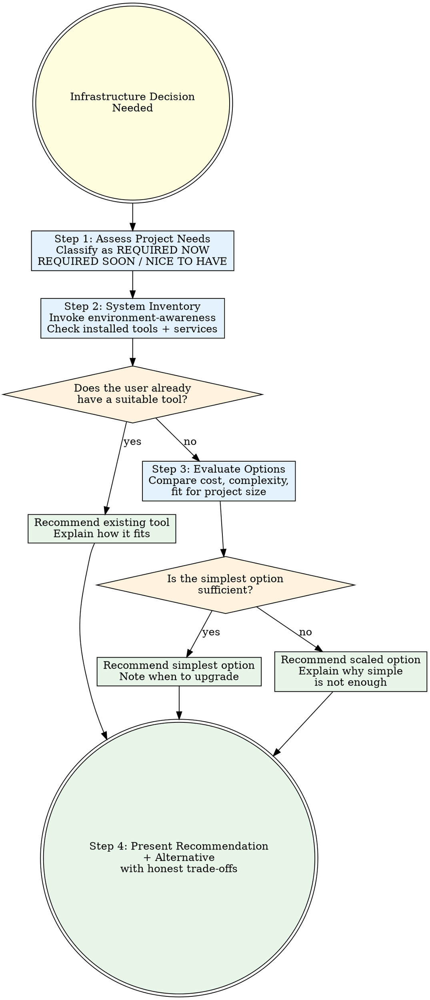

# Deployment Advisor

## Overview

The most expensive infrastructure mistake is not picking the wrong service — it is picking a service you do not need. Every external dependency is a bill, a failure point, and a piece of documentation you now have to read. The second most expensive mistake is ignoring what the user already has running on their machine.

**Core principle:** Recommend the simplest stack that meets the project's actual requirements, using what the user already has before suggesting anything new.

**No exceptions. No workarounds. No shortcuts.**

## The Prime Directive

```
NO TECHNOLOGY RECOMMENDATION WITHOUT CHECKING WHAT THE USER ALREADY HAS
```

If you have not inventoried the user's existing tools, runtimes, services, and running processes, you are guessing — not advising. Guessing wastes money and time.

## When to Use

**Required for:**
- New project setup ("what database should I use?", "where should I host this?")
- Architecture decisions involving external services
- Scaling discussions ("this needs to handle more traffic")
- Cost optimization ("my AWS bill is too high")
- Migration planning ("should I switch from X to Y?")
- Any question about databases, hosting, auth, storage, or background jobs

**Skip for:**
- The user has already chosen their stack and is asking for implementation help
- Bug fixes within an existing deployment
- Minor config changes to an already-deployed service
- The user explicitly says "I want X, help me set it up" (respect their decision)

## Cognitive Traps

| Rationalization | What Is Actually True |
|----------------|----------------------|
| "Everyone uses Supabase now" | The right tool depends on the project, not trends. SQLite handles more than people think. |
| "Cloud is always better" | A $4 VPS beats $50/mo in serverless for many workloads. Steady traffic favors fixed cost. |
| "More services = more professional" | Every service is a dependency, a bill, and a failure point. Fewer moving parts means fewer things break. |
| "They need microservices" | Most projects should be monoliths. Microservices solve organizational problems, not technical ones. |
| "Docker is required" | Many projects deploy fine without containerization. Docker adds complexity that small teams may not need. |
| "Serverless is cheaper" | Serverless is cheaper for spiky, low-volume traffic. For steady load, you are paying a premium for idle capacity you already rented. |
| "Managed services save time" | They save ops time but add vendor lock-in, cost, and API surface. Calculate the full trade-off. |

## Decision Framework

Before recommending anything, complete these four steps in order.

### Step 1: Assess Project Requirements

Determine what the project actually needs — not what it might need someday.

```
Classify each requirement as:
- REQUIRED NOW: The project cannot launch without it
- REQUIRED SOON: Needed within the first month post-launch
- NICE TO HAVE: Would be useful but the project works without it
- SPECULATIVE: "We might need this eventually"

Only recommend infrastructure for REQUIRED NOW and REQUIRED SOON.
Everything else is premature optimization.
```

**Common project needs to evaluate:**

| Need | Questions to Ask |
|------|-----------------|
| Database | How much data? How many concurrent users? Read-heavy or write-heavy? Relational or document? |
| Auth | How many users? Social login needed? Role-based access? Enterprise SSO? |
| File storage | How large are the files? How many? Public or private? CDN needed? |
| Background jobs | How frequent? How long-running? Retry logic needed? |
| Real-time | WebSocket? Server-sent events? Polling is fine? |
| Email | Transactional only? Marketing? Volume per month? |
| Payments | One-time? Subscriptions? Marketplace with splits? |
| Search | Full-text? Faceted? Can the database handle it? |

### Step 2: Cross-Reference with System Inventory

**Invoke ascension:environment-awareness** to get the user's system inventory.

```
Check for:
- Databases already installed (PostgreSQL, MySQL, SQLite, Redis, MongoDB)
- Container tools (Docker, Podman, containerd)
- Cloud CLIs (aws, gcloud, az, vercel, fly, railway, netlify)
- Runtime environments (Node.js, Python, Go, Rust, Java)
- Package managers and lockfiles (reveals the ecosystem)
- Running services (check ports 3000, 5432, 6379, 27017, 8080)
- Existing project dependencies (check package.json, requirements.txt, go.mod)
- .env files or config that reference existing services
```

**The rule:** If the user already has PostgreSQL running, do not recommend Supabase for the database. If they have the Vercel CLI and a Next.js project, Vercel is the obvious hosting choice. Work with what exists.

### Step 3: Evaluate Options with Trade-Offs

For each infrastructure need, present honest trade-offs.

### Step 4: Present the Recommendation

Format your output using the structure in the "Presenting the Recommendation" section below.

## Stack Decision Matrix

### Database

| Option | Best When | Cost | Complexity | Watch Out For |
|--------|-----------|------|------------|---------------|
| **SQLite** | Single-server, <100 concurrent writers, read-heavy | Free | Minimal | No concurrent writes, no replication, file-based |
| **PostgreSQL** | Multi-user, relational data, complex queries, ACID needed | Free (self-hosted) / $0-15/mo (managed) | Moderate | Needs a server process, connection pooling at scale |
| **Supabase** | Need real-time, auth bundled, PostgreSQL without ops | Free tier / $25/mo pro | Low (managed) | Vendor lock-in, row-level security learning curve |
| **PlanetScale** | MySQL at scale, branching workflow, serverless-friendly | Free tier / $29/mo | Low (managed) | MySQL dialect, no foreign keys on free tier |
| **Redis** | Caching, sessions, pub/sub, leaderboards | Free (self-hosted) / $0-5/mo | Low | Not a primary database, data loss risk without persistence config |
| **MongoDB** | Document-shaped data, flexible schema, prototyping | Free tier (Atlas) / varies | Moderate | Schema discipline still needed, joins are painful |

### Hosting

| Option | Best When | Cost | Complexity | Watch Out For |
|--------|-----------|------|------------|---------------|
| **Vercel** | Next.js, static sites, JAMstack, serverless functions | Free tier / $20/mo pro | Minimal | Vendor lock-in, serverless limits, build minute caps |
| **VPS (Hetzner/DigitalOcean)** | Steady traffic, full control needed, Docker workloads | $4-20/mo | Moderate (you manage it) | You own uptime, security patches, backups |
| **Railway / Render** | Quick deploy, small teams, database + app together | Free tier / $5-20/mo | Low | Costs scale fast, less control than VPS |
| **Fly.io** | Global edge deployment, containers, low latency worldwide | Pay-as-you-go / ~$5/mo base | Moderate | Newer platform, debugging deploys can be harder |
| **AWS / GCP / Azure** | Enterprise, complex infra, team with DevOps experience | Varies wildly | High | Bill shock, complexity explosion, needs dedicated ops knowledge |
| **Cloudflare Pages/Workers** | Static sites, edge compute, already using Cloudflare | Generous free tier | Low-Moderate | Worker limits (CPU time, memory), non-standard runtime |

### Auth

| Option | Best When | Cost | Complexity | Watch Out For |
|--------|-----------|------|------------|---------------|
| **NextAuth / Auth.js** | Next.js project, social login, self-hosted control | Free | Moderate | Config complexity, session strategy choices, migration pain |
| **Supabase Auth** | Already using Supabase for database | Included with Supabase | Low | Tied to Supabase ecosystem |
| **Clerk** | Need polished UI components, fast integration | Free tier / $25/mo | Low | Cost scales with MAU, vendor lock-in |
| **Auth0** | Enterprise SSO, compliance requirements, large org | Free tier / $23/mo | Moderate | Complex dashboard, expensive at scale |
| **Roll your own** | Very simple needs (API key, single admin), or deep expertise | Free | High (you own security) | You own every vulnerability. Do not do this for user-facing auth unless you know exactly what you are doing. |

### File Storage

| Option | Best When | Cost | Complexity | Watch Out For |
|--------|-----------|------|------------|---------------|
| **Local filesystem** | Dev only, single server, small files | Free | Minimal | Lost on redeploy, no CDN, no replication |
| **Cloudflare R2** | S3-compatible, no egress fees, already on Cloudflare | Free tier / pay-per-use | Low | Newer service, smaller ecosystem than S3 |
| **AWS S3** | Industry standard, enterprise, complex access policies | Pay-per-use (egress costs add up) | Moderate | Egress fees are the hidden cost. Budget for them. |
| **Supabase Storage** | Already using Supabase | Included with Supabase | Low | Tied to Supabase, size limits on free tier |

### Background Jobs

| Option | Best When | Cost | Complexity | Watch Out For |
|--------|-----------|------|------------|---------------|
| **Simple cron / setTimeout** | Periodic tasks, low volume, acceptable failure | Free | Minimal | No retry logic, no job queue, no persistence |
| **BullMQ** | Node.js project, need retries, job scheduling, Redis available | Free (needs Redis) | Moderate | Requires Redis, monitoring setup recommended |
| **Inngest** | Event-driven, serverless-friendly, need step functions | Free tier / paid | Low-Moderate | Vendor dependency, newer platform |
| **pg-boss** | PostgreSQL project, do not want Redis, moderate volume | Free (uses your PostgreSQL) | Low-Moderate | Adds load to your database, not for high throughput |

## Decision Flowchart



## MCP Integration Assessment

When evaluating a project's stack, also consider whether AI integration would add genuine value. This is not about adding AI for its own sake — it is about identifying cases where an MCP server or Claude integration solves a real problem.

**Consider MCP integration when:**
- The project has an API that users or internal teams query frequently (an MCP server lets Claude interact with it directly)
- The project involves content management, knowledge bases, or documentation (Claude can help users find and synthesize information)
- The project has complex admin operations that benefit from natural language interfaces
- Customer support workflows could benefit from an AI agent with access to project data

**Do NOT suggest MCP integration when:**
- The project is a simple CRUD app with no complex query patterns
- Adding AI does not solve a problem the user actually has
- The user has not expressed interest in AI features
- It would be a gimmick rather than a genuine productivity improvement

**If MCP integration is warranted:**
```
MCP Integration Opportunity:
- Use case: [specific problem it solves]
- Implementation: MCP server exposing [which endpoints/data]
- Effort: [estimate]
- Value: [what the user or their users gain]
```

## Presenting the Recommendation

**Format your output as:**

```
## Deployment Recommendation: [Project Name or Type]

### Project Requirements
- [Requirement 1]: REQUIRED NOW
- [Requirement 2]: REQUIRED SOON
- [Requirement 3]: NICE TO HAVE (defer)

### System Inventory
- Already installed: [tools, databases, CLIs detected]
- Running services: [ports, processes found]
- Project ecosystem: [framework, package manager, existing dependencies]

### Recommended Stack

| Layer | Choice | Reason |
|-------|--------|--------|
| Database | [choice] | [why — reference what user already has] |
| Hosting | [choice] | [why] |
| Auth | [choice] | [why] |
| [other] | [choice] | [why] |

Estimated monthly cost: $[X] (at current scale)

### Alternative Stack
[For when requirements change or scale increases]

| Layer | Choice | When to Switch |
|-------|--------|---------------|
| Database | [alt] | [trigger — e.g., "if concurrent users exceed 1000"] |
| Hosting | [alt] | [trigger] |

### What I Deliberately Did Not Recommend
- [Service X]: [why not — e.g., "overkill for this project size"]
- [Service Y]: [why not — e.g., "you do not have Docker installed and do not need it"]
```

Keep the recommendation proportional to the project. A weekend project gets a short recommendation. An enterprise SaaS gets thorough treatment.

## Guardrails

**Never:**
- Recommend a service without checking if the user already has an alternative installed
- Suggest a paid service when a free alternative covers the requirements
- Recommend Docker to someone who does not have it and does not need it
- Default to AWS/GCP/Azure for projects that do not need enterprise cloud
- Stack multiple managed services when one would suffice (do not use Supabase + Auth0 + separate hosting when Supabase covers all three)
- Recommend based on what is trendy instead of what fits
- Ignore cost — always include a monthly estimate
- Suggest microservices for a project that should be a monolith

**Always:**
- Run environment-awareness inventory before making recommendations
- Present at least one recommended stack and one alternative
- Include cost estimates (even rough ones)
- Explain when to upgrade from the simple recommendation to the alternative
- Mention what you deliberately did not recommend and why
- Bias toward fewer services, lower cost, and less complexity
- Respect the user's existing choices when they have already committed to a stack

## Connections

This skill integrates with the Ascension workflow at infrastructure decision points:

- **ascension:environment-awareness** -- Provides the system inventory this skill depends on. Always invoke before making recommendations.
- **ascension:rationale** -- Rationale surfaces alternatives at the feature level; deployment-advisor deepens the analysis for infrastructure-specific decisions.
- **ascension:system-design** -- Works together for architecture decisions. System-design handles application architecture; deployment-advisor handles infrastructure and services.
- **ascension:project-bootstrap** -- Deployment-advisor runs during project setup to establish the initial stack before any code is written.
- **ascension:security-protocol** -- Auth and hosting recommendations must align with security requirements.
