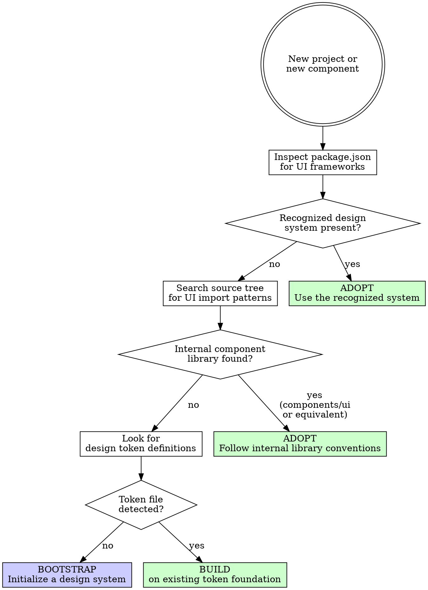

# Design Integration

## Overview

Detect the project's design system, embrace it fully, and extend it only through sanctioned channels. Never resist it, never overlook it, never rebuild what it already offers.

**Core principle:** When a project has a design system, every component you create must consume that system's primitives, tokens, and patterns. When no system exists, establish one before writing components.

**No exceptions. No workarounds. No shortcuts.**

## The Prime Directive

```
NEVER REBUILD WHAT THE DESIGN SYSTEM ALREADY PROVIDES
```

If the system ships a `<Dialog>` component, use it. Do not fabricate your own. Do not wrap it in a container with overriding styles. Consume its variant API and extend only through its documented extension points.

## When to Use

**Mandatory when:**
- Entering any existing codebase with a user interface
- Introducing new UI elements to an established application
- Growing a project's component library
- Initializing a new project that will have a UI layer

**Specifically triggered by:**
- Imports from `@shadcn/ui`, `@mui/material`, `antd`, `@chakra-ui`, or equivalents
- A `components/ui` directory containing base-level primitives
- Configuration files such as `tailwind.config`, `theme.ts`, or a design token file
- The need to add UI to a project with no system in place

## The Entry Protocol

```
BEFORE authoring any UI component:

1. DETECT: What design system governs this project? (see Detection below)
2. STUDY: Read the system's component API for the element you are building
3. ASSESS: Does the system already provide this component?
   - Yes -> Consume it directly. Do NOT recreate it.
   - Partially -> Compose from existing primitives
   - No -> Build it adhering to the system's conventions
4. VALIDATE: Does your component feel native to the system?

Omit any step = fighting the system
```

## Detection Sequence



### Phase 1: Inspect Dependencies

| Dependency | System | Approach |
|---|---|---|
| `@radix-ui/*`, `class-variance-authority` | shadcn/ui | Adhere to shadcn file and variant conventions |
| `@mui/material`, `@emotion/react` | Material UI | Follow Material Design specifications |
| `antd` | Ant Design | Follow Ant component patterns |
| `@chakra-ui/react` | Chakra UI | Follow Chakra theming and style props |
| `@headlessui/react` | Headless UI | Pair with Tailwind for styling |
| `@mantine/core` | Mantine | Follow Mantine hook and component patterns |
| `primereact`, `primevue` | PrimeReact/PrimeVue | Follow Prime theming and template system |

### Phase 2: Scan for Internal Components

Look for:
- `components/ui/` directory (typical shadcn/ui layout)
- `components/common/` or `components/shared/`
- Barrel re-exports from component directories
- Storybook stories (`.stories.tsx`)

### Phase 3: Locate Design Tokens

Search for:
- `tailwind.config.js/ts` (Tailwind CSS theme customization)
- `theme.ts` or `theme.js` (custom theme objects)
- CSS custom properties defined on `:root` or `[data-theme]`
- `tokens/` or `design-tokens/` directories
- `styles/variables.css` or `styles/tokens.css`

## Adoption: Operating Within an Existing System

### Universal Principles

1. **Consume the component API as-is.** Do not add wrapper elements with inline overrides.
2. **Use the system's variant mechanism.** If it offers `variant="danger"`, use that instead of manually overriding colors.
3. **Use the system's sizing props.** If it accepts `size="sm"`, do not override with custom CSS.
4. **Extend through the system's designated extension points.** Not through CSS specificity wars.
5. **Follow the system's directory conventions.** If primitives live in `components/ui/`, new ones go there too.

### shadcn/ui

Copy-and-customize components built on Radix UI + Tailwind CSS.

**Conventions:**
- Primitives in `components/ui/` (base building blocks)
- Application components in `components/` (composed from primitives)
- `cn()` helper for merging class strings
- `cva()` from `class-variance-authority` for variant definitions
- All styling through Tailwind utility classes

**Adding a missing component:**
```bash
npx shadcn@latest add [component-name]
```

**Composing custom components:**
```tsx
import { Card, CardContent, CardHeader, CardTitle } from "@/components/ui/card"
import { Badge } from "@/components/ui/badge"

export function ProjectCard({ project }) {
  return (
    <Card>
      <CardHeader><CardTitle>{project.title}</CardTitle></CardHeader>
      <CardContent>
        <Badge variant={project.live ? "default" : "secondary"}>
          {project.live ? "Live" : "Draft"}
        </Badge>
      </CardContent>
    </Card>
  )
}
```

**Forbidden:**
- Overriding shadcn styles with raw CSS files
- Rebuilding a component shadcn already provides
- Applying non-Tailwind styling alongside shadcn components
- Ignoring the `cn()` helper for conditional class composition

### Material UI

**Conventions:**
- Theme defined via `createTheme()` in `theme.ts`
- Components imported from `@mui/material`
- Styling via `sx` prop or `styled()` API
- Global overrides through `theme.components`

**Extending the theme:**
```tsx
const theme = createTheme({
  palette: { primary: { main: '#0d9488' } },
  components: {
    MuiButton: {
      defaultProps: { disableElevation: true },
      styleOverrides: { root: { textTransform: 'none', borderRadius: 8 } },
    },
  },
});
```

### Ant Design

**Conventions:**
- Components imported from `antd`
- Theming through ConfigProvider + token system
- Global tokens via `theme.token`, per-component via `theme.components`

**Forbidden:** Direct overrides of `.ant-*` CSS classes or mixing Ant with a competing component library.

### Tailwind CSS (Standalone, No Component Library)

When the project uses Tailwind without an accompanying component framework:
1. Inspect `tailwind.config` for custom theme extensions
2. Consume those values exclusively -- no arbitrary values
3. Replicate existing class patterns found in the codebase

## Extension: Adding to an Existing System

When the system lacks a component you require:

### Pre-Build Checklist

1. Search the system's documentation -- it may exist under a different name
2. Determine whether it can be assembled from existing primitives
3. Look for community plugins or extensions

### Building a New Component Within the System

Align with the system's norms:

1. **NAMING** -- Follow the system's naming pattern (PascalCase components, kebab-case files, etc.)
2. **API** -- Follow the system's prop conventions (variant + size, cva, sx, etc.)
3. **STYLING** -- Use the same styling mechanism (Tailwind + cn(), sx prop, token references)
4. **TOKENS** -- Reference system token values, never raw literals
5. **ACCESSIBILITY** -- Reproduce the system's a11y patterns (ARIA attributes, keyboard navigation, focus management)

## Bootstrap: When No System Exists

| Project Scale | Recommendation |
|---|---|
| Prototype / MVP | Tailwind CSS + shadcn/ui |
| Small team, distinctive brand | Tailwind CSS + headless primitives (Radix/Headless UI) |
| Enterprise / large organization | Material UI or Ant Design (full-featured, opinionated) |
| Design-centric / agency work | Tailwind CSS + bespoke component library |

### Minimum Bootstrap Steps

1. Install a CSS framework (Tailwind recommended for most scenarios)
2. Define design tokens (leverage templates from ascension:ux-patterns design-tokens.md)
3. Create foundational components (Button, Input, Card, Badge at minimum)
4. Configure theming (CSS custom properties or Tailwind config)

### Fast-Track Bootstrap (Tailwind + shadcn/ui)

```bash
npx tailwindcss init -p
npx shadcn@latest init
npx shadcn@latest add button input card badge dialog toast
```

Customize `tailwind.config.ts` with project-specific token values afterward.

## Token Discovery in Existing Codebases

When joining a project that lacks documented tokens:

| Token Category | Where to Find |
|---|---|
| Colors | CSS variables, Tailwind config, theme files, most-used hex/rgb values |
| Typography | Font imports, CSS font declarations, Tailwind config fonts section |
| Spacing | Most frequent padding/margin/gap values across stylesheets |
| Border radius | Most common border-radius values in component styles |
| Shadows | Most common box-shadow declarations |

**Discovery process:**
1. Search for CSS custom properties (`--`) across all style files
2. Inspect `tailwind.config` for `theme.extend` customizations
3. Check for `theme.ts` or `theme.js` exports
4. If nothing is found, audit the 5-10 most-used components for recurring values and document them as tokens

## Cognitive Traps

| Rationalization | Truth |
|---|---|
| "The system does not have this component" | Compose from primitives or extend within conventions. Do not bypass the system. |
| "Writing raw CSS is faster than learning the API" | Faster today, inconsistent forever. Invest in learning the system. |
| "I will wire it into the system later" | Later never arrives. Components outside the system infect everything they touch. |
| "The system's API is too restrictive" | The API prevents inconsistency by design. Work within it or extend properly. |
| "Combining two systems gives us the best of both" | Combining two systems delivers the worst of both: conflicting styles, doubled bundle weight. |
| "This is a one-off component, it does not matter" | One-off components multiply. Build it correctly or it becomes technical debt. |
| "I will just override this one property" | One override becomes twenty. Use the system's theming mechanism. |

## Guardrails -- HALT

- Overriding system styles with `!important`
- Mixing two different component frameworks in one project
- Rebuilding a component the system already ships
- Ignoring the system's theming or token approach
- Using raw HTML elements when system components exist
- Creating `components/custom/` alongside `components/ui/`
- Adding standalone CSS files in a Tailwind project
- Hard-coding hex colors when the system provides a palette
- Installing a second UI library when one is already present

**Every item on this list means: HALT. Consume the existing system.**

## Integration

**Prerequisite knowledge:**
- **ascension:ux-patterns** -- Provides design references; this skill handles system-specific implementation

**Complementary skills:**
- **ascension:ui-engineering** -- Implementation patterns that operate within design systems
- **ascension:project-bootstrap** -- Initialize a design system during project setup
