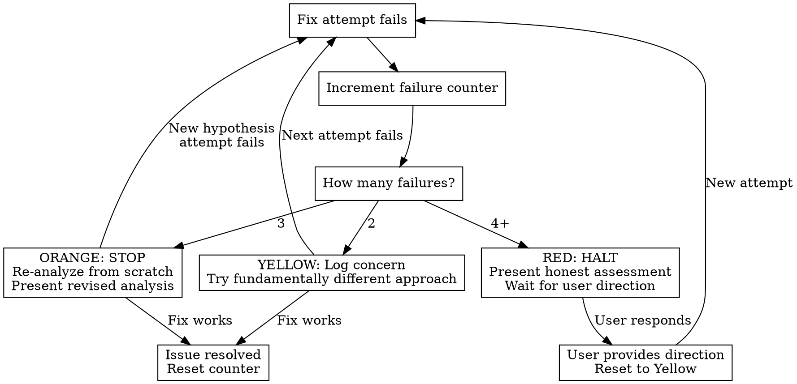

# Error Recovery

## Overview

AI agents get stuck. They try the same approach repeatedly, add complexity to fix complexity, and rationalize "one more attempt" long past the point of diminishing returns. This skill detects stuck patterns **proactively** and forces recovery before wasted effort compounds.

**Core principle:** Track every failed attempt. Escalate at defined thresholds. Never allow unbounded retries.

## The Prime Directive

```
NO CONTINUED ATTEMPTS WITHOUT ACKNOWLEDGING FAILURE COUNT
```

Before EVERY fix attempt, state: "This is attempt N of the current issue." If N >= 3, you are not authorized to continue without user direction.

## When to Use

This skill activates **automatically** when any of these patterns appear:

- Same error message after 2+ attempted fixes
- A fix for problem A introduces problem B
- File edited 3+ times for the same issue without resolution
- Increasing line count or complexity with each attempt
- "Let me try one more thing" after 2+ failures
- Test suite results getting worse, not better
- Reverting a fix and trying a variation of the same approach

**This skill overrides optimism.** When triggered, it takes priority over whatever strategy is currently failing.

## Failure Counter

You MUST maintain an internal failure counter for each distinct issue:

```
FAILURE LOG
Issue: [description]
Attempt 1: [what you tried] -> [result]
Attempt 2: [what you tried] -> [result]
Attempt 3: [what you tried] -> [result]  <- STOP HERE
```

**Rules:**
- Increment the counter for every attempted fix, including "small tweaks"
- A variation of the same approach counts as a new attempt
- Reverting and retrying counts as a new attempt
- The counter resets ONLY when the issue is resolved or the user explicitly resets scope

## Severity Levels

### Yellow -- 2 Failed Attempts

- Log the concern explicitly: "Two attempts have failed for [issue]."
- Identify what both attempts had in common
- Your next attempt MUST use a **fundamentally different** approach
- If you cannot identify a different approach, escalate to Orange immediately

### Orange -- 3 Failed Attempts

- **STOP all fix attempts.**
- Step back completely. Re-read the original error from scratch
- Re-analyze the problem as if seeing it for the first time
- List what you know, what you assumed, and what you have not verified
- Formulate a new hypothesis that contradicts your previous assumptions
- Present the situation to the user: "Three attempts have failed. Here is my revised analysis."

### Red -- 4+ Failed Attempts

- **HALT. Do not continue without explicit user direction.**
- Present an honest assessment:
  - What you tried (all attempts, briefly)
  - What you learned from each failure
  - What you believe the actual problem might be
  - What you recommend as next steps (including "I may not be able to solve this")
- Wait for user input before proceeding
- If the user says continue, reset to Yellow with the new direction

## Escalation Flowchart



## Recovery Strategies

When a fix fails, apply these in order:

1. **Re-read the actual error message.** Not your interpretation of it -- the literal text. Errors frequently contain the answer.

2. **Try a fundamentally different approach.** Not a variation. If you were editing config, try code. If you were patching, try replacing. If you were adding, try removing.

3. **Simplify ruthlessly.** Strip the problem to its smallest reproducible case. Remove everything non-essential. Test the simplest possible version.

4. **Verify your assumptions.** Print values. Check types. Confirm the file you think you are editing is the one actually being executed. Confirm the function you think is being called is actually being called.

5. **Escalate with honesty.** Tell the user: "I have tried N approaches. None worked. Here is what I know and what I recommend."

6. **Rollback to last known-good state.** If you have made things worse, undo all changes and return to where things last worked. Start fresh from there.

## Anti-Patterns to Block

These patterns indicate the agent is stuck and MUST trigger this skill:

| Anti-Pattern | What to Do Instead |
|---|---|
| "Let me try one more thing" (after 3+ failures) | STOP. You said that last time. Escalate. |
| Adding complexity to fix complexity | Simplify. Remove code. Reduce moving parts. |
| Ignoring the error message, trying random changes | Read the error. It is telling you something specific. |
| Blaming the environment ("must be a cache issue") | Verify the claim. Run a clean build. Check actually. |
| Widening scope instead of narrowing it | Focus on the smallest failing case, not the whole system. |
| Editing the same file repeatedly | Step back. The problem may not be in that file. |
| "It should work" without verifying | Run it. Check output. Trust evidence, not expectations. |
| Fixing the test instead of the code | The test is probably right. Fix what it is testing. |

## Cognitive Traps

| Rationalization | Reality |
|---|---|
| "This is a different issue" | If it appeared while fixing the original, it is the same issue. Count it. |
| "I almost had it last time" | Almost does not count. Two near-misses is a pattern, not progress. |
| "The approach is right, just needs tweaking" | Three tweaks of the same approach is not three different attempts. |
| "I need to understand the whole system first" | You need to understand the failing part. Scope down, not up. |
| "Let me refactor first, then fix" | Refactoring while debugging creates two problems. Fix first. |
| "This is an edge case" | If it blocks completion, it is a primary case. |
| "One more log statement will reveal it" | If three log statements did not help, you are looking in the wrong place. |

## Guardrails

STOP and activate this skill if you observe:

- You have edited the same file 3+ times for one issue
- Your fix introduced a new failure
- You are writing more code to handle an error than the original feature
- The test suite has more failures now than when you started
- You are suppressing errors or warnings instead of fixing them
- You are about to say "let me try" for the 3rd+ time
- Your solution is more complex than the original problem
- You have been working on the same error for more than 10 minutes of active attempts

## Connections

- **ascension:fault-diagnosis** -- Error recovery activates when fault diagnosis is not converging. If Phase 4 has failed 3+ times, this skill takes over.
- **ascension:completion-gate** -- After recovery, use completion-gate to verify the fix actually holds. Prevents false "done" claims after a recovery sequence.
- **ascension:test-first** -- Recovery should include writing a test that reproduces the exact failure. A fix without a regression test is not complete.
- **ascension:task-planning** -- If recovery reveals the task was scoped wrong, return to task planning to re-scope before continuing.
