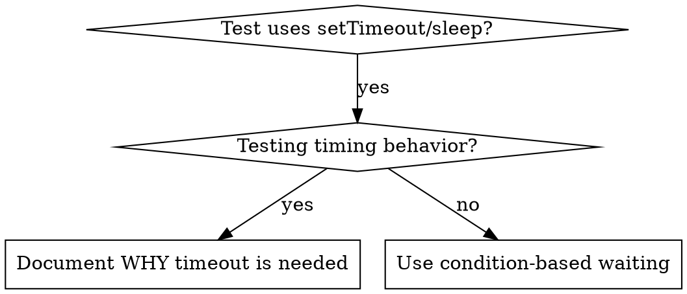

# Condition-Based Waiting

## Overview

Flaky tests frequently rely on arbitrary delays to guess at timing. This creates race conditions where tests pass on fast machines but fail under load or in CI environments.

**Core principle:** Wait for the actual condition you care about, not a guess about how long it takes.

## When to Use



**Use when:**
- Tests have arbitrary delays (`setTimeout`, `sleep`, `time.sleep()`)
- Tests are flaky (pass intermittently, fail under load)
- Tests timeout when run in parallel
- Waiting for async operations to complete

**Do not use when:**
- Testing actual timing behavior (debounce intervals, throttle windows)
- Always document WHY if using an arbitrary timeout

## Core Pattern

```typescript
// BEFORE: Guessing at timing
await new Promise(r => setTimeout(r, 50));
const value = getValue();
expect(value).toBeDefined();

// AFTER: Waiting for the condition
await waitUntil(() => getValue() !== undefined);
const value = getValue();
expect(value).toBeDefined();
```

## Quick Patterns

| Scenario | Pattern |
|----------|---------|
| Wait for event | `waitUntil(() => events.find(e => e.type === 'COMPLETE'))` |
| Wait for state | `waitUntil(() => machine.state === 'ready')` |
| Wait for count | `waitUntil(() => items.length >= 5)` |
| Wait for file | `waitUntil(() => fs.existsSync(filePath))` |
| Complex condition | `waitUntil(() => obj.ready && obj.value > 10)` |

## Implementation

Generic polling function:
```typescript
async function waitUntil<T>(
  predicate: () => T | undefined | null | false,
  label: string,
  maxWaitMs = 5000
): Promise<T> {
  const start = Date.now();

  while (true) {
    const result = predicate();
    if (result) return result;

    if (Date.now() - start > maxWaitMs) {
      throw new Error(`Timeout waiting for ${label} after ${maxWaitMs}ms`);
    }

    await new Promise(r => setTimeout(r, 10)); // Poll every 10ms
  }
}
```

See `condition-based-waiting-example.ts` in this directory for a complete implementation with domain-specific helpers (`waitForEvent`, `waitForEventCount`, `waitForEventMatch`).

## Common Mistakes

**Polling too frequently:** `setTimeout(check, 1)` -- wastes CPU
**Fix:** Poll every 10ms

**No timeout:** Loops forever if the condition is never met
**Fix:** Always include a timeout with a clear error message

**Stale data:** Caching state before the loop
**Fix:** Call the getter inside the loop for fresh data

## When an Arbitrary Timeout IS Correct

```typescript
// Tool ticks every 100ms - need 2 ticks to verify partial output
await waitForEvent(manager, 'TOOL_STARTED'); // First: wait for condition
await new Promise(r => setTimeout(r, 200));   // Then: wait for timed behavior
// 200ms = 2 ticks at 100ms intervals - documented and justified
```

**Requirements:**
1. First wait for the triggering condition
2. Based on known timing (not guessing)
3. Comment explaining WHY
