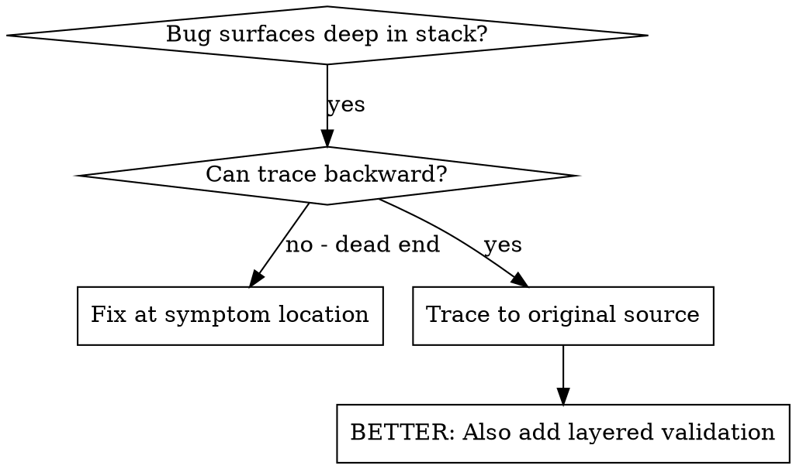
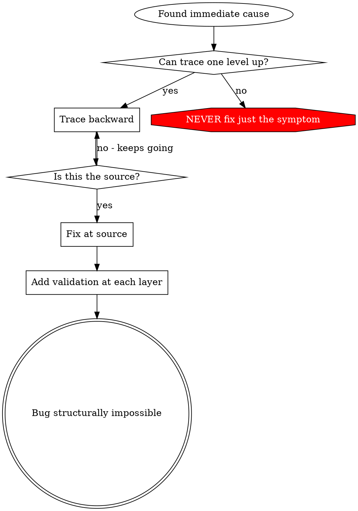

# Root Cause Tracing

## Overview

Bugs frequently surface deep in the execution chain (git init in the wrong directory, file created in the wrong location, database opened with an incorrect path). The natural instinct is to patch where the error appears, but that addresses only a symptom.

**Core principle:** Trace backward through the call chain until you find the original source, then fix there.

## When to Use



**Use when:**
- Error occurs deep in execution (not at the entry point)
- Stack trace shows a long call chain
- Unclear where invalid data originated
- Need to identify which test/code triggers the problem

## The Tracing Method

### 1. Observe the Symptom
```
Error: git init failed in /home/user/project/packages/core
```

### 2. Find the Immediate Cause
**What code directly triggers this?**
```typescript
await execFileAsync('git', ['init'], { cwd: targetDir });
```

### 3. Ask: What Called This?
```typescript
WorktreeManager.createWorktree(targetDir, sessionId)
  -> called by Session.setupWorkspace()
  -> called by Session.create()
  -> called by test at Project.create()
```

### 4. Keep Tracing Upward
**What value was passed?**
- `targetDir = ''` (empty string!)
- Empty string as `cwd` resolves to `process.cwd()`
- That is the source code directory!

### 5. Find the Original Source
**Where did the empty string come from?**
```typescript
const ctx = initTestContext(); // Returns { workDir: '' }
Project.create('name', ctx.workDir); // Accessed before beforeEach!
```

## Adding Stack Traces

When manual tracing is insufficient, add instrumentation:

```typescript
// Before the problematic operation
async function gitInit(dir: string) {
  const trace = new Error().stack;
  console.error('TRACE git init:', {
    dir,
    cwd: process.cwd(),
    env: process.env.NODE_ENV,
    trace,
  });

  await execFileAsync('git', ['init'], { cwd: dir });
}
```

**Important:** Use `console.error()` in tests (not logger -- logger may be suppressed)

**Run and capture:**
```bash
npm test 2>&1 | grep 'TRACE git init'
```

**Analyze the stack traces:**
- Look for test file names
- Find the line number initiating the call
- Identify the pattern (same test? same parameter?)

## Identifying Which Test Causes Pollution

If something appears during tests but you do not know which test:

Use the bisection script `find-polluter.sh` in this directory:

```bash
./find-polluter.sh '.git' 'src/**/*.test.ts'
```

Runs tests individually, stops at the first polluter. See script for usage details.

## Worked Example: Empty targetDir

**Symptom:** `.git` created in `packages/core/` (source code directory)

**Trace chain:**
1. `git init` runs in `process.cwd()` -- empty cwd parameter
2. WorktreeManager called with empty targetDir
3. Session.create() passed empty string
4. Test accessed `ctx.workDir` before beforeEach
5. initTestContext() returns `{ workDir: '' }` initially

**Root cause:** Top-level variable initialization accessing empty value

**Fix:** Made workDir a getter that throws if accessed before beforeEach

**Also added layered validation:**
- Layer 1: Project.create() validates directory
- Layer 2: WorktreeManager validates not empty
- Layer 3: NODE_ENV guard refuses git init outside tmpdir
- Layer 4: Stack trace logging before git init

## Key Principle



**NEVER fix only where the error appears.** Trace back to find the original source.

## Stack Trace Tips

**In tests:** Use `console.error()` not logger -- logger may be suppressed
**Before operation:** Log before the dangerous operation, not after it fails
**Include context:** Directory, cwd, environment variables, timestamps
**Capture stack:** `new Error().stack` shows the complete call chain
