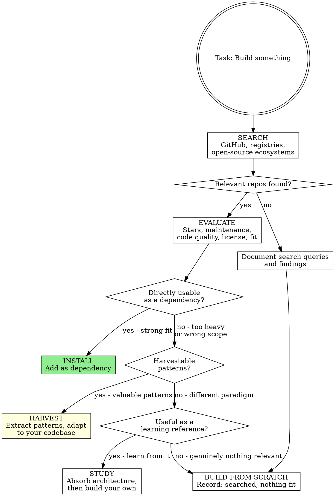
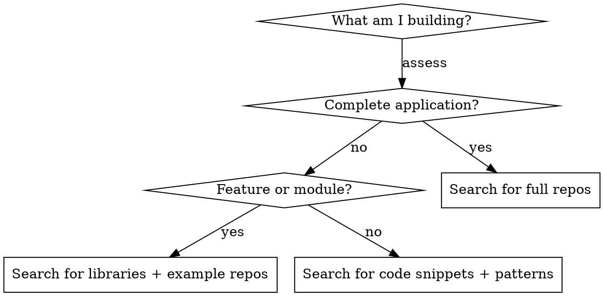

# GitHub Search

## Overview

Before writing a single line of code, determine whether someone on the planet has already solved the same problem and published the result. The strongest engineering move is recognizing when the work has already been done.

**Core principle:** Search GitHub repositories, package registries, and open-source ecosystems for existing implementations before building anything new. Harvest the best patterns from multiple projects. Attribute what you borrow. Respect licenses.

**No exceptions. No workarounds. No shortcuts.**

## The Prime Directive

```
NO BUILDING FROM SCRATCH WITHOUT SEARCHING GITHUB FIRST
```

If you have not queried public repositories for prior solutions, you are burning time on reinvention. Searched three different ways and found nothing applicable? Document what you searched and why nothing fit. Then build.

**No excuses:**
- Do not "just start coding and research later"
- Do not assume uniqueness because the problem feels novel
- Do not skip research for "straightforward" features (straightforward features have the densest prior art)
- Do not reject repositories because they are imperfect (extract what is valuable)
- "I know how to implement this" is not the same as "I should implement this from zero"

## When to Use

**Mandatory when:**
- Initiating a new feature or project
- Building something that plausibly exists as open source
- Weighing competing implementation strategies
- Seeking architectural precedents from real-world systems
- Evaluating frameworks, libraries, or tooling choices

**Particularly valuable when:**
- The task involves ubiquitous patterns (auth, CRUD, file handling, search, payments)
- Building a game (every genre has extensive open-source coverage)
- Creating a utility that addresses a known problem space
- Implementing algorithms or specialized data structures
- Setting up infrastructure (CI/CD, deployment pipelines, monitoring)
- Designing APIs, schemas, or protocols with established conventions

## The Entry Protocol



**BEFORE building anything:**

1. **SEARCH** -- Query GitHub, package registries, and the broader open-source ecosystem
2. **EVALUATE** -- Assess candidates for quality, relevance, and license compatibility
3. **DECIDE** -- Use as dependency, harvest patterns, study as reference, or build from scratch
4. **DOCUMENT** -- Record what you found and why you chose your path
5. **ONLY THEN** -- Begin building

## Search Methodology

### Where to Search

Cast a wide net across multiple channels before concluding nothing exists.

```
1. GitHub Search: github.com/search (code, repositories, topics)
2. GitHub Topics: github.com/topics/{topic}
3. WebSearch: "github {what you need} {tech stack}"
4. Package registries: npmjs.com, pypi.org, crates.io, rubygems.org, pkg.go.dev
5. Curated lists: awesome-{topic} repositories on GitHub
6. Framework ecosystems: official plugin/extension directories
```

### Effective Querying

**Multi-query discipline** -- Never settle for a single search.

| Query Style | Example | Discovers |
|---|---|---|
| **Literal name** | `tetris javascript` | Exact matches for the concept |
| **Problem statement** | `real-time collaboration websocket` | Solutions targeting the same problem |
| **Stack + pattern** | `vue authentication oauth2` | Technology-specific implementations |
| **Synonym exploration** | `kanban board` / `task tracker` / `project manager` | Same concept, different terminology |
| **Curated collections** | `awesome-react` / `awesome-python` | Community-vetted lists |

**Minimum threshold before declaring "nothing exists":** 3 distinct query formulations across at least 2 search channels.

### What to Search For



## Evaluating Repositories

When assessing discovered repositories, apply these signals systematically.

| Signal | Positive Indicator | Negative Indicator |
|---|---|---|
| **Popularity** | 100+ stars (community-validated) | 0-5 stars (unvetted) |
| **Maintenance** | Commit within 6 months | Dormant 2+ years |
| **Community health** | Active discussions, merged PRs | Hundreds of stale issues, no maintainer response |
| **License** | MIT, Apache 2.0, BSD | GPL (if you need permissive), no license at all |
| **Code discipline** | Tests, types, documentation, clean structure | No tests, no types, tangled code |
| **Dependency footprint** | Minimal, well-known dependencies | 50+ transitive deps, obscure packages |
| **Documentation** | Clear setup instructions, usage examples | Empty or outdated README |
| **Relevance** | Addresses 70%+ of your need | Tangentially related |

**Minimum viable candidate:** Has tests, has a license, updated within the past year, README explains usage.

### Quick Evaluation Checklist

```
For each candidate repository:

1. STARS & FORKS: Gauge community trust (100+ stars is a reasonable floor)
2. LAST COMMIT: Anything older than 18 months is a maintenance risk
3. OPEN ISSUES: High count with no maintainer replies signals abandonment
4. LICENSE FILE: No license means you cannot legally use it
5. TEST DIRECTORY: No tests means no confidence in correctness
6. README QUALITY: Poor docs usually correlate with poor internal structure
7. DEPENDENCIES: Check for bloated or unmaintained transitive deps
8. RELEASE CADENCE: Regular releases indicate ongoing investment
```

## Pattern Harvesting

When a repository is not directly consumable but contains valuable patterns, extract intelligently.

### Phase 1: Identify Extractable Value

```
FROM the repository, extract:
- Architectural patterns (how they organized the project)
- Algorithm implementations (how they solved the hard parts)
- Data models (how they structured domain entities)
- Interface designs (how they shaped the public API)
- Error handling approaches (how they manage edge cases)
- Test strategies (how they verify similar functionality)
```

### Phase 2: Adapt to Your Context

```
DO NOT copy-paste entire files.
DO extract the pattern and rewrite for your:
- Technology stack
- Naming conventions
- Design system (for UI code)
- Architectural layering
- Internal codebase conventions (use ascension:codebase-research to find them)
```

### Phase 3: Attribute the Source

```
In your codebase or documentation, note:
"Approach inspired by github.com/author/repo - [what was adapted]"
```

## License Compatibility

Before using any code from a discovered repository, verify license compatibility.

| Your Project License | Compatible Source Licenses |
|---|---|
| MIT | MIT, BSD, Apache 2.0, ISC, Unlicense |
| Apache 2.0 | MIT, BSD, Apache 2.0, ISC, Unlicense |
| GPL | Any (GPL is permissive for incoming code) |
| Proprietary | MIT, BSD, Apache 2.0, ISC, Unlicense |
| **Any** | **Never use: No license stated, AGPL (unless you comply fully)** |

**When uncertain:** MIT and Apache 2.0 are safe for virtually any project. GPL requires your project to also be GPL. No license means all rights reserved by the author -- do not use.

## Multi-Source Harvesting

For complex features, the optimal approach often combines patterns from several repositories.

```
Example: Building a real-time collaborative editor

Repo 1 (github.com/x/rich-editor): Polished prosemirror integration
  -> Harvest: Editor initialization pattern, schema definition approach

Repo 2 (github.com/y/crdt-sync): Clean CRDT implementation for text
  -> Harvest: Conflict resolution algorithm, operation transformation logic

Repo 3 (github.com/z/ws-rooms): WebSocket room management
  -> Harvest: Connection lifecycle, reconnection strategy, presence tracking

Result: Your implementation synthesizes the strongest elements from 3 repos,
each designed by specialists in their domain.
```

**Report to the user:**

Present discoveries as labeled options with links. Mark the recommendation with a star.

```
I found [N] relevant repositories. Here are the top candidates:

**A)** [repo-name] — [stars] stars, [license]
   Link: [GitHub URL]
   Extractable: [specific patterns/code worth harvesting]
   Fit: [what percentage of your need it covers]

**B)** [repo-name] — [stars] stars, [license]
   Link: [GitHub URL]
   Extractable: [specific patterns/code worth harvesting]
   Fit: [what percentage of your need it covers]

**C)** [repo-name] — [stars] stars, [license]
   Link: [GitHub URL]
   Extractable: [specific patterns/code worth harvesting]
   Fit: [what percentage of your need it covers]

**D) Multi-source harvest** — Best patterns from all three ⭐ Recommended
   From A: [what to extract]
   From B: [what to extract]
   From C: [what to extract]
   Build from scratch: [what is unique to this project]
   Why: Combines battle-tested patterns from [N] production systems

Check out the repos and pick A, B, C, or D.
```

**YoloMode exception:** Reference and repository selection is ALWAYS interactive — even in YoloMode, present the options and let the user pick. These choices are too impactful to auto-select.

## Cognitive Traps

| Rationalization | Truth |
|---|---|
| "I can build it faster than studying someone else's code" | You will also maintain it indefinitely. Battle-tested code has fewer defects. |
| "Nothing exists for my exact scenario" | Did you try 3+ query variations? Partial matches are valuable. |
| "Open source quality is unreliable" | Repositories with 1k+ stars and test suites are often superior to what you will produce under time pressure. |
| "It is faster to just start writing" | You will spend hours solving problems someone already addressed. |
| "I want to avoid external dependencies" | Harvest patterns without adding dependencies. The knowledge is free. |
| "Licensing is too complicated" | MIT/Apache/BSD means free to use. A two-second check saves you from reinvention. |
| "It is only 100 lines, not worth researching" | Those 100 lines with edge-case coverage someone already wrote outperform your 100 lines without it. |
| "I will research if I get stuck" | Research FIRST. Getting stuck means you already burned time. |

## Guardrails

**Prohibited actions:**
- Starting implementation without searching first (minimum 3 queries)
- Rejecting all search results without evaluation
- Copying code without verifying license compatibility
- Using a repository with no license (legal risk)
- Assuming your solution will surpass a battle-tested one
- Omitting attribution when harvesting patterns

**Required actions:**
- Search with at least 3 different query formulations
- Evaluate candidates against the assessment criteria
- Verify license compatibility before using any code
- Document what you found and your rationale
- Harvest patterns even from repositories you do not use directly
- Report findings to the user with links, popularity metrics, and what you are extracting

## Quick Reference

```
SEARCH -> EVALUATE -> DECIDE -> DOCUMENT -> BUILD

Search: 3+ queries across GitHub, registries, and curated lists
Evaluate: Stars, activity, tests, license, relevance
Decide: Use as dependency | Harvest patterns | Study as reference | Build from scratch
Document: What you searched, what you found, why you chose your path
Build: With patterns from research, not from assumptions
```

## Integration

**Invoked during:**
- **ascension:intent-discovery** -- Search during "Explore project context" and research phases
- **ascension:reference-engine** -- Routed here for external code and library research
- **ascension:task-planning** -- Reference repositories in plan tasks
- **ascension:system-design** -- Discover reference architectures on public repositories

**Complementary skills:**
- **ascension:codebase-research** -- For searching WITHIN the current codebase for internal patterns, conventions, and existing implementations to match
- **ascension:specification-first** -- Feeds search findings into formal specifications
- **ascension:ux-patterns** -- Repositories for code patterns; UX system for design patterns
- **ascension:design-integration** -- Find design system repos for bootstrapping
- **ascension:project-bootstrap** -- Locate starter templates and boilerplate projects
