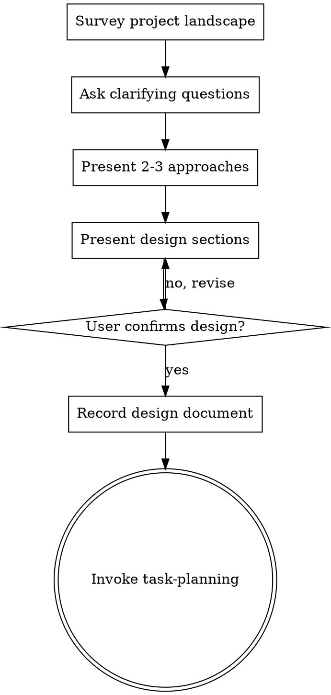

# Turning Ideas Into Actionable Designs

## Overview

Guide raw ideas through structured dialogue into fully specified, validated designs. Begin by surveying the existing project landscape, then iteratively refine understanding through targeted questions. Once the design crystallizes, present it for approval.

## The Prime Directive

```
NO IMPLEMENTATION WITHOUT A VALIDATED DESIGN FIRST
```

No exceptions. No workarounds. No shortcuts.

## When to Use

**Required for:**
- Creating new features or components
- Extending existing system capabilities
- Changing how existing code behaves
- Launching new projects or modules
- Rearchitecting or redesigning existing systems

**Skip for:**
- Correcting typos or spelling mistakes
- Updating imports the user has specified exactly
- Configuration changes dictated verbatim by the user
- Removing files the user has explicitly identified
- Executing commands the user has provided exactly

<MANDATORY-CHECKPOINT>
Do NOT invoke any implementation skill, generate any code, scaffold any project, or take any implementation action until a design has been presented and the user has signed off. This applies to EVERY project regardless of apparent simplicity.
</MANDATORY-CHECKPOINT>

## Cognitive Traps

| Rationalization | What Is Actually True |
|----------------|----------------------|
| "This is too trivial for design work" | Trivial projects harbor the most unchallenged assumptions. Even a notes app requires data model, storage, and interaction decisions. |
| "The user gave me exact specifications" | Users articulate goals, not designs. Intent discovery bridges the gap between what someone wants and how to build it. |
| "I already know the optimal approach" | You know *one* approach. Presenting alternatives exposes trade-offs and uncovers blind spots. |
| "Design work will slow us down" | Building the wrong thing is slower. Five minutes of design prevents two hours of rework. |
| "It's just a minor modification" | Minor changes in the wrong direction accumulate. Confirm direction before proceeding. |
| "The user seems eager to start" | Users are eager for *outcomes*, not for *rushing*. A brief design pass builds trust. |

Every project passes through this process. A todo list, a utility function, a config tweak -- all of them. "Simple" projects are precisely where unchallenged assumptions generate the most wasted effort. The design can be brief (a few sentences for genuinely simple work), but you MUST present it and receive approval.

## Checklist

You MUST create a task for each of these items and complete them sequentially:

1. **Survey project landscape** -- examine files, documentation, recent commits
2. **Locate reference material** -- invoke reference-engine skill to route to the appropriate reference system (github-search for external repos and libraries, codebase-research for internal patterns, design-research for visual themes, ux-patterns for UI, or built-in libraries for APIs/schemas/testing/infrastructure)
3. **Ask clarifying questions** -- one per message, understand purpose/constraints/success criteria
4. **Present 2-3 approaches** -- as labeled options (A/B/C) with trade-offs, star the recommendation
5. **Present design** -- in sections proportional to complexity, get user confirmation after each section (YoloMode: present and proceed)
6. **Record design document** -- save to `docs/plans/YYYY-MM-DD-<topic>-design.md` and commit
7. **Hand off to implementation** -- invoke task-planning skill to build the implementation plan

## Workflow Diagram



**The terminal state is invoking task-planning.** Do NOT invoke ui-engineering or any other implementation skill. The ONLY skill you invoke after intent-discovery is task-planning.

## Detailed Process

**Exploring the idea:**
- Review the current project state first (files, documentation, recent commits)
- Pose questions one at a time to sharpen understanding
- Favor multiple-choice questions when practical, but open-ended questions are acceptable
- Limit each message to one question -- if a topic needs deeper exploration, split it across messages
- Concentrate on: purpose, constraints, success criteria

**Researching existing solutions:**
- **REQUIRED SUB-SKILL:** Use ascension:reference-engine to route to the appropriate reference system
- The reference-engine skill routes to: github-search (external repos and libraries), codebase-research (internal codebase patterns), design-research (visual themes), ux-patterns (UI), or its own built-in libraries (APIs, schemas, testing, CI/CD, infrastructure)
- Summarize findings: "Found references from [sources]: [what is relevant]"
- Incorporate into proposals: which references to build on, extract from, or study

**Evaluating approaches:**
- Propose 2-3 distinct approaches as labeled options (A, B, C) with trade-offs
- Mark the recommended option with a star (⭐)
- Lead with the recommended option and explain the rationale
- Reference findings: "Approach A is inspired by github.com/x/y (5k stars, MIT license)"
- **If YoloMode is active:** Still present all options and wait for user selection. Approach selection is never auto-picked.

**Presenting the design:**
- Once you believe the design is clear, present it
- Scale each section to its complexity: a few sentences for straightforward parts, up to 200-300 words for nuanced areas
- Ask after each section whether it looks correct so far
- Cover: architecture, components, data flow, error handling, testing strategy
- Be prepared to revisit and clarify if something is unclear
- **If YoloMode is active:** Present the full design in one pass and proceed to recording, without per-section confirmation. The user trusts the recommendation.

## Visual Companion (Optional)

When a question is genuinely *visual* — comparing layouts, judging look-and-feel, showing wireframes or architecture diagrams — words in the terminal are the wrong medium. A browser-based companion can render mockups and clickable options your human partner selects directly.

- Offer it only when it earns its keep: "would they understand this better by seeing it than reading it?" Requirements, scope, and conceptual A/B/C choices stay in the terminal.
- Ask before launching it (it starts a local web server). It loads no external resources and makes no network requests.
- When approved, follow the full guide: [visual-companion.md](visual-companion.md). Scripts live in `scripts/` (`start-server.sh`, `stop-server.sh`, `server.cjs`). Session files persist under `<project>/.ascension/brainstorm/` — remind your human partner to gitignore `.ascension/`.

## After Design Approval

**Documentation:**
- Write the validated design to `docs/plans/YYYY-MM-DD-<topic>-design.md`
- Commit the design document to version control

**Implementation:**
- Invoke the task-planning skill to produce a detailed implementation plan
- Do NOT invoke any other skill. task-planning is the next step.

## Guardrails

**Never:**
- Skip design for "simple" work -- simplicity is where assumptions hide
- Jump straight to code after hearing the request
- Present only one approach -- always offer 2-3 with trade-offs
- Treat user approval as a rubber stamp -- genuinely integrate feedback
- Begin implementation before the design document is written and committed

**Always:**
- Present 2-3 approaches with trade-offs and a clear recommendation
- Obtain explicit user approval on each design section before advancing
- Write the design document to `docs/plans/` and commit it
- Invoke task-planning as the next step (never an implementation skill)
- Scale design depth to complexity -- brief for simple, thorough for complex

## Guiding Principles

- **One question at a time** - Avoid overwhelming with multiple questions
- **Multiple choice preferred** - Easier to respond to than open-ended when feasible
- **YAGNI ruthlessly** - Strip unnecessary features from every design
- **Explore alternatives** - Always propose 2-3 approaches before committing
- **Incremental validation** - Present design, obtain approval before advancing
- **Stay flexible** - Revisit and clarify when something does not make sense

## Connections

This skill fits into the broader Ascension workflow:

- **task-planning** -- The ONLY next step after intent-discovery. Converts the validated design into an actionable implementation plan.
- **reference-engine** -- Invoked DURING intent-discovery to locate reference implementations, themes, UX patterns, or built-in libraries relevant to the design.
- **github-search** -- Used during research to find existing open-source implementations, libraries, and patterns before building from scratch.
- **codebase-research** -- Used by reference-engine to find internal codebase patterns, conventions, and similar implementations.
- **specification-first** -- For projects requiring formal specifications, the design document produced here feeds into specification-driven workflows.
