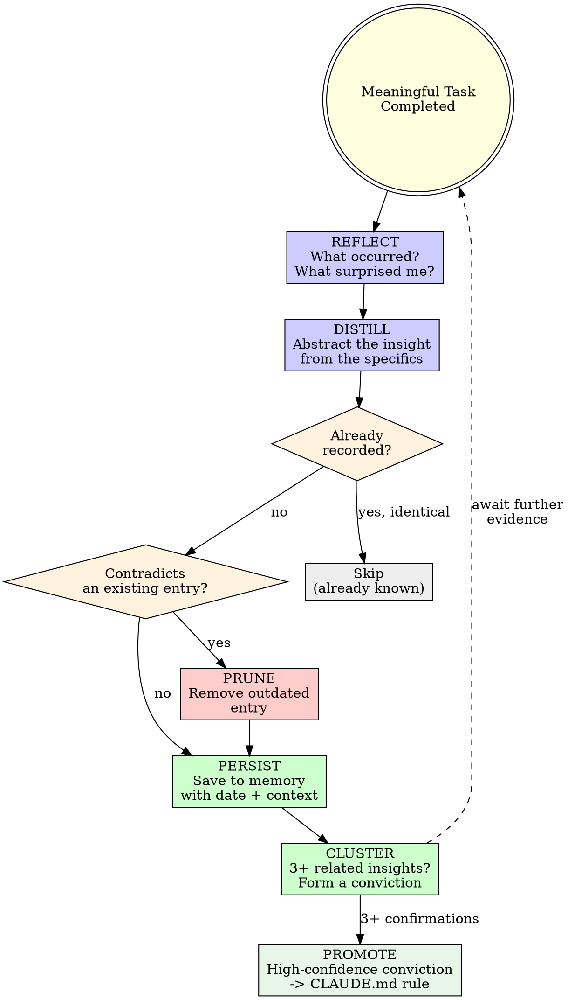

# Knowledge Capture

## Overview

Every substantial interaction yields signal. A debugging session exposes a hidden codebase convention. A user correction reveals a preference. A failed plan uncovers a blind spot. Recording these observations is not overhead -- it is compound interest on capability.

**Core principle:** Solving a difficult problem without recording what you discovered means solving it from zero next time.

**No exceptions. No workarounds. No shortcuts.**

## The Prime Directive

```
EXTRACT INSIGHT FROM EVERY MEANINGFUL INTERACTION
```

An interaction that ends without reflection is a wasted investment. You possessed the context, found the answer, observed what succeeded -- then discarded all of it.

**No excuses:**
- Do not skip capture because the task felt "routine"
- Do not skip capture because you are "about to switch contexts"
- Do not skip capture because the lesson seems "self-evident"
- What feels obvious with full context becomes invisible from a cold start

Reflect. Distill. Persist. Full stop.

## When to Use

**Mandatory after:**
- Delivering a complex feature (which patterns proved effective?)
- Resolving a stubborn defect (what was the root-cause signature?)
- Receiving review feedback that surfaced issues (what should differ next time?)
- Being corrected by the user (new preference discovered)
- Revising a plan significantly (what was misjudged?)
- Discovering a codebase convention through trial and error (spare the next session that journey)

**Exceptions (confirm with the human):**
- One-line trivial fixes
- Interactions that produced no new information
- When the user explicitly declines

Tempted to think "there is nothing to capture here"? Pause. That is rationalization.

## The Entry Protocol

```
AFTER completing any meaningful task:

1. REFLECT: What succeeded? What failed? What was unexpected?
2. DISTILL: What generalizable pattern or insight emerges?
3. DEDUPLICATE: Is this already recorded? Does it contradict something stored?
4. PERSIST: Write it to the appropriate memory file with date and context
5. PRUNE: Remove any prior entries that newer evidence invalidates

Omit any step = insight permanently lost
```

## The Capture Lifecycle



## Categories of Insight

### Effective Patterns

Code approaches, debugging tactics, and architectural choices that led to clean results. These are positive signals to reinforce.

```
Sample entry:
  Date: 2025-04-10
  Context: Built retry logic for third-party webhook delivery
  Insight: Exponential backoff with random jitter eliminated thundering-herd spikes
  Confidence: medium (validated once)
```

### Failures and Their Remedies

What went wrong, how it was resolved, how to prevent recurrence. Failures yield the highest-signal lessons.

```
Sample entry:
  Date: 2025-04-12
  Context: Logging middleware silently swallowed request bodies after refactor
  Insight: Any change to middleware ordering demands a full integration test pass -- blast radius is total
  Confidence: high (validated by production incident)
```

### User Preferences

Stylistic choices, tool preferences, and conventions the user follows. Discovered through corrections and direct statements.

```
Sample entry:
  Date: 2025-04-13
  Context: User corrected my naming approach
  Insight: User requires camelCase for variables, PascalCase for types, and no abbreviations anywhere
  Confidence: high (direct correction)
```

### Project-Specific Knowledge

Architecture details, hidden gotchas, critical files, tribal knowledge that lives nowhere in documentation.

```
Sample entry:
  Date: 2025-04-14
  Context: Spent 15 minutes searching for runtime config
  Insight: All runtime configuration lives in src/config/runtime.ts, not in .env files
  Confidence: high (verified in source)
```

## Storage Mechanism

Leverage Claude Code's memory system: `~/.claude/projects/[project]/memory/`

### Memory File Taxonomy

| File | Purpose | Example Entry |
|---|---|---|
| `effective-patterns.md` | Code approaches and strategies that produced clean outcomes | "Zod schemas at API boundaries catch malformed data before it propagates" |
| `failure-analysis.md` | Root-cause patterns and diagnostic techniques | "Tests passing locally but failing in CI usually indicate timezone or locale assumptions" |
| `project-map.md` | Architecture, key files, and codebase conventions | "Database migrations reside in db/migrations/ and execute via `pnpm db:migrate`" |
| `human-preferences.md` | Stylistic choices, tooling preferences, and conventions the user enforces | "User demands explicit error types; string-based errors are rejected" |

### Entry Structure

Every captured insight must include:

```markdown
### [Concise title]
- **Date:** YYYY-MM-DD
- **Context:** What was happening when this was discovered
- **Insight:** The generalized takeaway
- **Confidence:** low / medium / high
- **Confirmations:** Number of times this has been validated
```

### Deduplication Protocol

Before writing a new entry, scan the target memory file. If the insight already exists:
- Same insight, same confidence level -> skip entirely
- Same insight, elevated confidence -> update confidence and increment confirmation count
- Contradicting insight -> replace the old entry, note the contradiction

## The Maturation Cycle

Isolated insights become powerful when they converge into convictions.

### From Insight to Conviction

```
Insight 1: "This project validates forms with zod" (medium confidence)
Insight 2: "API route handlers also validate payloads with zod" (medium confidence)
Insight 3: "User corrected me for using manual validation instead of zod" (high confidence)

    Converge into conviction

Conviction: "This project ALWAYS validates at every boundary using zod"
Confidence: high (confirmed across 3 interactions)
```

### From Conviction to Rule

When a conviction reaches high confidence (confirmed across 3+ interactions), it becomes eligible for promotion to a project `CLAUDE.md` rule:

```
Conviction: "This project always validates with zod"
  -> Confirmed 3+ times
  -> Propose to user: "I have observed that this project consistently
    uses zod for validation. Should I codify this as a project rule in CLAUDE.md?"
  -> User approves -> add to CLAUDE.md
```

**Never auto-promote.** Always obtain user consent before adding entries to `CLAUDE.md`. The human is the final authority on permanent rules.

### Session-Start Review

When beginning a new session on a project:
1. Read all memory files for the project
2. Identify clusters of related insights that have not been synthesized
3. Flag entries that may be stale (old date, low confidence, never reconfirmed)
4. Surface convictions ready for promotion

## Confidence Tiers

| Tier | Meaning | Origin | Action |
|---|---|---|---|
| **Low** | Tentative signal | Single occurrence, unconfirmed | Record, watch for confirmation |
| **Medium** | Probable pattern | Confirmed twice, or one strong indicator | Record, apply when relevant |
| **High** | Established truth | Confirmed 3+ times, or explicit user declaration | Record, apply consistently, consider promotion |

## Cognitive Traps

| Rationalization | Truth |
|---|---|
| "There is nothing to capture here" | Every task produces signal. You are not examining closely enough. |
| "I will recall this naturally" | You will not. The next session starts with a blank slate. Memory files are your continuity. |
| "Too minor to bother recording" | Minor insights accumulate. Three small observations become one powerful conviction. |
| "It is self-evident" | Self-evident to you now, with full context. Not self-evident when cold-starting next week. |
| "Recording takes too long" | Thirty seconds to write an entry. Thirty minutes to rediscover the same insight. |
| "The user did not request this" | They requested quality. Learning from experience IS how quality improves over time. |
| "Memory files are getting cluttered" | That is a pruning problem, not a recording problem. Prune more; never stop capturing. |
| "This only applies to this one project" | Project-specific knowledge is the MOST valuable kind. That is precisely why it is stored per-project. |

## Guardrails

**Prohibited actions:**
- Skipping reflection after a difficult debugging session
- Storing entries without date and context (undated insights decay)
- Auto-adding rules to CLAUDE.md without user approval
- Recording the same insight twice without deduplication
- Retaining entries that newer evidence contradicts
- Recording implementation minutiae instead of generalizable patterns

**Required actions:**
- Reflect after completing any significant work
- Check memory before persisting (deduplicate)
- Attach confidence levels to every entry
- Obtain user consent before promoting convictions to CLAUDE.md rules
- Prune entries invalidated by newer evidence
- Organize entries by topic, not chronologically

## Integration

**This skill feeds INTO other skills:**

- **ascension:fault-diagnosis** -- Historical failure analysis informs current troubleshooting
- **ascension:pattern-matching** -- Captured conventions reinforce code conformity
- **ascension:test-first** -- Past test failures shape future test strategy
- **ascension:task-planning** -- Past plan failures prevent repeating misjudgments
- **ascension:quality-enforcement** -- Captured quality patterns elevate the baseline

**This skill is fed BY other skills:**

- **ascension:review-response** -- Review feedback becomes captured insights
- **ascension:completion-gate** -- Verification failures become recorded lessons
- **ascension:comprehension-check** -- Walkthrough findings become stored observations
- **ascension:task-runner** -- Plan execution reveals what works and what does not

**The virtuous cycle:**
```
Work -> Capture -> Persist -> Apply -> Work better -> Capture more
```
