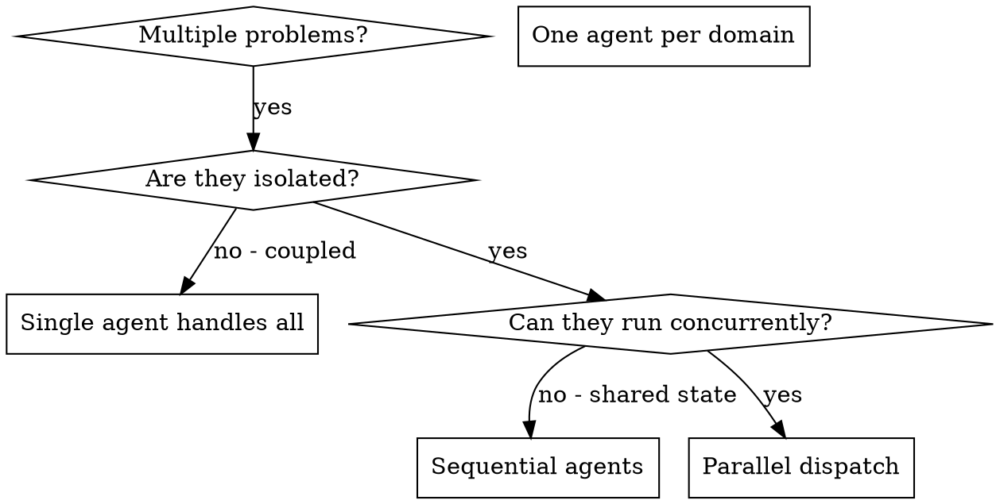

# Parallel Execution

## Overview

When multiple distinct failures appear across separate subsystems, tackling them one after another wastes time. Each investigation is self-contained and can run simultaneously.

**Core principle:** Assign one agent per isolated problem domain. Let them operate concurrently.

## Prime Directive

> **NO CONCURRENT DISPATCH WITHOUT CONFIRMING ISOLATION**

No exceptions. No workarounds. No shortcuts.

## When to Use



**Appropriate when:**
- Three or more test files failing for distinct reasons
- Multiple subsystems broken independently
- Each issue can be understood without knowledge of the others
- No shared mutable state between the work items

**Not appropriate when:**
- Failures are connected (resolving one may resolve others)
- Understanding requires a holistic system view
- Agents would interfere with each other's work

## The Approach

### 1. Map Independent Domains

Classify failures by root cause area:
- Module X tests: Permission validation flow
- Module Y tests: Queue drain behavior
- Module Z tests: Cancellation handling

Each domain is self-contained — fixing permissions has no bearing on cancellation tests.

### 2. Craft Focused Agent Briefs

Each agent receives:
- **Defined scope:** One test file or subsystem
- **Concrete objective:** Get these tests green
- **Boundaries:** Do not modify code outside your scope
- **Deliverable:** Summary of root cause and changes made

### 3. Launch Concurrently

```
// Dispatch parallel agents using the Agent tool in Claude Code
Agent("Fix permission-validation.test.ts failures")
Agent("Fix queue-drain-behavior.test.ts failures")
Agent("Fix cancellation-handling.test.ts failures")
// All three execute at the same time
```

### 4. Reconcile and Verify

When agents complete:
- Study each summary
- Confirm changes do not overlap
- Execute the full test suite
- Integrate all results

## Agent Brief Structure

Effective agent briefs share these qualities:
1. **Narrow** — One clear problem area
2. **Self-sufficient** — Everything needed to understand the issue is included
3. **Output-specified** — The agent knows exactly what to report

```markdown
Resolve the 3 failing tests in src/workers/queue-drain.test.ts:

1. "should drain remaining items on shutdown" - expects empty queue, finds 2 items
2. "should handle mixed priorities during drain" - high-priority item processed last
3. "should report drain metrics accurately" - expects 3 metrics but receives 0

These stem from async drain ordering. Your assignment:

1. Read the test file and understand the intended behavior
2. Determine root cause - ordering bug or stale test assumptions?
3. Fix by:
   - Implementing deterministic drain ordering
   - Correcting production bugs if found
   - Updating test expectations if behavior legitimately changed

Do NOT just add delays or increase timeouts - identify the underlying issue.

Return: Root cause analysis and description of changes made.
```

## Pitfalls

**Too broad:** "Fix all the tests" — the agent loses focus
**Focused:** "Fix queue-drain.test.ts" — narrow scope

**No context:** "Fix the ordering bug" — the agent has no starting point
**Contextual:** Paste error messages and failing test names

**No boundaries:** Agent may restructure unrelated code
**Bounded:** "Do NOT modify production code outside src/workers/"

**Vague output request:** "Fix it" — you have no idea what changed
**Specific output request:** "Return root cause summary and list of modified files"

## Cognitive Traps

| Rationalization | Truth |
|-----------------|-------|
| "They're probably isolated enough" | Confirm isolation explicitly or agents will collide. |
| "We'll reconcile conflicts later" | Merge conflicts from concurrent agents are harder than sequential work. |
| "More agents = faster delivery" | Agents editing shared files = wasted effort and broken merges. |
| "The scope is self-evident" | Vague briefs yield vague outcomes. Specify scope, boundaries, and output. |
| "One agent can handle everything" | An agent with too wide a scope gets lost. Divide by domain. |

## When NOT to Use

**Coupled failures:** Resolving one may cascade fixes to others — investigate holistically first
**Holistic understanding required:** Comprehension demands seeing the full system
**Exploratory debugging:** The problem space is unknown
**Shared resources:** Agents would conflict (same files, same databases, same services)

## Worked Example

**Situation:** 8 test failures across 3 files after a major refactor

**Failures:**
- permission-validation.test.ts: 3 failures (auth token issues)
- queue-drain-behavior.test.ts: 3 failures (ordering bugs)
- cancellation-handling.test.ts: 2 failures (incomplete cleanup)

**Judgment:** Isolated domains — auth validation, queue drain, and cancellation logic are unrelated

**Dispatch:**
```
Agent 1 -> Fix permission-validation.test.ts
Agent 2 -> Fix queue-drain-behavior.test.ts
Agent 3 -> Fix cancellation-handling.test.ts
```

**Outcomes:**
- Agent 1: Replaced hardcoded tokens with dynamic fixtures
- Agent 2: Fixed drain ordering to respect priority field
- Agent 3: Added cleanup hooks for partial cancellation state

**Reconciliation:** All fixes touched separate files, zero conflicts, full suite green

**Value:** Three problems solved concurrently instead of sequentially

## Advantages

1. **Concurrency** — Multiple investigations proceed at once
2. **Concentration** — Each agent manages a small context
3. **Non-interference** — Agents stay out of each other's way
4. **Throughput** — N problems solved in the time of one

## Post-Dispatch Checks

After agents return:
1. **Study each summary** — Understand what changed and why
2. **Detect overlaps** — Did any agents touch the same code?
3. **Run the full suite** — Confirm all fixes coexist
4. **Spot-check** — Agents can introduce systematic errors
5. **Finalize** — REQUIRED SUB-SKILL: Use `ascension:merge-protocol` to land the work

## Guardrails

**Prohibited:**
- Dispatching concurrent agents without verifying task isolation
- Allowing agents to modify the same files simultaneously
- Integrating without reviewing agent summaries
- Using parallel dispatch for exploratory diagnosis
- Dispatching without defined scope, boundaries, and deliverables

**Mandatory:**
- Confirm isolation before dispatching
- Give each agent a narrow, explicit scope
- Include error messages and test names in agent briefs
- Review all agent summaries before integration
- Execute full test suite after integrating all changes
- Check for conflicts between agent outputs

## Integration

**ascension:team-orchestration:**
- Parallel execution is a foundational pattern for team-based work
- Use team orchestration when agents have partial dependencies

**ascension:delegated-execution:**
- Launch parallel agents for independent tasks within a development plan
- Each agent owns one task from the plan

**ascension:agent-messaging:**
- Agents dispatched in parallel should not need inter-agent communication
- If they need to communicate, they are not isolated enough for parallel dispatch
