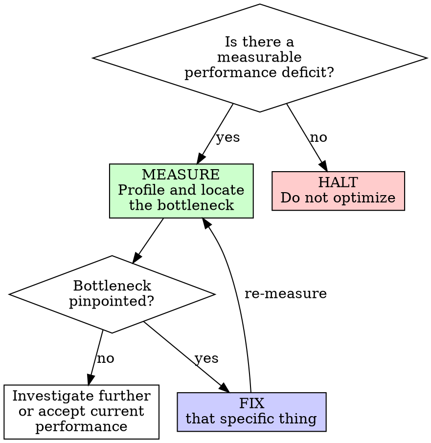

# Performance Tuning

## Overview

Blind optimization is the root of wasted effort. Measure, pinpoint the bottleneck, fix that specific thing.

**Core principle:** No optimization without measurement. No measurement without a demonstrated performance problem.

**No exceptions. No workarounds. No shortcuts.**

## The Prime Directive

```
NO OPTIMIZATION WITHOUT A MEASUREMENT PROVING THE PROBLEM
```

If you have not profiled it, you are not qualified to optimize it. Intuitions about performance are reliably wrong.

## When to Use



**Engage when:**
- Users report perceptible slowness
- Telemetry shows regression (response time, page load, throughput)
- Performance budgets are breached (bundle size, Core Web Vitals)
- Database queries exceed 100ms for routine operations
- API responses exceed 500ms for typical requests

**Do not engage when:**
- "It might be slow someday" (measure when it actually is)
- "Best practice recommends optimizing X" (is X actually slow?)
- Current performance satisfies current requirements
- The feature does not yet work correctly (correctness first)

## The Entry Protocol

```
BEFORE any optimization effort:

1. MEASURE: What is the current performance? (Numbers, not hunches)
2. TARGET: What performance level is required? (Specific threshold)
3. PINPOINT: Where is the bottleneck? (Profiler data, not speculation)
4. FIX: Address that specific bottleneck
5. VERIFY: Did the measurement improve? By how much?

Omit any step = premature optimization
```

## The Methodology

### Phase 1: Establish a Baseline

**You must have numbers before changing anything.**

| Dimension | How to Measure |
|---|---|
| Page load latency | Lighthouse, WebPageTest, browser DevTools Performance panel |
| API response time | Server logs, APM instrumentation, `time curl` |
| Query execution time | `EXPLAIN ANALYZE`, slow query log, ORM query logging |
| Bundle weight | `webpack-bundle-analyzer`, `source-map-explorer` |
| Memory consumption | Heap snapshots, `process.memoryUsage()` |
| CPU utilization | Flame charts via profiler, `perf`, `py-spy` |

Record the baseline. You need it to prove the optimization was effective.

### Phase 2: Locate the Bottleneck

**The bottleneck is almost never where you expect it.**

```
Profile -> identify the function/query/resource consuming the most time
                                    |
                    That is your optimization target
                                    |
                    Everything else is a distraction
```

Check these locations in order (most common first):

1. **Database queries** -- N+1 patterns, absent indexes, full table scans
2. **Network calls** -- Sequential when parallelizable, no caching layer
3. **Serialization** -- Oversized payloads, unnecessary nested data
4. **Computation** -- Suboptimal algorithms, redundant processing
5. **I/O operations** -- File system access, disk reads, external API latency

### Phase 3: Resolve the Bottleneck

**Fix only what the profiler revealed. Change one variable at a time.**

#### Database Tuning

| Symptom | Remedy |
|---|---|
| N+1 queries | Eager loading / JOIN / batched query |
| Missing index | Add index on columns in WHERE/JOIN/ORDER BY clauses |
| Full table scan | Add appropriate index; constrain result set |
| Oversized result sets | Cursor-based pagination for large datasets |
| Expensive aggregations | Materialized views or pre-computed summaries |
| Lock contention | Tighten transaction scope; introduce read replicas |

```sql
-- BEFORE: Diagnose the problem
EXPLAIN ANALYZE SELECT * FROM transactions WHERE account_id = 789;

-- Look for: Seq Scan (missing index), high cost, slow execution
-- AFTER: Add index, re-run EXPLAIN ANALYZE, compare numbers
```

#### Frontend Tuning (Core Web Vitals)

| Metric | Threshold | Typical Remedies |
|---|---|---|
| LCP (Largest Contentful Paint) | < 2.5s | Optimize hero images, preload critical resources, enable SSR |
| INP (Interaction to Next Paint) | < 200ms | Break long tasks, defer non-critical JS, offload to web workers |
| CLS (Cumulative Layout Shift) | < 0.1 | Set explicit dimensions on media, avoid dynamic content insertion above fold |

**Bundle weight reduction:**
```
1. Audit: what occupies space in the bundle?
2. Remove unused dependencies
3. Code-split by route (lazy loading)
4. Ensure ESM imports for tree-shaking
5. Enable compression (gzip/brotli)
```

#### API Tuning

| Symptom | Remedy |
|---|---|
| Over-fetching | Return only requested fields; support sparse fieldsets |
| Under-fetching | Batch endpoints; return compound documents |
| No caching | Add Cache-Control headers and ETags |
| Synchronous heavy processing | Return 202 Accepted with async processing + polling |
| Oversized responses | Paginate, compress, or stream |
| Slow serialization | Profile the serializer; reduce nesting depth |

#### Algorithm Tuning

Only when the profiler points to computation as the bottleneck:

| From | To | When Applicable |
|---|---|---|
| O(n^2) nested loops | Hash map lookup O(n) | Large input sets |
| Repeated computation | Memoization or caching | Same inputs, expensive function |
| Synchronous blocking | Async / parallel execution | I/O-bound work |
| Full recomputation | Incremental update | Small mutations to large datasets |

### Phase 4: Confirm the Improvement

**Re-run the identical measurement. Compare the numbers.**

```
Baseline: API response 920ms
After optimization: API response 145ms
Improvement: 84% reduction
Required threshold: < 500ms -- ACHIEVED
```

If the improvement is not measurable, revert the change. An optimization that cannot be measured is not an optimization.

## Anti-Patterns to Avoid

| Anti-Pattern | Why It Fails | Better Approach |
|---|---|---|
| Premature caching | Adds complexity and stale-data risks | Optimize the query first |
| Premature indexing | Indexes degrade write throughput and consume storage | Add only when a query is demonstrably slow |
| Micro-optimizing tight loops | Saves nanoseconds, destroys readability | Profile first; only touch what the profiler flags |
| "Async all the things" | Adds cognitive complexity, harder debugging | Apply async only to I/O-bound operations |
| Optimizing in dev environment | Dev performance diverges from production | Profile in a production-like environment |
| Caching without invalidation | Stale data, consistency bugs | Design invalidation strategy before adding cache |

## Cognitive Traps

| Rationalization | Truth |
|---|---|
| "This will be slow at scale" | Is it slow NOW? Optimize when evidence arrives. |
| "Best practice says to add an index" | Is the query actually slow? Indexes impose write overhead. |
| "Caching will speed everything up" | Have you measured what is actually slow? Caching adds complexity. |
| "Async will make this faster" | Is this I/O-bound? Async adds mental overhead for no gain on CPU-bound work. |
| "I know where the bottleneck is" | Profilers exist because human intuition about performance is unreliable. Measure. |
| "Quick optimization while I am in here" | Unplanned optimizations are premature by definition. |

## Guardrails -- HALT and Measure

- Optimizing without profiler output on hand
- "While I am here, let me tune this..."
- Adding a cache without measuring what is slow
- Optimizing code that runs once (startup routines, one-time migrations)
- Sacrificing readability for unmeasured performance gains
- Solving scaling problems that do not yet exist
- Applying multiple optimizations simultaneously (isolate impact per change)

**Every item on this list means: HALT. Measure first. Optimize only the measured bottleneck.**

## Integration

**Complementary skills:**
- **ascension:system-design** -- Architectural choices that influence performance characteristics
- **ascension:completion-gate** -- Validate optimization with measurements
- **ascension:quality-enforcement** -- Performance budgets as automated quality gates

## The Bottom Line

```
Measure -> Pinpoint bottleneck -> Fix that one thing -> Confirm improvement
```

Everything else is speculation. Speculation about performance is always wrong.
