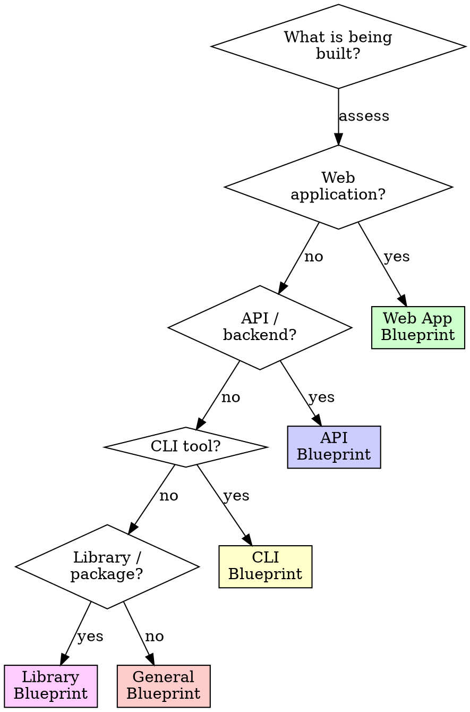

# Project Bootstrap

## Overview

A properly initialized project prevents 80% of future structural headaches.

**Core principle:** Invest 30 minutes in setup now, or spend 30 hours unwinding structural debt later.

**No exceptions. No workarounds. No shortcuts.**

## The Prime Directive

```
NO FEATURE CODE BEFORE PROJECT STRUCTURE IS ESTABLISHED
```

If the project lacks linting, formatting, testing infrastructure, and version control hygiene, address those gaps before writing any business logic.

## When to Use

**Mandatory when:**
- Creating a new project from nothing
- "Just get something running" (especially then)
- Building a prototype that could evolve into production
- Setting up a shared repository for a team

**Also applicable when:**
- Inheriting a project with no structural foundation
- Retrofitting test infrastructure into untested code
- Introducing CI/CD for the first time

## The Entry Protocol

```
BEFORE writing any feature code:

1. STRUCTURE: Is the directory layout established?
2. TOOLING: Are linter, formatter, and type checker wired up?
3. TESTING: Is the test runner configured with a passing placeholder?
4. VERSION CONTROL: Are .gitignore, branch conventions, and hooks set up?
5. DEPENDENCIES: Is the package manager initialized with a committed lockfile?
6. AUTOMATION: Does at minimum a lint + test pipeline exist?

If any answer is NO: fix it first.
```

## Project Classification



Consult `templates.md` for detailed setup checklists per project classification.

## Universal Foundation (All Projects)

### 1. Version Control Hygiene

```
.gitignore          # Language-specific + universal exclusions
.gitattributes      # Line ending normalization, binary file handling
```

**Mandatory .gitignore entries:**
- `node_modules/`, `venv/`, `__pycache__/`, `target/` (dependency directories)
- `.env`, `.env.local`, `.env.*.local` (secrets and credentials)
- `*.log` (log files)
- `.DS_Store`, `Thumbs.db` (OS artifacts)
- IDE directories: `.idea/`, `.vscode/` (unless sharing settings deliberately)
- Build output: `dist/`, `build/`, `out/`

### 2. Static Analysis and Formatting

| Language | Linter | Formatter |
|---|---|---|
| TypeScript/JavaScript | ESLint | Prettier |
| Python | Ruff (lint + format) | Ruff |
| Go | golangci-lint | gofmt (built-in) |
| Rust | clippy | rustfmt (built-in) |
| Ruby | RuboCop | RuboCop |

**Install on day one.** Adopting a linter after 10,000 lines means triaging hundreds of violations on your first run.

### 3. Test Infrastructure

| Language | Framework | Runner |
|---|---|---|
| TypeScript/JavaScript | Vitest or Jest | Built-in |
| Python | pytest | Built-in |
| Go | testing (stdlib) | `go test` |
| Rust | built-in test harness | `cargo test` |
| Ruby | RSpec or Minitest | Built-in |

**Write one passing test immediately.** This confirms the test pipeline functions before you actually need it.

### 4. Type Safety

| Language | Requirement |
|---|---|
| TypeScript | `strict: true` in tsconfig.json. Non-negotiable. |
| Python | Type annotations + mypy or pyright |
| JavaScript | Consider TypeScript. If not, at minimum use JSDoc type annotations. |

### 5. Continuous Integration Minimum

Every project must have at minimum:

```yaml
# Minimum CI pipeline (GitHub Actions example)
on: [push, pull_request]
jobs:
  check:
    steps:
      - lint
      - type-check
      - test
```

If it does not execute in CI, it will not be maintained.

## Directory Structure Principles

**Organize by feature, not by file type** (see `ascension:system-design`).

**Every project requires:**

```
project-root/
  src/              # Source code (or lib/, app/ per convention)
  tests/            # Test files (or co-located alongside source)
  docs/             # Documentation (when applicable)
  scripts/          # Build, deploy, and utility scripts
  .gitignore
  README.md         # Purpose, installation, how to run
  <config files>    # Linter, formatter, CI, package manager
```

**Co-located tests vs separate directory:**
- Co-located (`payment.ts` + `payment.test.ts`): Easier to maintain, preferred default
- Separate (`tests/`): When tests require shared fixtures or team convention mandates it

## Dependency Governance

```
BEFORE adding any dependency:

1. Is it genuinely necessary? Could you write it in under 50 lines?
2. Is it actively maintained?
3. How many transitive dependencies does it introduce?
4. Does it carry known vulnerabilities?

When uncertain, write the code yourself.
```

**Always:**
- Commit lockfiles (`package-lock.json`, `poetry.lock`, `Cargo.lock`)
- Pin major versions, permit patch-level updates
- Execute security audit in CI

## Cognitive Traps

| Rationalization | Truth |
|---|---|
| "It is just a prototype" | Prototypes graduate to production. Initialize properly. |
| "I will add linting later" | After 10,000 lines you will face hundreds of violations. Now is always easier. |
| "Tests decelerate initial development" | Test setup takes 5 minutes. Hunting bugs without tests takes hours. |
| "CI is excessive for this" | CI catches what you forget. Wire it up on day one. |
| "I will organize the files later" | You will not. Directory structure is harder to change than code. |
| "The .gitignore can wait" | One committed .env file means leaked credentials. Configure it first. |

## Guardrails -- HALT and Set Up

- Writing features without a linter configured
- No .gitignore in the repository
- No test framework installed
- Secrets committed to version history (even once, even if deleted -- they persist in git history)
- No README explaining how to run the project
- Build artifacts checked into git
- No CI pipeline
- `any` types everywhere (TypeScript)

**Every item on this list means: halt feature work. Fix the foundation first.**

## Integration

**Complementary skills:**
- **ascension:system-design** -- Directory structure and technology selection
- **ascension:quality-enforcement** -- Quality gates wired into CI from the start
- **ascension:security-protocol** -- Secrets management and .gitignore discipline
- **ascension:ux-patterns** -- Design system initialization for UI projects

## The Bottom Line

```
30 minutes of setup now > 30 hours of structural debt later
```

Linter. Formatter. Tests. CI. .gitignore. README. Before the first feature. Every single time.
