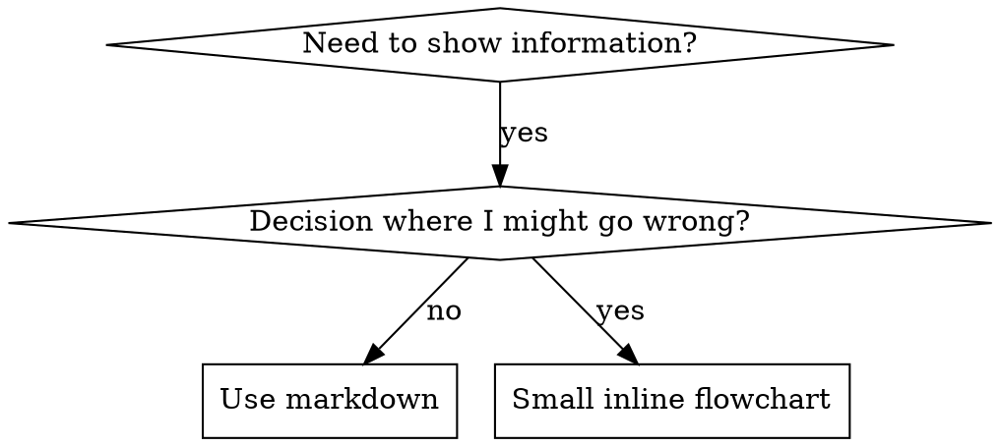

# Protocol Authoring

## Overview

**Authoring protocols IS Test-Driven Development applied to process documentation.**

**Personal protocols live in agent-specific directories (`~/.claude/skills` for Claude Code, `~/.agents/skills/` for Codex)**

You design test scenarios (pressure-based exercises with subagents), observe failure (baseline behavior), author the protocol (documentation), observe compliance (agents follow the protocol), and harden (seal loopholes).

**Core principle:** If you never observed an agent fail without the protocol, you cannot know what the protocol needs to prevent.

**REQUIRED BACKGROUND:** You MUST understand ascension:test-first before using this skill. That skill defines the foundational RED-GREEN-REFACTOR cycle. This skill adapts TDD to documentation.

## What is a Protocol?

A **protocol** is a reference guide for proven techniques, patterns, or tools. Protocols help future Claude instances discover and apply effective approaches.

**Protocols are:** Reusable techniques, patterns, tools, reference guides

**Protocols are NOT:** Narratives about how you solved something once

## TDD Mapping for Protocols

| TDD Concept | Protocol Creation |
|-------------|-------------------|
| **Test case** | Pressure scenario with subagent |
| **Production code** | Protocol document (SKILL.md) |
| **Test fails (RED)** | Agent breaks rule without protocol (baseline) |
| **Test passes (GREEN)** | Agent complies when protocol is present |
| **Refactor** | Seal loopholes while maintaining compliance |
| **Write test first** | Run baseline scenario BEFORE authoring protocol |
| **Watch it fail** | Record exact rationalizations the agent uses |
| **Minimal code** | Author protocol addressing those specific violations |
| **Watch it pass** | Confirm agent now complies |
| **Refactor cycle** | Discover new rationalizations, plug them, re-verify |

The entire protocol creation process follows RED-GREEN-REFACTOR.

## When to Create a Protocol

**Create when:**
- The technique was not intuitively obvious to you
- You would reference this again across multiple projects
- The pattern applies broadly (not project-specific)
- Others would benefit from it

**Do not create for:**
- One-off solutions
- Standard practices well-documented elsewhere
- Project-specific conventions (put those in CLAUDE.md)
- Mechanical constraints (if enforceable with regex or validation, automate it — save documentation for judgment calls)

## Protocol Categories

### Technique
Concrete method with steps to follow (event-based-waiting, root-cause-tracing)

### Pattern
Cognitive framework for approaching problems (flatten-with-flags, test-invariants)

### Reference
API documentation, syntax guides, tool documentation (office docs)

## Directory Layout

```
skills/
  protocol-name/
    SKILL.md              # Primary reference (required)
    supporting-file.*     # Only when necessary
```

**Flat namespace** — all protocols in one searchable namespace

**Separate files for:**
1. **Dense reference material** (100+ lines) — API docs, comprehensive syntax
2. **Reusable tools** — Scripts, utilities, templates

**Keep inline:**
- Principles and concepts
- Code patterns (under 50 lines)
- Everything else

## SKILL.md Structure

**Frontmatter (YAML):**
- Only two fields supported: `name` and `description`
- Max 1024 characters total
- `name`: Letters, numbers, and hyphens only (no parentheses or special characters)
- `description`: Third-person, describes ONLY when to use (NOT what it does)
  - Start with "Use when..." to focus on trigger conditions
  - Include specific symptoms, situations, and contexts
  - **NEVER summarize the protocol's process or workflow** (see Discovery Optimization section)
  - Keep under 500 characters if possible

```markdown
---
name: Protocol-Name-With-Hyphens
description: Use when [specific trigger conditions and symptoms]
---

# Protocol Name

## Overview
What is this? Core principle in 1-2 sentences.

## When to Use
[Small inline flowchart IF decision non-obvious]

Bullet list with SYMPTOMS and use cases
When NOT to use

## Core Pattern (for techniques/patterns)
Before/after code comparison

## Quick Reference
Table or bullets for scanning common operations

## Implementation
Inline code for simple patterns
Link to file for dense reference or reusable tools

## Common Mistakes
What goes wrong + fixes

## Real-World Impact (optional)
Concrete results
```

## Discovery Optimization

**Critical for visibility:** Future Claude instances must FIND your protocol.

### 1. Rich Description Field

**Purpose:** Claude reads the description to decide which protocols to load. Make it answer: "Should I read this protocol right now?"

**Format:** Start with "Use when..." focusing on trigger conditions.

**CRITICAL: Description = When to Use, NOT What the Protocol Does**

The description should ONLY describe trigger conditions. Do NOT summarize the protocol's workflow.

**Why this matters:** Testing revealed that when a description summarizes the workflow, Claude may follow the description instead of reading the full protocol. A description mentioning "review between tasks" caused Claude to perform ONE review, even though the protocol's flowchart clearly showed TWO reviews (spec compliance then code quality).

When the description was changed to just "Use when executing implementation plans with independent tasks" (no workflow summary), Claude correctly read the flowchart and followed the two-stage review process.

**The trap:** Descriptions that summarize workflow create a shortcut Claude will take. The protocol body becomes documentation Claude skips.

```yaml
# BAD: Summarizes workflow - Claude may follow this instead of reading protocol
description: Use when executing plans - launches subagent per task with review between tasks

# BAD: Too much process detail
description: Use for TDD - write test first, watch it fail, write minimal code, refactor

# GOOD: Just trigger conditions, no workflow summary
description: Use when executing implementation plans with independent tasks in the current session

# GOOD: Trigger conditions only
description: Use when implementing any feature or bugfix, before writing implementation code
```

**Content:**
- Use concrete triggers, symptoms, and situations that signal this protocol applies
- Describe the *problem* (race conditions, inconsistent behavior) not *technology-specific symptoms* (setTimeout, sleep)
- Keep triggers technology-agnostic unless the protocol itself is technology-specific
- If protocol is technology-specific, make that explicit
- Write in third person (injected into system prompt)
- **NEVER summarize the protocol's process or workflow**

```yaml
# BAD: Too abstract, vague, no trigger conditions
description: For async testing

# BAD: First person
description: I can help you with async tests when they're flaky

# BAD: Mentions technology but protocol isn't specific to it
description: Use when tests use setTimeout/sleep and are flaky

# GOOD: Starts with "Use when", describes problem, no workflow
description: Use when tests have race conditions, timing dependencies, or pass/fail inconsistently

# GOOD: Technology-specific protocol with explicit trigger
description: Use when using React Router and handling authentication redirects
```

### 2. Keyword Coverage

Use words Claude would search for:
- Error messages: "Hook timed out", "ENOTEMPTY", "race condition"
- Symptoms: "flaky", "hanging", "zombie", "pollution"
- Synonyms: "timeout/hang/freeze", "cleanup/teardown/afterEach"
- Tools: Actual commands, library names, file types

### 3. Descriptive Naming

**Use active voice, verb-first:**
- `creating-protocols` not `protocol-creation`
- `event-based-waiting` not `async-test-helpers`

**Gerunds (-ing) work well for processes:**
- `creating-protocols`, `validating-protocols`, `debugging-with-logs`
- Active, describes the action being taken

### 4. Token Efficiency (Critical)

**Problem:** Getting-started and frequently-referenced protocols load into EVERY conversation. Every token counts.

**Target word counts:**
- Getting-started workflows: <150 words each
- Frequently-loaded protocols: <200 words total
- Other protocols: <500 words (still be concise)

**Techniques:**

**Defer details to tool help:**
```bash
# BAD: Document all flags in SKILL.md
search-conversations supports --text, --both, --after DATE, --before DATE, --limit N

# GOOD: Reference --help
search-conversations supports multiple modes and filters. Run --help for details.
```

**Use cross-references:**
```markdown
# BAD: Repeat workflow details
When searching, dispatch subagent with template...
[20 lines of repeated instructions]

# GOOD: Reference other protocol
Always use subagents (50-100x context savings). REQUIRED: Use [other-protocol-name] for workflow.
```

**Compress examples:**
```markdown
# BAD: Verbose example (42 words)
your human partner: "How did we handle authentication errors in React Router before?"
You: I'll search past conversations for React Router authentication patterns.
[Dispatch subagent with search query: "React Router authentication error handling 401"]

# GOOD: Minimal example (20 words)
Partner: "How did we handle auth errors in React Router?"
You: Searching...
[Dispatch subagent -> synthesis]
```

**Eliminate redundancy:**
- Do not repeat what is in cross-referenced protocols
- Do not explain what is obvious from the command
- Do not include multiple examples of the same pattern

**Verification:**
```bash
wc -w skills/path/SKILL.md
# getting-started workflows: aim for <150 each
# Other frequently-loaded: aim for <200 total
```

**Name by what you DO or the core insight:**
- `event-based-waiting` > `async-test-helpers`
- `using-protocols` not `protocol-usage`
- `flatten-with-flags` > `data-structure-refactoring`
- `root-cause-tracing` > `debugging-techniques`

### 5. Cross-Referencing Other Protocols

**When writing documentation that references other protocols:**

Use protocol name only, with explicit requirement markers:
- GOOD: `**REQUIRED SUB-PROTOCOL:** Use ascension:test-first`
- GOOD: `**REQUIRED BACKGROUND:** You MUST understand ascension:fault-diagnosis`
- BAD: `See skills/testing/test-first` (unclear if required)
- BAD: `@skills/testing/test-first/SKILL.md` (force-loads, burns context)

**Why no @ links:** `@` syntax force-loads files immediately, consuming 200k+ context before you need them.

## Flowchart Usage



**Use flowcharts ONLY for:**
- Non-obvious decision points
- Process loops where you might terminate too early
- "When to use A vs B" decisions

**Never use flowcharts for:**
- Reference material -> Tables, lists
- Code examples -> Markdown blocks
- Linear instructions -> Numbered lists
- Labels without semantic meaning (step1, helper2)

See `graphviz-conventions.dot` in this directory for graphviz style rules.

**Visualizing for your human partner:** Use `render-graphs.js` in this directory to render a protocol's flowcharts to SVG:
```bash
./render-graphs.js ../some-protocol           # Each diagram separately
./render-graphs.js ../some-protocol --combine # All diagrams in one SVG
```

## Code Examples

**One outstanding example beats many mediocre ones**

Choose the most relevant language:
- Testing techniques -> TypeScript/JavaScript
- System debugging -> Shell/Python
- Data processing -> Python

**Strong example:**
- Complete and runnable
- Well-commented explaining WHY
- From a real scenario
- Shows the pattern clearly
- Ready to adapt (not a generic template)

**Avoid:**
- Implementing in 5+ languages
- Creating fill-in-the-blank templates
- Writing contrived examples

You are skilled at porting — one strong example is sufficient.

## File Organization

### Self-Contained Protocol
```
defense-in-depth/
  SKILL.md    # Everything inline
```
When: All content fits, no dense reference needed

### Protocol with Reusable Tool
```
event-based-waiting/
  SKILL.md    # Overview + patterns
  example.ts  # Working helpers to adapt
```
When: Tool is reusable code, not just narrative

### Protocol with Dense Reference
```
pptx/
  SKILL.md       # Overview + workflows
  pptxgenjs.md   # 600 lines API reference
  ooxml.md       # 500 lines XML structure
  scripts/       # Executable tools
```
When: Reference material too large for inline

## The Prime Directive (Same as TDD)

```
NO PROTOCOL WITHOUT A FAILING TEST FIRST
```

This applies to NEW protocols AND EDITS to existing protocols.

Author before testing? Delete it. Start over.
Edit without testing? Same violation.

**No exceptions:**
- Not for "simple additions"
- Not for "just adding a section"
- Not for "documentation updates"
- Do not keep untested changes as "reference"
- Do not "adapt" while running tests
- Delete means delete

**REQUIRED BACKGROUND:** The ascension:test-first protocol explains why this matters. Same principles apply to documentation.

## Testing All Protocol Types

Different protocol types require different test approaches:

### Discipline-Enforcing Protocols (rules/requirements)

**Examples:** TDD, completion-gate, design-before-coding

**Test with:**
- Academic questions: Do they understand the rules?
- Pressure scenarios: Do they comply under stress?
- Multiple pressures combined: time + sunk cost + exhaustion
- Identify rationalizations and add explicit counters

**Success criteria:** Agent follows the rule under maximum pressure

### Technique Protocols (how-to guides)

**Examples:** event-based-waiting, root-cause-tracing, defensive-programming

**Test with:**
- Application scenarios: Can they apply the technique correctly?
- Variation scenarios: Do they handle edge cases?
- Missing information tests: Do the instructions have gaps?

**Success criteria:** Agent successfully applies technique to a new scenario

### Pattern Protocols (mental models)

**Examples:** reducing-complexity, information-hiding concepts

**Test with:**
- Recognition scenarios: Do they recognize when the pattern applies?
- Application scenarios: Can they use the mental model?
- Counter-examples: Do they know when NOT to apply?

**Success criteria:** Agent correctly identifies when and how to apply the pattern

### Reference Protocols (documentation/APIs)

**Examples:** API documentation, command references, library guides

**Test with:**
- Retrieval scenarios: Can they find the right information?
- Application scenarios: Can they use what they found correctly?
- Gap testing: Are common use cases covered?

**Success criteria:** Agent finds and correctly applies reference information

## Cognitive Traps for Skipping Testing

| Rationalization | Truth |
|-----------------|-------|
| "Protocol is obviously clear" | Clear to you does not mean clear to other agents. Test it. |
| "It's just a reference" | References can have gaps and unclear sections. Test retrieval. |
| "Testing is overkill" | Untested protocols have issues. Always. 15 minutes of testing prevents hours of confusion. |
| "I'll test if problems surface" | Problems mean agents cannot use the protocol. Test BEFORE deploying. |
| "Too tedious to test" | Testing is less tedious than debugging a bad protocol in production. |
| "I'm confident it's solid" | Overconfidence guarantees issues. Test anyway. |
| "Academic review is sufficient" | Reading is not using. Test application scenarios. |
| "No time to test" | Deploying untested protocols wastes more time fixing them later. |

**All of these mean: Test before deploying. No exceptions.**

## Hardening Protocols Against Rationalization

Protocols that enforce discipline (like TDD) must resist rationalization. Agents are sophisticated and will discover loopholes under pressure.

**Reference:** For the underlying influence techniques that make behavior-shaping language actually stick — commitment framing, identity anchoring, social proof, and how to phrase counters — see [persuasion-principles.md](persuasion-principles.md). Use it when a Rationalization Table row keeps getting rationalized away anyway.

### Seal Every Loophole Explicitly

Do not just state the rule — forbid specific workarounds:

```markdown
# Insufficient
Author code before test? Delete it.

# Sufficient
Author code before test? Delete it. Start over.

**No exceptions:**
- Do not keep it as "reference"
- Do not "adapt" it while writing tests
- Do not look at it
- Delete means delete
```

### Preempt "Spirit vs Letter" Arguments

Add a foundational principle early:

```markdown
**No exceptions. No workarounds. No shortcuts.**
```

This closes off the entire class of "I'm following the spirit" rationalizations.

### Build Rationalization Table

Capture rationalizations from baseline testing. Every excuse agents produce goes in the table:

```markdown
| Rationalization | Truth |
|-----------------|-------|
| "Too simple to test" | Simple code breaks. Testing takes 30 seconds. |
| "I'll test afterward" | Tests that pass immediately prove nothing about design. |
| "Tests-after achieve the same result" | Tests-after = "what does this do?" Tests-first = "what should this do?" |
```

### Create Guardrails List

Make it easy for agents to self-check when rationalizing:

```markdown
## Guardrails - HALT and Start Over

- Code before test
- "I already manually tested it"
- "Tests after achieve the same purpose"
- "It's about spirit not ritual"
- "This is different because..."

**All of these mean: Delete code. Start over with TDD.**
```

### Update Description for Violation Symptoms

Add to description: symptoms of when you are ABOUT to violate the rule:

```yaml
description: Use when implementing any feature or bugfix, before writing implementation code
```

## RED-GREEN-REFACTOR for Protocols

Follow the TDD cycle:

### RED: Write Failing Test (Baseline)

Run a pressure scenario with a subagent WITHOUT the protocol. Document exact behavior:
- What choices did they make?
- What rationalizations did they use (verbatim)?
- Which pressures triggered violations?

This is "watch the test fail" — you must observe what agents naturally do before authoring the protocol.

### GREEN: Author Minimal Protocol

Author a protocol that addresses those specific rationalizations. Do not add content for hypothetical cases.

Run the same scenarios WITH the protocol. The agent should now comply.

### REFACTOR: Seal Loopholes

Agent found a new rationalization? Add an explicit counter. Re-test until airtight.

**Testing methodology:** See @testing-skills-with-subagents.md for the complete testing methodology:
- How to design pressure scenarios
- Pressure categories (time, sunk cost, authority, exhaustion)
- Systematic hole-plugging
- Meta-testing techniques

## Anti-Patterns

### Narrative Example
"In session 2025-10-03, we found empty projectDir caused..."
**Why bad:** Too specific, not reusable

### Multi-Language Dilution
example-js.js, example-py.py, example-go.go
**Why bad:** Mediocre quality, maintenance burden

### Code in Flowcharts
```dot
step1 [label="import fs"];
step2 [label="read file"];
```
**Why bad:** Cannot copy-paste, hard to read

### Generic Labels
helper1, helper2, step3, pattern4
**Why bad:** Labels should carry semantic meaning

## STOP: Before Moving to Next Protocol

**After authoring ANY protocol, you MUST STOP and complete the deployment process.**

**Do NOT:**
- Create multiple protocols in batch without testing each
- Move to the next protocol before the current one is verified
- Skip testing because "batching is more efficient"

**The deployment checklist below is MANDATORY for EACH protocol.**

Deploying untested protocols = deploying untested code. It violates quality standards.

## Protocol Creation Checklist (TDD Adapted)

**RED Phase - Write Failing Test:**
- [ ] Create pressure scenarios (3+ combined pressures for discipline protocols)
- [ ] Run scenarios WITHOUT protocol - document baseline behavior verbatim
- [ ] Identify patterns in rationalizations and failures

**GREEN Phase - Author Minimal Protocol:**
- [ ] Name uses only letters, numbers, hyphens (no parentheses or special chars)
- [ ] YAML frontmatter with only name and description (max 1024 chars)
- [ ] Description starts with "Use when..." and includes specific triggers/symptoms
- [ ] Description written in third person
- [ ] Keywords throughout for discoverability (errors, symptoms, tools)
- [ ] Clear overview with core principle
- [ ] Address specific baseline failures identified in RED
- [ ] Code inline OR link to separate file
- [ ] One outstanding example (not multi-language)
- [ ] Run scenarios WITH protocol - verify agents now comply

**REFACTOR Phase - Seal Loopholes:**
- [ ] Identify NEW rationalizations from testing
- [ ] Add explicit counters (if discipline protocol)
- [ ] Build rationalization table from all test iterations
- [ ] Create guardrails list
- [ ] Re-test until airtight

**Quality Checks:**
- [ ] Small flowchart only if decision non-obvious
- [ ] Quick reference table
- [ ] Common mistakes section
- [ ] No narrative storytelling
- [ ] Supporting files only for tools or dense reference

**Deployment:**
- [ ] Commit protocol to git and push to your fork (if configured)
- [ ] Consider contributing back via PR (if broadly useful)

## Discovery Workflow

How future Claude discovers your protocol:

1. **Encounters problem** ("tests are flaky")
3. **Finds PROTOCOL** (description matches)
4. **Scans overview** (is this relevant?)
5. **Reads patterns** (quick reference table)
6. **Loads example** (only when implementing)

**Optimize for this flow** — put searchable terms early and often.

## The Bottom Line

**Creating protocols IS TDD for process documentation.**

Same Prime Directive: No protocol without failing test first.
Same cycle: RED (baseline) -> GREEN (author protocol) -> REFACTOR (seal loopholes).
Same benefits: Higher quality, fewer surprises, airtight results.

If you follow TDD for code, follow it for protocols. It is the same discipline applied to documentation.
