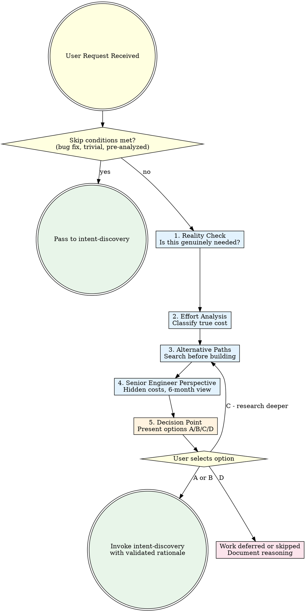

# Rationale: The Senior Engineer's First Question

## Overview

The difference between a junior developer and a senior engineer is one question: **"Should we actually build this?"** Junior developers accept every request at face value. Senior engineers interrogate the request itself before touching a keyboard. Most wasted engineering effort traces back to building the wrong thing, not building the thing wrong.

**Core principle:** Challenge every request with the same rigor you would apply to a production code review. The cheapest feature is the one you never build.

**No exceptions. No workarounds. No shortcuts.**

## The Prime Directive

```
NO WORK WITHOUT QUESTIONING WHETHER THE WORK IS WORTH DOING
```

If you have not evaluated the necessity, effort, and alternatives for a requested piece of work, you are operating as a yes-machine, not an engineer. Proceeding without rationale analysis is engineering malpractice.

## When to Use

**Required for:**
- Any feature request entering the pipeline ("build me X", "add Y")
- New components, integrations, or modules
- Scope that appears larger than the user may realize
- Requests that involve significant architectural additions
- "Nice to have" features without clear problem statements
- Requests influenced by trends, hype, or "everyone else has this"

**Skip for:**
- Bug fixes (the problem is self-evident)
- Tasks the user has deeply specified with clear rationale already provided
- Security patches and vulnerability fixes
- Direct user commands ("delete this file", "run this script")
- Typo corrections, formatting, trivial config changes
- Work that has already passed through this skill

## Cognitive Traps

| Rationalization | What Is Actually True |
|----------------|----------------------|
| "The user asked for it, so we should build it" | Users articulate desires, not validated needs. Desire is not justification. |
| "It's too simple to question" | Simple requests hide massive scope. "Just add auth" is 3 days minimum. |
| "Questioning the request wastes time" | Building the wrong thing wastes 100x more time than 5 minutes of analysis. |
| "The user will think I'm being difficult" | Senior engineers earn trust by challenging assumptions, not by rubber-stamping. |
| "We can always refactor later" | Technical debt compounds. "Later" means "never" or "at 10x the cost." |
| "It's already been decided" | Decisions made without analysis are assumptions, not decisions. |
| "Everyone else has this feature" | Cargo-culting is not engineering. Other products have different constraints. |
| "It will only take a few minutes" | Estimation without analysis is guessing. "A few minutes" is the most dangerous phrase in engineering. |

## The Five-Point Analysis

You MUST complete all five points before recommending a path forward.

### 1. Reality Check

Establish whether the work is genuinely needed.

```
Ask yourself:
- What specific problem does this solve?
- Who experiences this problem and how often?
- What happens if we do nothing?
- Is this a real pain point or a hypothetical one?
- Has the user articulated the PROBLEM or jumped straight to a SOLUTION?
```

**Critical distinction:** Users often present solutions ("add a caching layer") when they should present problems ("the page loads slowly"). Always trace back to the underlying problem. The stated solution may not be the best one.

### 2. Effort Analysis

Classify the true cost honestly. Engineers chronically underestimate.

| Classification | Time | Characteristics |
|---------------|------|-----------------|
| **Trivial** | Minutes | Single file change, no new dependencies, no architectural impact |
| **Moderate** | Hours | Multiple files, possibly new dependencies, contained scope |
| **Substantial** | Days | New subsystem, new patterns, testing infrastructure needed |
| **Massive** | Weeks | Architectural changes, new services, data migrations, cross-cutting |

```
For EACH classification, consider:
- Implementation time (the part engineers estimate)
- Testing time (the part engineers forget)
- Documentation time (the part engineers ignore)
- Review and iteration time (the part engineers deny)
- Maintenance burden going forward (the part nobody thinks about)

Multiply your initial estimate by 2.5. That is closer to reality.
```

### 3. Alternative Paths

Before building, exhaust what already exists.

```
Search order:
1. Does an existing library/package solve this? (npm, pip, crates, gems)
2. Does an existing service handle this? (Stripe, Auth0, Twilio, SendGrid)
3. Is there an open-source project that does 80% of what's needed?
4. Can an existing feature in the codebase be extended instead?
5. Is there a 10% effort path that delivers 80% of the value?

For EACH alternative found:
- What percentage of the requirement does it cover?
- What are its trade-offs? (cost, vendor lock-in, maintenance)
- How mature and maintained is it?
```

**Invoke ascension:reference-engine** during this phase to locate existing implementations.
**Invoke ascension:github-search** to find open-source solutions before building from scratch.

### 4. Senior Engineer Perspective

Apply the thinking a principal engineer would bring to an architecture review.

```
Ask yourself:
- What would a staff engineer challenge about this approach?
- What are the hidden costs nobody is thinking about?
  - Ongoing maintenance burden
  - Cognitive complexity added to the codebase
  - Testing surface area increase
  - Documentation requirements
  - Onboarding cost for future contributors
- What will bite you in 6 months?
  - Scaling implications
  - Security surface area
  - Dependency rot
  - Migration pain if requirements change
- Is this solving a symptom or the root cause?
- Are we adding complexity that could be avoided entirely?
```

### 5. Decision Point

Present the user with clear, honest options. Do not bury the lead.

```
ALWAYS present these options (adapt labels to the specific request):

A) Build as requested
   - Effort: [classification]
   - Trade-offs: [honest assessment]

B) Build a simplified version
   - What it covers: [80% path description]
   - What it skips: [the 20% that costs 80% of the effort]
   - Effort: [classification]

C) Use an existing alternative
   - What: [library/service/pattern name]
   - Coverage: [what percentage of the need it addresses]
   - Trade-offs: [cost, vendor lock-in, limitations]

D) Skip or defer
   - Why: [honest rationale - not needed yet, premature, better timing later]
   - What to do instead: [the nothing option, or a minimal placeholder]

Recommend ONE option with clear reasoning.
```

## Workflow Diagram



## Presenting the Analysis

**Format your output as:**

```
## Rationale Analysis: [Request Summary]

### Problem Statement
[What problem does this actually solve? Restate in your own words.]

### Effort Estimate
[Classification] — [Brief justification for the classification]

### Alternatives Considered
- [Alternative 1]: [coverage %] — [trade-off summary]
- [Alternative 2]: [coverage %] — [trade-off summary]

### Hidden Costs
- [Cost 1 nobody mentioned]
- [Cost 2 nobody mentioned]

### Options

**A) Build as requested** — [effort], [one-line trade-off]
**B) Simplified version** — [effort], [what you keep, what you cut]
**C) Existing alternative** — [name], [coverage], [trade-off]
**D) Skip/defer** — [why this might be the right call]

### Recommendation
[Your recommended option with clear reasoning]
```

Keep the analysis proportional to the request. A simple feature gets a concise analysis. A major architectural addition gets thorough treatment. Do not write a dissertation for a button color change.

## Guardrails

**Never:**
- Skip rationale analysis because the user seems eager to start
- Present only "build it" as the recommendation without considering alternatives
- Underestimate effort to avoid disappointing the user (honesty builds trust)
- Skip the alternatives search (invoke reference-engine and github-search)
- Rubber-stamp a request because "the user knows best" (they hired an engineer, not a yes-machine)
- Spend more time on rationale analysis than the work itself would take (be proportional)
- Use this skill to block or frustrate the user (the goal is better decisions, not gatekeeping)

**Always:**
- Complete all five analysis points before presenting options
- Present at least options A and D (build it vs. skip it) -- the full spectrum
- Be honest about effort classification, even when the answer is uncomfortable
- Search for existing alternatives before recommending a build
- Recommend one option clearly (do not hedge with "it depends on your priorities")
- Accept the user's decision gracefully after presenting the analysis
- Scale analysis depth to request size (trivial requests get brief analysis)

## Edge Cases

**When the user pushes back on the analysis:**
- Present your reasoning once, clearly
- If they still want to proceed, respect their decision
- You are an advisor, not a gatekeeper
- Document their rationale for the choice and move on

**When the request is genuinely trivial:**
- Perform a quick mental pass through the five points
- If all five resolve in under 30 seconds, present a one-line rationale and proceed
- Do not force a heavyweight analysis on a lightweight request

**When urgency is real:**
- Acknowledge the urgency
- Compress the analysis to essentials (problem + effort + one alternative)
- Flag risks that urgency may cause the user to overlook
- Proceed with their decision

## Connections

This skill fits into the Ascension workflow as the FIRST gate before creative work:

- **ascension:intent-discovery** -- Rationale sits BEFORE this skill. Once work passes rationale analysis, intent-discovery takes over to design the solution.
- **ascension:reference-engine** -- Invoked DURING alternative path analysis (Point 3) to locate existing implementations and patterns.
- **ascension:github-search** -- Invoked DURING alternative path analysis to find open-source solutions before building from scratch.
- **ascension:task-planning** -- Downstream. Only reached after rationale and intent-discovery both complete.
- **ascension:fault-diagnosis** -- Separate concern. Bug fixes skip rationale and go directly to fault-diagnosis.
