<EXTREMELY-IMPORTANT>
This is the meta-protocol that governs ALL reference-first behavior. If you are building something and no domain-specific reference protocol exists, this protocol IS your reference system.

YOU MUST LOCATE A REFERENCE BEFORE YOU BUILD. NO EXCEPTIONS.
</EXTREMELY-IMPORTANT>

# Reference Engine: The Universal Reference-First System

## Overview

Every domain has thousands of hours of professional engineering already completed. APIs have been designed, schemas have been refined, pipelines have been battle-tested, patterns have been hardened. Leveraging them as your reference is not laziness — it is engineering intelligence.

**Core principle:** Before building ANYTHING, locate the best existing reference. Extract its patterns. Build on proven foundations, not assumptions.

**No exceptions. No workarounds. No shortcuts.**

## The Prime Directive

```
NO BUILDING WITHOUT A REFERENCE
```

If you have not searched for proven references in the domain you are working in, you are disregarding thousands of hours of professional engineering. A payment API should resemble Stripe's API patterns, not a generic AI-generated endpoint.

## When to Use

**Always.** This protocol is the router. It determines WHICH reference system to engage based on what is being built.

```dot
digraph reference_router {
    rankdir=TB;
    node [shape=box style=filled];

    task [label="Task Received" fillcolor=lightyellow shape=doublecircle];

    classify [label="Classify Task Domain" fillcolor=lightyellow];

    ui [label="UI / Frontend?\n-> ux-patterns\n-> ui-engineering\n-> design-integration" fillcolor="#e8f5e9"];
    website [label="Website Design?\n-> design-research\n-> ux-patterns" fillcolor="#e8f5e9"];
    code [label="Code / Library?\n-> github-search (external)\n-> codebase-research (internal)\n-> pattern-matching" fillcolor="#e8f5e9"];
    api [label="API Design?\n-> API References\n(this protocol)" fillcolor="#fff3e0"];
    database [label="Database / Schema?\n-> Schema References\n(this protocol)" fillcolor="#fff3e0"];
    testing [label="Testing Strategy?\n-> Testing References\n(this protocol)" fillcolor="#fff3e0"];
    devops [label="CI/CD / DevOps?\n-> DevOps References\n(this protocol)" fillcolor="#fff3e0"];
    arch [label="Architecture?\n-> system-design\n-> Architecture References\n(this protocol)" fillcolor="#fff3e0"];
    quality [label="Code Quality?\n-> quality-enforcement\n-> Quality References\n(this protocol)" fillcolor="#fff3e0"];
    perf [label="Performance?\n-> performance-tuning\n-> Perf References\n(this protocol)" fillcolor="#fff3e0"];
    security [label="Security?\n-> security-protocol\n-> Security References\n(this protocol)" fillcolor="#fff3e0"];
    other [label="Other Domain?\n-> Research + Build Reference\n(this protocol)" fillcolor="#fce4ec"];

    task -> classify;
    classify -> ui;
    classify -> website;
    classify -> code;
    classify -> api;
    classify -> database;
    classify -> testing;
    classify -> devops;
    classify -> arch;
    classify -> quality;
    classify -> perf;
    classify -> security;
    classify -> other;
}
```



**Green nodes** = dedicated protocol exists, invoke it.
**Orange nodes** = use reference libraries from THIS protocol.
**Red nodes** = no reference exists yet — research first, then build.

## The Entry Protocol

```
BEFORE building anything:

1. CLASSIFY: What domain is this task in?
2. ROUTE: Does a dedicated reference protocol exist? (ux-patterns, design-research, github-search, codebase-research, etc.)
   -> YES: Invoke that protocol
   -> NO: Continue to step 3
3. SEARCH: Locate reference implementations for this domain
   - External: Use github-search for open-source repos, libraries, and patterns
   - Internal: Use codebase-research for existing conventions and similar code
   - GitHub: Search for gold-standard implementations
   - Documentation: Find official best practices (RFC specs, framework docs, cloud provider guides)
   - Industry leaders: What do Stripe, GitHub, Vercel, AWS do for this?
4. EXTRACT: Isolate the patterns that make these references excellent
5. PRESENT: Show the user your references and recommended approach
6. BUILD: Implement using the reference

Skip any step = building from assumptions instead of knowledge
```

## The Reference Philosophy

```
"Accumulated Expertise" Principle:

Every professional implementation represents:
- Months of design iteration
- Thousands of users providing feedback
- Production incidents that drove improvements
- Security audits that uncovered vulnerabilities
- Performance tuning under real load

When you generate from scratch, you inherit NONE of this.
When you use a reference, you inherit ALL of it.
```

## Domain Reference Libraries

### API Design References

**Gold-standard implementations to study:**

| API Style | Reference | Study For |
|-----------|-----------|-----------|
| REST | Stripe API | Resource naming, versioning, error format, pagination, idempotency |
| REST | GitHub API v3 | Hypermedia, conditional requests, rate limiting headers |
| REST | Twilio API | Nested resources, webhooks, status callbacks |
| GraphQL | GitHub API v4 | Schema design, pagination (connections), error handling |
| GraphQL | Shopify Storefront | Query complexity limits, versioning strategy |
| RPC/gRPC | Google Cloud APIs | Proto design, error model, long-running operations |
| Webhooks | Stripe Webhooks | Event types, signing, retry policy, idempotency |
| Real-time | Discord Gateway | WebSocket lifecycle, heartbeats, reconnection, intents |

**API Reference Checklist:**

```
BEFORE designing any API:

1. Resource naming: Use nouns, plural, lowercase
   Reference: Stripe -> /v1/customers, /v1/payment_intents

2. Error format: Consistent error object
   Reference: Stripe -> { error: { type, code, message, param } }

3. Pagination: Cursor-based for real-time data, offset for static
   Reference: GitHub -> Link headers + per_page + page params
   Reference: Stripe -> has_more + starting_after cursor

4. Versioning: URL path or header
   Reference: Stripe -> /v1/ prefix
   Reference: GitHub -> Accept header with version

5. Auth: API keys for server, OAuth for users
   Reference: Stripe -> Bearer token in Authorization header

6. Rate limiting: Return limits in headers
   Reference: GitHub -> X-RateLimit-Limit, X-RateLimit-Remaining, X-RateLimit-Reset

7. Idempotency: Idempotency keys for mutations
   Reference: Stripe -> Idempotency-Key header

8. Filtering/sorting: Consistent query parameter patterns
   Reference: Stripe -> created[gte]=timestamp, status=active
```

### Database Schema References

**Reference patterns by domain:**

| Domain | Schema Pattern | Source |
|--------|---------------|--------|
| Users & Auth | Users -> Roles -> Permissions (RBAC) | Auth0, Supabase auth schema |
| E-commerce | Products -> Variants -> Orders -> LineItems | Shopify schema, Medusa.js |
| Multi-tenant SaaS | Organizations -> Members -> Resources | Clerk, WorkOS patterns |
| CMS | Content -> Versions -> Media -> Taxonomies | Strapi, Payload CMS schema |
| Social | Users -> Posts -> Comments -> Reactions -> Follows | Mastodon, Lemmy schema |
| Messaging | Conversations -> Participants -> Messages | Matrix protocol, Slack data model |
| Scheduling | Events -> Slots -> Bookings -> Availability | Cal.com schema |
| Analytics | Events -> Sessions -> Properties (star schema) | PostHog, Plausible schema |
| Inventory | Products -> Warehouses -> Stock -> Movements | Odoo inventory module |

**Schema Reference Checklist:**

```
BEFORE designing any database schema:

1. Find the domain pattern above (or search GitHub for "[domain] database schema")
2. Study the reference implementation's:
   - Table relationships and foreign keys
   - Indexing strategy
   - Soft delete approach (deleted_at vs status)
   - Audit trail pattern (created_at, updated_at, created_by)
   - Multi-tenancy approach (row-level vs schema-level)
3. Standard columns for EVERY table:
   - id (UUID or ULID, not auto-increment for distributed systems)
   - created_at (timestamp with timezone)
   - updated_at (timestamp with timezone)
4. Naming convention: snake_case for tables and columns
5. Junction tables: {table_a}_{table_b} alphabetically
```

### Testing Strategy References

**Reference frameworks by project type:**

| Project Type | Testing Approach | Tools |
|-------------|------------------|-------|
| React/Vue/Svelte | Component -> Integration -> E2E | Testing Library + Vitest + Playwright |
| API/Backend | Unit -> Integration -> Contract -> E2E | Jest/Vitest + Supertest + Pact |
| CLI Tool | Unit -> Integration -> Snapshot | Jest + mock-stdin + snapshot testing |
| Library/Package | Unit -> Property-based -> Compatibility | Vitest + fast-check + matrix CI |
| Mobile | Component -> Screen -> E2E | Detox (RN), XCTest (iOS), Espresso (Android) |
| Data Pipeline | Unit -> Integration -> Data quality | Great Expectations, dbt tests |
| Infrastructure | Plan -> Apply -> Verify | Terratest, kitchen-terraform |

**Testing Reference Checklist:**

```
BEFORE writing tests:

1. Identify project type -> select testing approach above
2. Test pyramid for this project:
   - Unit tests: 70% (fast, isolated, mock dependencies)
   - Integration tests: 20% (real dependencies, test interactions)
   - E2E tests: 10% (user flows, critical paths only)
3. What to test:
   - Happy path (minimum viable test)
   - Edge cases from spec (empty, null, max, concurrent)
   - Error paths (invalid input, network failure, timeout)
   - Security paths (injection, auth bypass, privilege escalation)
4. What NOT to test:
   - Framework internals (React renders correctly)
   - Third-party library behavior (axios sends requests)
   - Implementation details (internal state shape)
5. Test naming: describe("[unit]", () => it("should [behavior] when [condition]"))
6. Test data: Use factories/fixtures, not inline magic values
```

### CI/CD Pipeline References

**Reference pipelines by platform:**

| Platform | Source | Key Patterns |
|----------|--------|--------------|
| GitHub Actions | github/starter-workflows | Matrix builds, caching, artifact upload |
| GitHub Actions | Vercel's Next.js workflow | Preview deploys, environment protection |
| GitLab CI | gitlab-org/gitlab | Multi-stage, DAG pipelines, includes |
| CircleCI | circleci/circleci-docs | Orbs, workspace persistence |
| AWS | aws-actions/* | OIDC auth, CodeBuild, ECS deploy |
| GCP | google-github-actions/* | Workload Identity, Cloud Run deploy |

**CI/CD Reference Checklist:**

```
BEFORE setting up CI/CD:

1. Standard pipeline stages:
   Install -> Lint -> Type Check -> Test -> Build -> Deploy

2. Caching strategy:
   - Node: cache node_modules with package-lock.json hash
   - Python: cache .venv with requirements.txt hash
   - Go: cache go/pkg/mod with go.sum hash
   - Rust: cache target/ with Cargo.lock hash

3. Required checks before merge:
   - All tests pass
   - Linting passes
   - Type checking passes
   - Build succeeds
   - Security audit passes (npm audit, pip audit)

4. Deployment strategy:
   - Preview deploys for PRs (Vercel, Netlify, or custom)
   - Staging auto-deploy from main
   - Production manual approval or tag-based

5. Secrets management:
   - Use platform secret stores (GitHub Secrets, Vault)
   - Never echo secrets in logs
   - Rotate on compromise
```

### Code Pattern References

**Reference implementations by language/framework:**

| Pattern | Source | When to Use |
|---------|--------|-------------|
| Error handling (TS) | Effect-TS, neverthrow | Typed errors, Result pattern |
| Error handling (Go) | Standard library | errors.Is/As, wrapping, sentinel errors |
| Error handling (Rust) | thiserror + anyhow | Custom error types + context |
| State machines | XState, Robot | Complex UI state, workflows |
| Event sourcing | EventStoreDB examples | Audit trails, temporal queries |
| CQRS | Axon Framework examples | Read/write separation at scale |
| Repository pattern | Spring Data, TypeORM | Data access abstraction |
| Middleware pattern | Express, Koa, Hono | Request pipeline, cross-cutting concerns |
| Plugin system | Vite, ESLint, Webpack | Extensibility, hooks |
| Queue/worker | BullMQ, Celery | Background jobs, async processing |
| Pub/sub | Redis Streams, NATS | Event-driven communication |
| Rate limiting | Upstash ratelimit | API protection, fair usage |
| Feature flags | Unleash, LaunchDarkly SDK | Progressive rollout, A/B testing |
| Caching | Redis patterns, SWR | Performance, stale-while-revalidate |

**Code Pattern Reference Checklist:**

```
BEFORE implementing a pattern:

1. Identify the pattern needed from the table above
2. Search GitHub for the reference implementation
3. Study HOW it implements the pattern:
   - What's the public API? (how do consumers use it?)
   - What's the internal structure? (how is it organized?)
   - How does it handle errors?
   - How does it handle edge cases?
4. Extract the minimal pattern for your use case
5. Implement following the reference structure
```

### Architecture References

**Reference architectures by scale:**

| Scale | Architecture | Source |
|-------|-------------|--------|
| Solo/MVP | Monolith + managed DB | Rails, Django, Next.js full-stack |
| Small team | Modular monolith | Shopify's approach (components), Laravel modules |
| Growing | Monolith -> extract services | Segment's centrifuge pattern |
| Scale | Microservices + event bus | Netflix OSS, Uber's domain-oriented |
| Serverless | Functions + managed services | SST (sst.dev) patterns, Vercel's architecture |
| Edge | Edge compute + CDN | Cloudflare Workers patterns, Deno Deploy |

### Security References

**Reference implementations by concern:**

| Concern | Source | Key Patterns |
|---------|--------|--------------|
| Authentication | Auth.js (NextAuth) | Session strategy, provider pattern, CSRF protection |
| Authorization | CASL, Casbin | ABAC/RBAC policies, permission checking |
| Input validation | Zod, Valibot | Schema validation at boundaries |
| Rate limiting | Upstash ratelimit | Sliding window, token bucket |
| CORS | Express CORS middleware | Allowlist origins, credentials handling |
| CSP | Helmet.js | Content-Security-Policy headers |
| Secrets | 1Password CLI, Vault | Secret rotation, zero-trust access |
| Encryption | libsodium, Web Crypto | Envelope encryption, key derivation |

### DevOps / Infrastructure References

**Reference patterns by provider:**

| Provider | Source | Covers |
|----------|--------|--------|
| AWS | aws-samples/* | VPC, ECS, Lambda, RDS, S3 patterns |
| GCP | GoogleCloudPlatform/* | Cloud Run, GKE, Pub/Sub, Firestore |
| Azure | Azure-Samples/* | App Service, Functions, Cosmos DB |
| Kubernetes | kubernetes/examples | Deployments, services, ingress, HPA |
| Terraform | hashicorp/terraform-provider-* | Module patterns, state management |
| Docker | docker/awesome-compose | Multi-service compose patterns |
| Monitoring | grafana/grafana | Dashboard templates, alert rules |

### Documentation References

| Doc Type | Source | Study For |
|----------|--------|-----------|
| API docs | Stripe docs | Clear examples, language tabs, copy-paste ready |
| README | Best-of-breed GitHub READMEs | Badges, quick start, feature list, contributing |
| Architecture | arc42, C4 model | Decision records, context diagrams |
| Runbooks | PagerDuty runbooks | Incident response, escalation |
| Changelogs | Keep a Changelog | Versioning, categorization |

## The Research Process

When no specific reference library above covers your domain:

```
1. GitHub Search:
   - "[domain] [language] example" (e.g., "payment processing typescript example")
   - "[domain] boilerplate" or "[domain] starter"
   - Sort by stars, filter to recently updated

2. Official Documentation:
   - Framework guides (Next.js docs, Django docs, Rails guides)
   - Cloud provider best practices (AWS Well-Architected, GCP Architecture Center)
   - RFC specifications (for protocols, standards)

3. Industry Leaders:
   - What does Stripe do for payments?
   - What does GitHub do for API design?
   - What does Vercel do for deployment?
   - What does Cloudflare do for edge computing?

4. Open Source Implementations:
   - Search for mature, well-maintained projects in the same domain
   - Examine how they structure their code
   - Cherry-pick patterns from 3+ implementations
```

## Multi-Reference Cherry-Picking

The best results come from combining references from multiple sources:

```
Example: Building a SaaS billing system

Reference 1 (Stripe API patterns):
  -> Take: Resource naming, error format, idempotency
  -> Take: Webhook event structure and signing

Reference 2 (Lago open-source billing):
  -> Take: Usage-based metering data model
  -> Take: Invoice generation pipeline

Reference 3 (Supabase auth schema):
  -> Take: Multi-tenant organization structure
  -> Take: Row-level security patterns

Reference 4 (Cal.com):
  -> Take: Subscription lifecycle state machine
  -> Take: Webhook delivery with retry logic

Result: A billing system built on patterns from 4 production-tested systems,
each designed by teams who spent months on exactly these problems.
```

## Reference Quality Criteria

Not all references are equal. Evaluate by:

| Criterion | Weight | What to Check |
|-----------|--------|---------------|
| Production usage | High | Is this deployed in production by real organizations? |
| Community size | High | Stars, contributors, download counts |
| Maintenance | High | Recent commits, responsive issue handling |
| Documentation | Medium | Are patterns documented and explained? |
| Test coverage | Medium | Does the reference have strong tests? |
| Security audited | Medium | Has it passed security review? |
| Simplicity | Medium | Is the pattern minimal and clear? |
| Portability | Low | Can the pattern be adapted to other stacks? |

## Cognitive Traps

| Rationalization | Truth |
|-----------------|-------|
| "I know how to build this" | You know how to build A version. References give you the BEST version. |
| "This is too simple for a reference" | Simple things done wrong compound. A bad schema pattern affects every query forever. |
| "I'll consult references later" | Research FIRST. Structural decisions made early are hardest to reverse. |
| "The user didn't request research" | They requested quality. References ARE how you deliver quality. |
| "There's no reference for this" | There is always a reference. Adjacent domains, similar patterns, analogous systems. |
| "References slow me down" | Building the wrong thing slows you down MORE. |
| "I can improve on the reference" | Prove it. Show the reference first, then propose improvements. |
| "AI can generate strong patterns" | AI generates plausible patterns. Plausible does not mean production-tested. |

## Guardrails

**Prohibited:**
- Generating API designs without studying Stripe/GitHub/Twilio patterns
- Creating database schemas without locating domain-specific references
- Setting up CI/CD without examining starter workflows
- Implementing security without studying auth library patterns
- Writing tests without a testing strategy reference
- Choosing architecture without studying reference architectures

**Mandatory:**
- Locate at least 2 reference implementations before building
- Cherry-pick from 3+ sources for complex systems
- Present your references and approach to the user
- Explain WHY you chose specific patterns from specific references
- Update references when you discover superior ones

## Integration

**This protocol is the ROUTER. It invokes other protocols:**

- **ascension:ux-patterns** — UI/UX references
- **ascension:design-research** — Website design references
- **ascension:github-search** — External code and library research (GitHub, package registries, open-source ecosystems)
- **ascension:codebase-research** — Internal codebase pattern matching (conventions, similar files, existing implementations)
- **ascension:system-design** — Architecture decision references
- **ascension:quality-enforcement** — Quality standard references
- **ascension:security-protocol** — Security pattern references
- **ascension:performance-tuning** — Performance references
- **ascension:project-bootstrap** — Project structure references

**Invoked by:**
- **ascension:intent-discovery** — During the "what exists?" phase
- **ascension:specification-first** — To inform specs with proven patterns
- **ascension:task-planning** — To ground plans in reality

**The hierarchy:**
```
reference-engine (this protocol - the universal router)
+-- ux-patterns (UI/UX domain)
+-- design-research (website design domain)
+-- github-search (external code research domain)
+-- codebase-research (internal code pattern domain)
+-- system-design (structural design domain)
+-- quality-enforcement (quality domain)
+-- security-protocol (security domain)
+-- performance-tuning (performance domain)
+-- project-bootstrap (structure domain)
+-- [this protocol's built-in libraries] (API, DB, testing, CI/CD, DevOps, docs)
```
