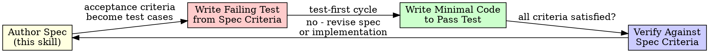

# Specification First

## Overview

Author the specification before the implementation. The specification is the source of truth. Code is generated to satisfy the specification, never the reverse.

**Core principle:** A behavior specification defines WHAT the system does. Code implements HOW. Without a specification, you are guessing.

**No exceptions. No workarounds. No shortcuts.**

## The Prime Directive

```
NO IMPLEMENTATION WITHOUT A SPECIFICATION FIRST
```

If you have not produced a specification defining inputs, outputs, edge cases, and acceptance criteria, you are not authorized to write code. This is not optional. This is not excessive. This prevents the leading cause of AI-generated code failures: building the wrong thing.

## When to Use

**Mandatory when:**
- Developing a new feature or module
- Creating an API endpoint
- Constructing a data pipeline
- Building any system with defined inputs and outputs
- The user says "build me X" or "create Y"

**Exceptions (confirm with the human):**
- Configuration changes
- Single-line defect fixes with unambiguous behavior
- Documentation updates

## The Entry Protocol

```
BEFORE writing any implementation code:

1. IDENTIFY: What are the inputs?
2. DEFINE: What are the expected outputs?
3. CONSTRAIN: What are the boundaries and limitations?
4. EDGE: What happens at the edges? (empty, null, maximum, concurrent)
5. ACCEPT: What criteria demonstrate correctness?
6. WRITE: Produce the specification document
7. APPROVE: Obtain user confirmation
8. ONLY THEN: Implement

Omit any step = building the wrong thing
```

## Specification Document Template

```markdown
# [Feature Name] Specification

## Purpose
[Single sentence: what this does and why it exists]

## Inputs
| Input | Type | Required | Constraints | Default |
|-------|------|----------|-------------|---------|
| [name] | [type] | [yes/no] | [validation rules] | [default] |

## Outputs
| Scenario | Output | Shape |
|----------|--------|-------|
| Success | [what is returned] | [type/structure] |
| Invalid input | [error response] | [error shape] |
| Not found | [404 response] | [error shape] |

## Behavior

### Standard Path
1. [Step-by-step behavior for normal usage]
2. [Include state mutations, side effects]

### Edge Cases
| Case | Input | Expected Behavior |
|------|-------|-------------------|
| Empty input | "" | Return validation error |
| Maximum length | 10000 chars | Truncate to 5000 |
| Concurrent access | 2 simultaneous requests | Serialize second request |
| [case] | [input] | [behavior] |

## Acceptance Criteria
- [ ] [Criterion 1 - testable, specific]
- [ ] [Criterion 2 - testable, specific]
- [ ] [Criterion 3 - testable, specific]

## Explicitly Excluded (YAGNI)
- [Feature intentionally omitted]
- [Optimization intentionally deferred]
```

## Relationship with Test-First Development



**Specification -> Tests -> Code -> Verify against Specification**

The specification's acceptance criteria map directly to test cases. Each criterion generates at least one test. If you cannot derive a test from a criterion, the criterion is too vague -- refine the specification.

## Specification Depth Levels

| Level | When Appropriate | Scope |
|---|---|---|
| **Minimal** | Simple feature, obvious behavior | Purpose + Inputs + Outputs + 3 acceptance criteria |
| **Standard** | Most features | Full template above |
| **Exhaustive** | Complex systems, public APIs, multi-tenant | Full template + sequence diagrams + state machines + error taxonomy |

Scale the specification to the complexity. A utility function warrants a minimal spec. An authentication system demands an exhaustive one.

## Cognitive Traps

| Rationalization | Truth |
|---|---|
| "It is too simple to specify" | Simple features harbor hidden edge cases. A specification takes 2 minutes. |
| "I will figure it out while coding" | You will build the wrong thing and refactor three times. |
| "The user already described what they want" | Users describe goals, not behavior. The specification bridges that gap. |
| "Test-first is sufficient; I do not need a spec" | Test-first tells you WHAT to verify. The specification tells you WHAT to build. Both are necessary. |
| "Specifications slow me down" | Specifications prevent building the wrong thing. That is faster in every measurable way. |
| "I will write the spec afterward" | Specifications written after implementation rationalize what was built, not what should have been built. |
| "AI understands my intent" | AI produces plausible code that may diverge from intent. The specification eliminates ambiguity. |

## Guardrails

**Prohibited actions:**
- Starting implementation before specification approval
- Writing tests without referencing specification criteria
- Changing behavior without updating the specification
- Shipping without verifying against acceptance criteria
- Deferring edge cases ("we will handle those later")
- Writing a specification after implementation is complete

**Required actions:**
- Obtain specification approval before writing code
- Map acceptance criteria to test cases one-to-one
- Update the specification when requirements evolve
- Verify all criteria pass before declaring completion
- Include explicitly excluded features (what you are NOT building)

## Integration

**Workflow sequence:**
- **ascension:intent-discovery** -> produces design
- **ascension:specification-first** -> produces specification from design
- **ascension:task-planning** -> produces implementation plan from specification
- **ascension:test-first** -> produces tests from specification criteria
- **ascension:completion-gate** -> verifies against specification criteria

**REQUIRED COMPANION SKILL:** Invoke ascension:test-first when implementing
