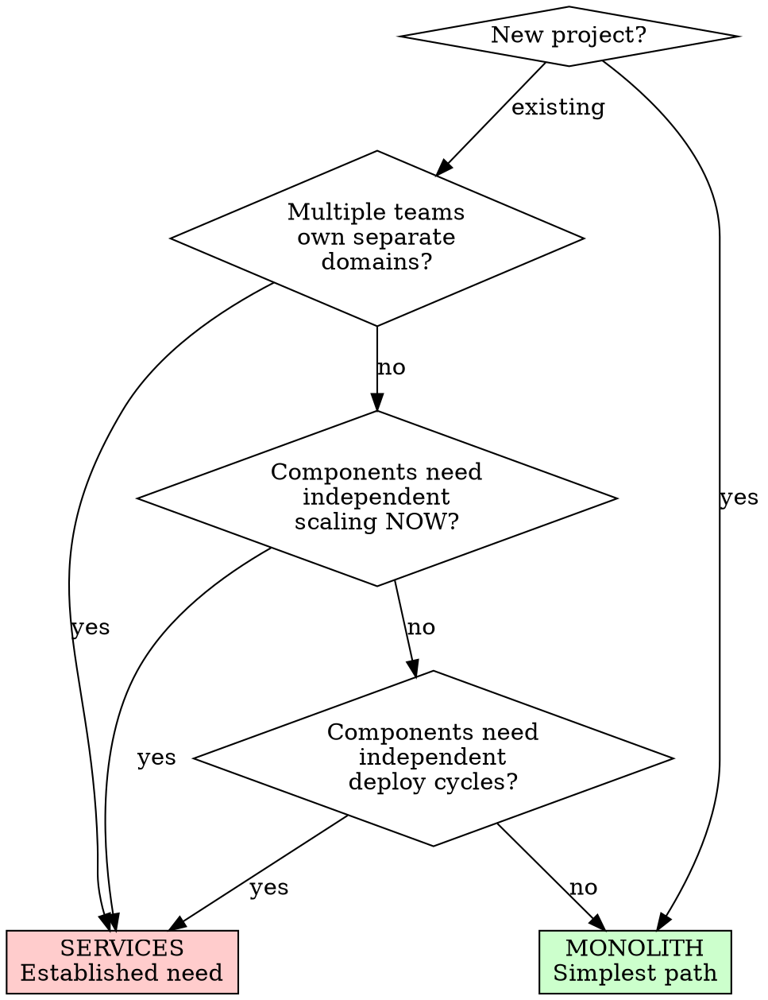

# System Design

## Overview

Select the simplest architecture that satisfies requirements. Introduce complexity only when evidence demands it.

**Core principle:** Every structural decision must be driven by a current requirement, not a speculative future one.

**No exceptions. No workarounds. No shortcuts.**

## The Prime Directive

```
NO STRUCTURAL COMPLEXITY WITHOUT AN ESTABLISHED REQUIREMENT
```

If you cannot point to a concrete, current requirement that demands the complexity, choose the simpler option.

## When to Use

**Always before:**
- Selecting a database
- Designing an API
- Organizing a new project
- Introducing a caching layer
- Adding message queues or event systems
- Choosing authentication strategy
- Deciding on monolith vs services

**Especially when:**
- "We might need to scale" (might = do not add complexity)
- "What if we need X later?" (later = not now)
- Multiple valid approaches exist

## The Entry Protocol

```
BEFORE making ANY structural decision:

1. IDENTIFY: What concrete requirement drives this choice?
2. COMPARE: What is the simplest option that satisfies it?
3. JUSTIFY: Why is anything more complex necessary?
   - If no justification: Use the simple option
   - If justified: Record the requirement driving complexity
4. DECIDE: Choose. Document. Move on.

Skip any step = over-engineering
```

## Decision Frameworks

### Monolith vs Services



**Default: Monolith.** Extract services only when a specific component demonstrates it requires independent scaling or deployment.

### Database Selection

| Requirement | Select | Rationale |
|-------------|--------|-----------|
| Structured data, relationships, transactions | PostgreSQL | ACID guarantees, mature, covers 90% of use cases |
| Document-oriented, genuinely variable schema per record | MongoDB | Only when schema truly differs per document |
| Key-value, caching, session storage | Redis | In-memory speed, built-in TTL |
| Full-text search at volume | Elasticsearch | Purpose-built for search workloads |
| Time-series data (metrics, logs) | TimescaleDB / InfluxDB | Optimized for time-indexed writes |
| Graph traversal is the primary query model | Neo4j | Only when traversal IS the product |
| Embedded, zero-config, single-user | SQLite | Simplest possible, no server needed |

**Default: PostgreSQL.** It handles JSON, full-text search, and most workloads adequately. Switch only when PostgreSQL demonstrably cannot meet a requirement.

### API Design

| Context | Select | Rationale |
|---------|--------|-----------|
| CRUD operations, public-facing API | REST | Universal, cacheable, well-understood |
| Complex nested data, client-controlled shape | GraphQL | Eliminates over/under-fetching |
| Internal service-to-service, high throughput | gRPC | Binary protocol, generated stubs, streaming |
| Real-time bidirectional communication | WebSockets | Persistent connection, low latency |
| Simple webhooks, event notification | REST callbacks | Stateless, easy to troubleshoot |

**Default: REST.** Adopt GraphQL only when clients genuinely need flexible queries. Adopt gRPC only for internal services where throughput is measured and proven insufficient with REST.

### Authentication Strategy

| Context | Select | Rationale |
|---------|--------|-----------|
| Standard web application | Session-based (cookies) | Simple, secure, server-controlled revocation |
| SPA + API on different origins | JWT (short-lived) + refresh tokens | Stateless API auth across domains |
| Third-party login | OAuth 2.0 / OIDC | Delegated authentication standard |
| Machine-to-machine | API keys + HMAC | Simple, auditable |
| Multi-tenant SaaS | OIDC + tenant-scoped tokens | Isolation per tenant |

**Default: Session-based auth with httpOnly cookies.** JWTs are not inherently more secure. Use them only when stateless authentication across domains is a concrete requirement.

### Caching Strategy

```
BEFORE introducing a cache:

1. Is there actually a measured performance problem?
2. Can the database query be optimized instead?
3. Is the data read-heavy with infrequent writes?

Only if YES to 1, NO to 2, YES to 3: Introduce cache.
```

| Layer | Mechanism | Use When |
|-------|-----------|----------|
| Application | In-memory (LRU) | Single instance, small dataset |
| Distributed | Redis / Memcached | Multi-instance, shared state |
| HTTP | CDN / reverse proxy | Static assets, public pages |
| Database | Query cache / materialized views | Expensive aggregations |

**Default: No cache.** Optimize queries first. Introduce caching only after measuring a bottleneck.

### Event-Driven Architecture

```
BEFORE introducing a message queue:

1. Do you need asynchronous processing? (Email delivery, image processing)
2. Do producers and consumers need to scale independently?
3. Do you need guaranteed delivery across service boundaries?

If NO to all: Direct function calls are sufficient.
```

| Need | Mechanism | Rationale |
|------|-----------|-----------|
| Simple task queue | Redis + BullMQ / Celery | Lightweight, familiar |
| Event streaming, replay | Kafka | High throughput, log-based |
| Cloud-native messaging | SQS / Cloud Pub/Sub | Managed, serverless |
| Complex routing | RabbitMQ | Flexible routing, mature |

**Default: Direct function calls.** Queues add operational complexity. Introduce them only when async processing or decoupling is an established requirement.

## File Organization Conventions

**Organize by capability, not by layer:**

```
# AVOID: organized by layer
src/
  controllers/
  models/
  services/
  validators/

# PREFER: organized by capability
src/
  users/
    user.controller.ts
    user.service.ts
    user.model.ts
    user.test.ts
  orders/
    order.controller.ts
    order.service.ts
    order.model.ts
    order.test.ts
  shared/
    database.ts
    auth.middleware.ts
```

Capability-based organization keeps related code together. Changing one capability touches one directory.

## Cognitive Traps

| Rationalization | Truth |
|-----------------|-------|
| "We might need microservices later" | Extract when needed. Monolith-first is faster to build and debug. |
| "NoSQL is more flexible" | PostgreSQL handles JSON. Schema flexibility usually means schema confusion. |
| "GraphQL is the modern choice" | REST is simpler for CRUD. Modern does not mean appropriate. |
| "JWTs are more secure" | JWTs are harder to revoke. Sessions are simpler and server-controlled. |
| "We need a cache for performance" | Have you optimized your queries? Measure first. |
| "Event-driven is more scalable" | Direct calls are simpler. Scaling concerns are future concerns. |
| "This architecture handles future growth" | The future is unpredictable. Solve current problems. |

## Guardrails - HALT and Simplify

- Adding infrastructure for "future scale"
- Selecting technology because it is "modern" or "industry standard"
- Architecture diagram has more than 5 components for an MVP
- Multiple databases without distinct access patterns
- Message queues for synchronous workflows
- Microservices with a single team
- "Flexible" schemas without concrete varying fields
- Caching before measuring

**All of these mean: Simplify. Use the boring, proven option.**

## Integration

**Complements:**
- **ascension:performance-tuning** — When structural choices affect performance
- **ascension:security-protocol** — Auth patterns and data flow security
- **ascension:project-bootstrap** — File organization and initial setup
- **ascension:task-planning** — Structural decisions during planning phase

## The Bottom Line

```
Simplest architecture that works > "best" architecture that might be needed
```

PostgreSQL. REST. Monolith. Sessions. No cache. Direct calls. Start there. Introduce complexity only when you have evidence it is necessary.
