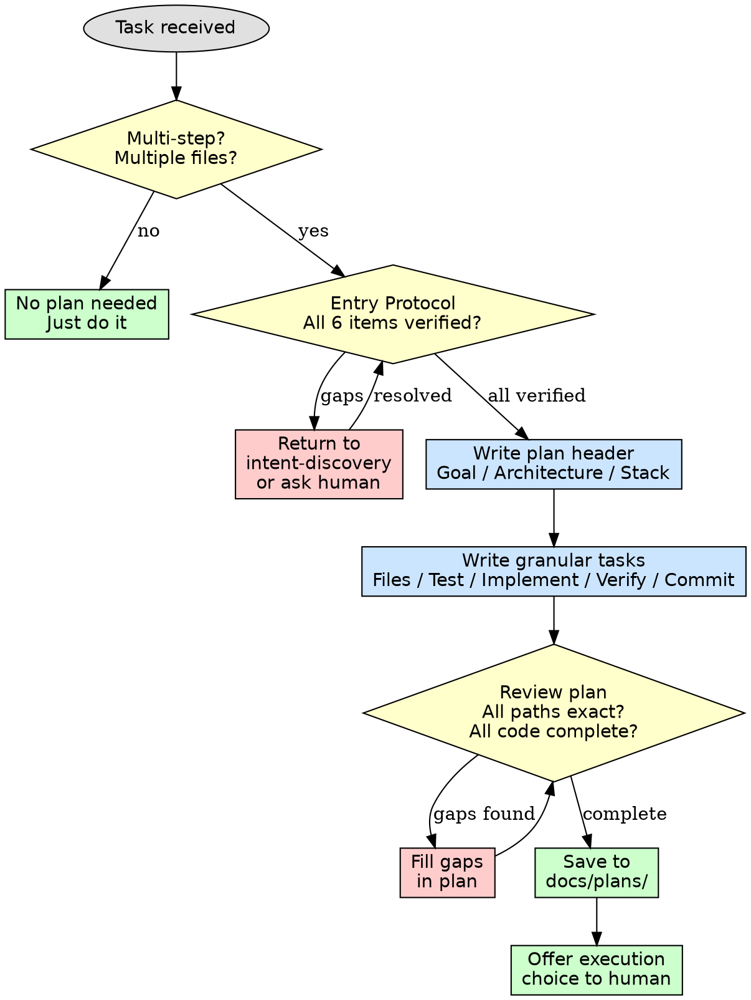

# Task Planning

## Overview

Produce thorough implementation plans written for an engineer with zero familiarity with the codebase and unreliable design instincts. Spell out everything: which files to touch per task, exact code, testing procedures, relevant documentation, how to verify each step. Deliver the plan as granular, self-contained tasks. DRY. YAGNI. TDD. Frequent commits.

Assume the engineer is technically competent but knows almost nothing about the project's tooling or problem domain. Assume their test design skills are weak.

**Announce at start:** "I'm applying the task-planning skill to build the implementation plan."

**Context:** This should run in a dedicated worktree (created during the intent-discovery phase).

**Save plans to:** `docs/plans/YYYY-MM-DD-<feature-name>.md`

## The Prime Directive

```
NO IMPLEMENTATION WITHOUT A PLAN FIRST
```

No exceptions. No workarounds. No shortcuts.

## When to Use

**Required:**
- Multi-step features (touching more than one file or behavior)
- Bug fixes spanning multiple components
- Refactoring across module boundaries
- Any task requiring coordinated test + code + commit across files
- When an intent-discovery session produces a spec or design

**Not required:**
- Single-line fixes with obvious scope (typo, config value)
- Adding a single test for existing code
- Documentation-only changes
- Renaming a variable in one file

Tempted to think "this is too simple for a plan"? If it touches more than one file, write the plan.

## The Entry Protocol

Before writing a plan, confirm ALL of these:

1. **Design is approved** - An intent-discovery session or human partner has confirmed the approach
2. **Scope is defined** - You can enumerate every component that will change
3. **Requirements are concrete** - You know what "done" looks like (acceptance criteria, not feelings)
4. **Tech stack is identified** - You know the languages, frameworks, and libraries involved
5. **Test strategy is defined** - You know how each piece will be verified
6. **Worktree is active** - You are working in an isolated branch, not main

**Any item unclear?** Stop. Return to intent-discovery or consult your human partner. Do NOT write a plan with gaps -- gaps become defects.

## Cognitive Traps

| Rationalization | What Is Actually True |
|----------------|----------------------|
| "Too simple for a plan" | Simple tasks contain hidden complexity. Plans take 5 minutes. Debugging takes hours. |
| "I'll figure it out as I go" | That is called hacking. You will miss edge cases and skip verification steps. |
| "The spec IS the plan" | Specs describe WHAT. Plans describe HOW, step by step, with file paths and commands. |
| "I already know what to do" | Excellent. Write it down. If it is obvious, the plan writes itself in 2 minutes. |
| "Plans slow me down" | Rework slows you down. Plans prevent rework. Net time saved every time. |
| "I'll add the plan after" | A plan written after implementation is documentation, not a plan. It cannot prevent mistakes already made. |

## Guardrails

**Never:**
- Write ambiguous steps like "implement the feature" or "add validation" -- specify exact code
- Omit test commands or expected output from plan steps
- Leave out file paths -- every step must reference exact paths
- Begin implementing before the plan is saved and reviewed

**Always:**
- Include complete code snippets, not descriptions of code
- Specify exact shell commands with expected output for every verification step
- List every file that will be created, modified, or deleted
- End each task with a commit step including the precise commit message

## Task Granularity

**Each step is one action (2-5 minutes):**
- "Write the failing test" -- step
- "Run it to confirm it fails" -- step
- "Implement the minimal code to pass" -- step
- "Run the tests to confirm they pass" -- step
- "Commit" -- step

## Plan Document Header

**Every plan MUST open with this header:**

```markdown
# [Feature Name] Implementation Plan

> **For Claude:** REQUIRED SUB-SKILL: Use ascension:task-runner to implement this plan task-by-task.

**Goal:** [One sentence describing what this builds]

**Architecture:** [2-3 sentences about the approach]

**Tech Stack:** [Key technologies/libraries]

---
```

## Task Template

````markdown
### Task N: [Component Name]

**Files:**
- Create: `exact/path/to/file.py`
- Modify: `exact/path/to/existing.py:123-145`
- Test: `tests/exact/path/to/test.py`

**Step 1: Write the failing test**

```python
def test_specific_behavior():
    result = function(input)
    assert result == expected
```

**Step 2: Run test to verify failure**

Run: `pytest tests/path/test.py::test_name -v`
Expected: FAIL with "function not defined"

**Step 3: Write minimal implementation**

```python
def function(input):
    return expected
```

**Step 4: Run test to verify it passes**

Run: `pytest tests/path/test.py::test_name -v`
Expected: PASS

**Step 5: Commit**

```bash
git add tests/path/test.py src/path/file.py
git commit -m "feat: add specific feature"
```
````

## Reminders
- Exact file paths in every step
- Complete code in the plan (not "add validation")
- Exact commands with expected output
- Reference relevant skills by name (e.g., `ascension:test-first`)
- DRY, YAGNI, TDD, frequent commits

## Execution Handoff

After saving the plan, offer the user a choice:

**"Plan complete and saved to `docs/plans/<filename>.md`. Two execution options:**

**1. Delegated Execution (this session)** - I dispatch a fresh subagent per task, review between tasks, fast iteration

**2. Separate Session** - Open a new session with task-runner, batch execution with checkpoints

**Which approach?"**

**If Delegated Execution chosen:**
- **REQUIRED SUB-SKILL:** Use ascension:delegated-execution
- Stay in this session
- Fresh subagent per task + code review

**If Separate Session chosen:**
- Guide them to open a new session in the worktree
- **REQUIRED SUB-SKILL:** New session uses ascension:task-runner

## Connections

**Required workflow skills:**
- **ascension:intent-discovery** - Produces the spec/design that feeds into this skill
- **ascension:workspace-isolation** - REQUIRED: Set up isolated workspace before planning
- **ascension:task-runner** - Executes the plan this skill produces
- **ascension:delegated-execution** - Alternative execution via subagents in same session
- **ascension:test-first** - Every task in the plan follows TDD cycle
- **ascension:merge-protocol** - Completes development after plan execution

## Plan Construction Workflow


