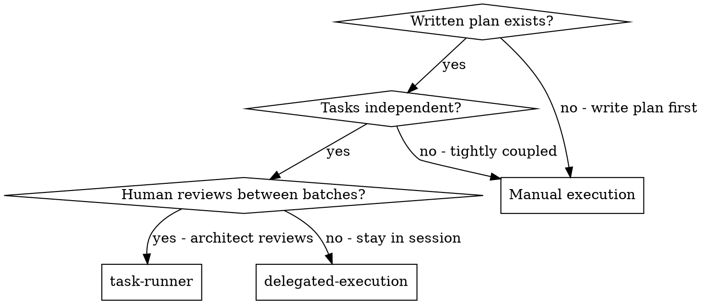
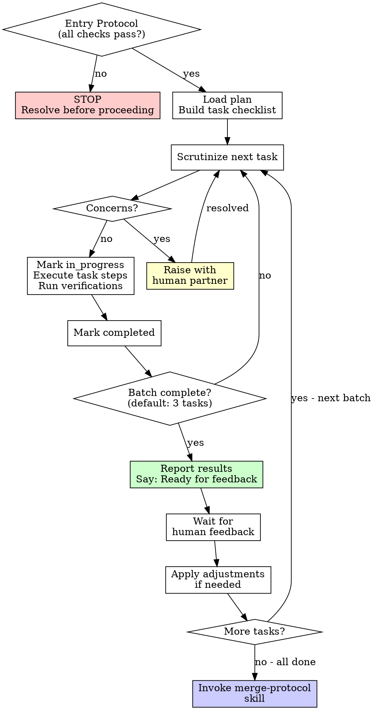

# Task Runner

## Overview

Load the plan, scrutinize it, execute tasks in batches, and pause for architect review between batches.

**Core principle:** Batch execution with checkpoints for architect oversight.

**Announce at start:** "I'm applying the task-runner skill to execute this implementation plan."

## The Prime Directive

```
NO PLAN EXECUTION WITHOUT CRITICAL REVIEW OF EACH TASK FIRST
```

No exceptions. No workarounds. No shortcuts.

Plans contain errors, ambiguities, and outdated assumptions. Every task must be critically examined before execution begins. Blindly following a plan is not "efficiency" -- it is investing time in incorrect work.

## When to Use



**Use task-runner when:**
- A written implementation plan exists (from task-planning or equivalent)
- Tasks should execute in batches with human review between them
- The architect wants to inspect progress and make corrections between batches
- Working in a parallel session (separate from the planning session)

**Use delegated-execution instead when:**
- Staying in the same session (no context switch)
- Prefer automated two-stage review (spec + quality) over human review
- Tasks are independent and can be dispatched to fresh subagents

**Use manual execution when:**
- No written plan exists yet
- Tasks are tightly coupled and need continuous human guidance
- Exploratory work where a plan would be premature

## The Entry Protocol

Before beginning plan execution, verify ALL of these:

1. **Plan exists and is accessible** - You have a path to a written plan file
2. **Plan has been scrutinized** - You have critically read every task and flagged concerns
3. **Concerns are addressed** - Questions and ambiguities have been raised and answered
4. **Tests pass at baseline** - Existing tests pass before any changes are made
5. **Branch is clean** - Working in a feature branch (not main/master), no uncommitted changes
6. **Worktree is configured** - Using git worktree for isolation (ascension:workspace-isolation)
7. **Task checklist is populated** - All tasks loaded into a tracking checklist

**If any gate fails, STOP.** Do not proceed until every gate passes.

## Cognitive Traps

| Rationalization | What Is Actually True |
|----------------|----------------------|
| "The plan looks fine, skip review" | Plans contain errors. Review catches them before time is wasted on incorrect work. |
| "I'll review while executing" | Reviewing during execution means you are already committed. Review before starting. |
| "This task is self-explanatory" | Self-explanatory tasks conceal assumptions. Thirty seconds of review prevents thirty minutes of rework. |
| "Batching is slow, I'll do everything at once" | Batches exist for human review. Skipping review lets errors compound across all tasks. |
| "Tests are slow, skip verification this round" | Unverified batches hide failures. Debugging later costs more. |
| "The plan says X but Y seems better" | Raise it with your human partner. Silently deviating from the plan creates confusion. |

## The Process

### Step 1: Load and Scrutinize Plan
1. Read the plan file
2. Review critically -- flag any questions or concerns about each task
3. If concerns: Raise with your human partner before starting
4. If no concerns: Build a task checklist and proceed

### Step 2: Execute Batch
**Default batch size: 3 tasks**

For each task:
1. Mark as in_progress
2. Follow each step precisely (plan provides granular steps)
3. Run verifications as specified
4. Mark as completed

### Step 3: Report
When batch completes:
- Show what was implemented
- Show verification output
- Say: "Ready for feedback."

### Step 4: Continue
Based on feedback:
- Apply changes if needed
- Execute next batch
- Repeat until all tasks are done

### Step 5: Finalize

After all tasks are complete and verified:
- Announce: "I'm applying the merge-protocol skill to finalize this work."
- **REQUIRED SUB-SKILL:** Use ascension:merge-protocol
- Follow that skill to verify tests, present options, execute choice

## When to Stop and Ask

**STOP executing immediately when:**
- You hit a blocker mid-batch (missing dependency, test failure, unclear instruction)
- The plan has critical gaps that prevent starting
- You do not understand an instruction
- Verification fails repeatedly

**Ask for clarification rather than guessing.**

## When to Revisit Earlier Steps

**Return to Scrutiny (Step 1) when:**
- Partner updates the plan based on your feedback
- The fundamental approach needs rethinking

**Do not force through blockers** -- stop and ask.

## Guardrails

**Never:**
- Execute a task you have not critically reviewed first
- Skip verification steps to "save time"
- Silently deviate from the plan without raising it with your human partner
- Start implementation on main/master branch without explicit user consent

**Always:**
- Review each task before marking it in_progress
- Run verifications as specified in the plan after each task
- Stop and ask when blocked (do not guess or improvise)
- Report the completed batch and wait for feedback before continuing

## Batch Execution Diagram



## Reminders
- Scrutinize the plan critically before starting
- Follow plan steps precisely
- Do not skip verifications
- Reference skills when the plan calls for them
- Between batches: report and wait
- Stop when blocked, do not guess
- Never start implementation on main/master without explicit user consent

## Connections

**Required workflow skills:**
- **ascension:workspace-isolation** - REQUIRED: Set up isolated workspace before starting
- **ascension:task-planning** - Creates the plan this skill executes
- **ascension:merge-protocol** - Finalize development after all tasks

**During execution, tasks may invoke:**
- **ascension:test-first** - When plan tasks involve writing new code
- **ascension:fault-diagnosis** - When a task encounters unexpected failures
- **ascension:completion-gate** - Verify each batch before reporting

**Alternative workflow:**
- **ascension:delegated-execution** - Use for same-session execution with automated two-stage review instead of human-in-loop batches
