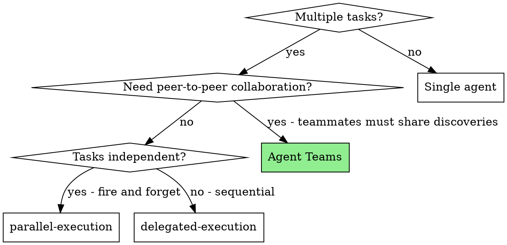
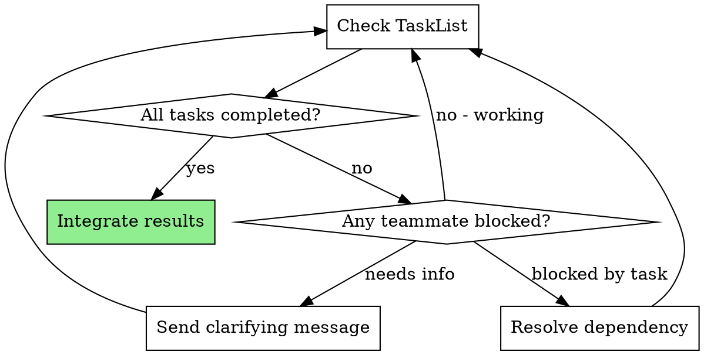

# Team Orchestration

## Overview

Agent Teams enable multiple Claude Code sessions to collaborate on a shared project with direct peer-to-peer messaging and shared task lists. Unlike subagents, teammates can communicate with each other, claim tasks dynamically, and coordinate on shared problems.

**Core principle:** Deploy teams when tasks benefit from collaboration, not merely parallelism. If teammates will never need to message each other, use parallel subagents instead.

**No exceptions. No workarounds. No shortcuts.**

## The Prime Directive

```
NO TEAM WITHOUT A COLLABORATION REQUIREMENT
```

If teammates will never exchange messages, you do not need a team.

## When to Use



**Deploy Teams when:**
- Parallel research where discoveries from one investigation redirect another
- Multi-module features where frontend/backend/tests must coordinate
- Cross-layer changes requiring interface negotiation
- Debugging with competing hypotheses that need to share evidence
- Large refactoring across multiple subsystems with shared conventions

**Do not use when:**
- Simple independent tasks (use ascension:parallel-execution)
- Sequential dependent tasks (use ascension:delegated-execution)
- Single-file or single-module changes
- Agent Teams feature not enabled
- Fewer than 2 genuinely collaborative tasks

## Prerequisites

Agent Teams is an experimental feature. It must be enabled:

```
CLAUDE_CODE_EXPERIMENTAL_AGENT_TEAMS=true
```

Without this, TeamCreate, TaskCreate, and SendMessage tools are unavailable.

**Deferred tools:** TeamCreate, TaskCreate, TaskUpdate, TaskGet, TaskList, SendMessage, and EnterWorktree are deferred tools. They must be loaded via ToolSearch before first use:

```json
// Load all team tools at once
ToolSearch: { "query": "select:SendMessage,TaskCreate,TaskUpdate,TaskList,TaskGet,EnterWorktree" }
```

## The Entry Protocol

```
BEFORE forming a team:

1. ENUMERATE: What are all the tasks?
2. MAP: Which tasks need information from other tasks?
3. COUNT: How many task pairs require shared discoveries?
4. DECIDE:
   - 0 pairs need collaboration -> Use parallel-execution
   - 1 pair needs collaboration -> Consider single agent or subagents
   - 2+ pairs need collaboration -> Use Agent Teams
5. ONLY THEN: Form the team

Skip any step = unnecessary team overhead
```

## The Workflow

### Step 1: Evaluate Task-Team Fit

Before reaching for TeamCreate, answer these:

| Question | If Yes | If No |
|----------|--------|-------|
| Can a single agent handle this? | Do that instead | Continue |
| Can parallel subagents handle this? | Use parallel-execution | Continue |
| Do agents need to share discoveries mid-work? | Teams | Subagents |
| Do agents need to negotiate interfaces? | Teams | Subagents |
| Is coordination overhead justified? | Teams | Simpler approach |

### Step 2: Architect the Team

Create the team, then spawn teammates using the Agent tool:

```json
// 1. Create the team
TeamCreate: {
  "team_name": "auth-refactor-team",
  "description": "Refactor authentication across API and frontend modules"
}

// 2. Spawn each teammate (2-5 max)
Agent: {
  "name": "backend-eng",
  "team_name": "auth-refactor-team",
  "prompt": "You are the backend engineer. Own all files in src/api/auth/. Implement the new token refresh flow. Coordinate with frontend-eng on the session interface.",
  "description": "Backend auth implementation",
  "mode": "bypassPermissions"
}

Agent: {
  "name": "frontend-eng",
  "team_name": "auth-refactor-team",
  "prompt": "You are the frontend engineer. Own all files in src/ui/auth/. Update login flow to use new token refresh. Coordinate with backend-eng on the session interface.",
  "description": "Frontend auth implementation",
  "mode": "bypassPermissions"
}
```

**Teammate count guidance:**

| Count | When | Coordination Cost |
|-------|------|-------------------|
| 2 | Two distinct modules that must agree on interface | Low |
| 3 | Frontend + backend + tests, or 3 independent subsystems | Medium |
| 4 | Cross-cutting refactor with 4 modules | High |
| 5 | Maximum — only for genuinely large efforts | Very High |

### Step 2b: Isolate Workspaces

Each teammate should work in an isolated git worktree to prevent merge conflicts at the filesystem level:

```json
// Called by each teammate at the start of their work
EnterWorktree: { "name": "auth-backend" }
```

EnterWorktree creates a separate git worktree so teammates edit files in parallel without stepping on each other. The team lead runs ascension:merge-protocol to integrate worktrees at the end.

### Step 3: Define Tasks with Clear Boundaries

```json
// Create tasks with clear scope and success criteria
TaskCreate: {
  "subject": "Implement token refresh endpoint",
  "description": "Build POST /api/auth/refresh that validates expired access tokens against refresh tokens. Return new access+refresh token pair. Files: src/api/auth/refresh.ts, src/api/auth/refresh.test.ts",
  "activeForm": "Implementing token refresh endpoint"
}

TaskCreate: {
  "subject": "Update login UI for token refresh",
  "description": "Update login flow to store refresh token and auto-refresh on 401. Files: src/ui/auth/login.tsx, src/ui/auth/session.ts",
  "activeForm": "Updating login UI for token refresh"
}

// Set up dependencies and assign owners
TaskUpdate: { "taskId": "2", "addBlockedBy": ["1"] }
TaskUpdate: { "taskId": "1", "owner": "backend-eng" }
TaskUpdate: { "taskId": "2", "owner": "frontend-eng" }
```

**Task design rules:**
- Clear scope: exactly which files/modules this teammate owns
- Dependencies: use `addBlockedBy` for tasks that must complete first
- Success criteria: what "done" looks like in the description
- File ownership: NO overlap between teammates (prevents merge conflicts)

**File ownership is non-negotiable.** Two teammates editing the same file guarantees merge conflicts. If a shared file needs changes from multiple perspectives, assign it to ONE teammate who coordinates with others via messaging.

### Step 4: Coordinate as Team Lead



As team lead:
- Track task completion via TaskList (no parameters needed — just call it)
- Relay discoveries between teammates using direct messages:

```json
// Direct message to relay a discovery
SendMessage: {
  "type": "message",
  "recipient": "frontend-eng",
  "content": "backend-eng finished the refresh endpoint. The response shape is { accessToken, refreshToken, expiresIn }. You can unblock now.",
  "summary": "Refresh endpoint contract ready"
}
```

- Unblock dependencies by marking prerequisite tasks complete:

```json
TaskUpdate: { "taskId": "1", "status": "completed" }
```

- Arbitrate conflicts if teammates disagree on approach
- Use broadcast ONLY for team-wide critical issues (expensive — sends N messages):

```json
// Broadcast — use sparingly, sends N separate messages
SendMessage: {
  "type": "broadcast",
  "content": "Convention change: all auth endpoints now return camelCase keys",
  "summary": "Auth API convention change"
}
```

### Step 5: Integrate Results

When all tasks complete:
1. Review all changes together for consistency
2. Confirm no file conflicts between teammates
3. Run full test suite
4. Verify that cross-module interfaces agree
5. **REQUIRED SUB-PROTOCOL:** Use ascension:merge-protocol

## Team Patterns

See `team-patterns.md` in this directory for five documented team patterns:
1. **Exploration Team** — Parallel investigation of different dimensions
2. **Feature Team** — Multi-module development (frontend + backend + tests)
3. **Diagnosis Team** — Competing hypotheses tested concurrently
4. **Inspection Team** — Multi-perspective code review
5. **Migration Team** — Cross-cutting convention changes across codebase

Each pattern includes: when to use, team structure, task design, coordination flow, and example.

## Tools at a Glance

| Tool | Purpose | Key Parameters | When |
|------|---------|----------------|------|
| **TeamCreate** | Form team | `team_name`, `description` | Once at start |
| **Agent** | Spawn teammate | `name`, `team_name`, `prompt`, `description`, `mode` | Once per teammate |
| **EnterWorktree** | Isolate workspace | `name` | Each teammate at start |
| **TaskCreate** | Add task | `subject`, `description`, `activeForm` | During setup |
| **TaskList** | View all tasks | *(none)* | Monitoring |
| **TaskGet** | Get task details | `taskId` | Before starting work |
| **TaskUpdate** | Claim/complete/update | `taskId`, `status`, `owner`, `addBlockedBy` | Throughout |
| **SendMessage** | Direct message | `type: "message"`, `recipient`, `content`, `summary` | Coordination |
| **SendMessage** | Broadcast | `type: "broadcast"`, `content`, `summary` | Critical issues only |
| **SendMessage** | Shutdown | `type: "shutdown_request"`, `recipient`, `content` | Winding down |

## Teammate Behavior: What to Expect

Teammates are independent Claude sessions. Key behaviors:

- **Idle between turns** — This is normal. Teammates go idle when waiting for messages or tasks. They reactivate when messaged or when tasks become available.
- **Claim tasks** — Teammates use TaskUpdate to assign themselves before starting work.
- **Message each other** — Teammates can and should message each other directly, not just the team lead.
- **Self-directed** — Once given a task, teammates work autonomously. Avoid micromanagement.

## Cognitive Traps

| Rationalization | Truth |
|-----------------|-------|
| "Teams are always superior to subagents" | Teams add coordination overhead. Deploy only when collaboration is necessary. |
| "More teammates = faster delivery" | More teammates = more coordination. 3 focused teammates outperform 6 scattered ones. |
| "I'll form the team and figure out tasks later" | Tasks MUST be designed before team formation. No tasks = idle teammates burning tokens. |
| "Teammates can share files" | Shared files = merge conflicts. Assign clear ownership. |
| "Broadcast is fine for routine updates" | Broadcast sends N messages. Use SendMessage to specific teammates. |
| "Dependencies are implied" | Undefined dependencies = teammates stepping on each other. |

## Guardrails

**Prohibited:**
- Forming teams for simple tasks (overhead not justified)
- Allowing teammates to edit the same files (merge conflicts)
- Skipping integration review after team completion
- Ignoring teammate messages (they contain discoveries)
- Forming teams with more than 5 teammates (coordination explodes)
- Using broadcast for routine updates (use direct messages)
- Starting a team without clearly designed tasks
- Leaving dependencies undefined between tasks

**Mandatory:**
- Define clear file ownership boundaries
- Set up task dependencies with blockedBy
- Review all changes together after completion
- Run full test suite after integration
- Use SendMessage for teammate-to-teammate coordination
- Mark tasks complete when done (teammates check TaskList for available work)

## Tool Invocation Reference

Complete parameter specifications for every Agent Teams tool. Copy these directly — parameter names are exact.

### TeamCreate

Creates a named team. Call once before spawning teammates.

```json
{
  "team_name": "feature-billing-team",
  "description": "Build subscription billing feature"
}
```

| Parameter | Type | Required | Notes |
|-----------|------|----------|-------|
| `team_name` | string | yes | Kebab-case identifier |
| `description` | string | yes | What the team is working on |

### Agent (spawn teammate)

Spawns a teammate into an existing team. Each teammate is an independent Claude session.

```json
{
  "name": "backend-eng",
  "team_name": "feature-billing-team",
  "prompt": "You are the backend engineer on this team. Own src/api/billing/. Build the Stripe webhook handler and subscription CRUD endpoints. Use ascension:test-first for implementation. Coordinate with frontend-eng on API contracts via SendMessage.",
  "description": "Backend billing implementation",
  "mode": "bypassPermissions"
}
```

| Parameter | Type | Required | Notes |
|-----------|------|----------|-------|
| `name` | string | yes | Teammate identifier (used in SendMessage `recipient`) |
| `team_name` | string | yes | Must match TeamCreate `team_name` |
| `prompt` | string | yes | Full instructions — include file ownership, scope, coordination rules |
| `description` | string | yes | Short description shown in UI |
| `mode` | string | no | `"bypassPermissions"` lets teammate work without permission prompts |

### EnterWorktree

Creates an isolated git worktree for a teammate. Prevents filesystem conflicts when multiple teammates edit files in parallel.

```json
{
  "name": "billing-feature"
}
```

| Parameter | Type | Required | Notes |
|-----------|------|----------|-------|
| `name` | string | yes | Worktree identifier — becomes the branch/directory name |

### TaskCreate

Adds a task to the shared task list visible to all teammates.

```json
{
  "subject": "Implement Stripe webhook handler",
  "description": "Build POST /webhooks/stripe endpoint that handles subscription.created, subscription.updated, and subscription.deleted events. Files: src/api/billing/webhooks.ts, src/api/billing/webhooks.test.ts",
  "activeForm": "Implementing Stripe webhook handler"
}
```

| Parameter | Type | Required | Notes |
|-----------|------|----------|-------|
| `subject` | string | yes | Imperative form title (e.g., "Fix auth bug") |
| `description` | string | yes | Full scope, file list, acceptance criteria |
| `activeForm` | string | no | Present continuous form for spinner (e.g., "Fixing auth bug") |

### TaskUpdate

Updates a task's status, owner, or dependencies. Use for claiming, completing, and wiring up blocked-by relationships.

```json
// Assign owner
{ "taskId": "1", "owner": "backend-eng" }

// Set dependency — task 3 cannot start until tasks 1 and 2 complete
{ "taskId": "3", "addBlockedBy": ["1", "2"] }

// Mark in progress
{ "taskId": "1", "status": "in_progress" }

// Mark complete
{ "taskId": "1", "status": "completed" }
```

| Parameter | Type | Required | Notes |
|-----------|------|----------|-------|
| `taskId` | string | yes | Task ID from TaskCreate/TaskList |
| `status` | string | no | `"pending"`, `"in_progress"`, `"completed"`, or `"deleted"` |
| `owner` | string | no | Teammate name to assign |
| `addBlockedBy` | string[] | no | Task IDs that must complete before this task |
| `addBlocks` | string[] | no | Task IDs that this task blocks |
| `subject` | string | no | Updated title |
| `description` | string | no | Updated description |
| `activeForm` | string | no | Updated spinner text |

### TaskList

Returns all tasks with their status, owner, and blocked-by info. No parameters.

```json
// No parameters — just call it
TaskList: {}
```

### TaskGet

Retrieves full details of a specific task.

```json
{ "taskId": "1" }
```

| Parameter | Type | Required | Notes |
|-----------|------|----------|-------|
| `taskId` | string | yes | Task ID to retrieve |

### SendMessage

Three message types for team communication.

**Direct message** (default — use this for most communication):

```json
{
  "type": "message",
  "recipient": "backend-eng",
  "content": "The profile API needs a PUT /profile/preferences endpoint. Frontend needs to update preferences without replacing the full profile.",
  "summary": "API contract update request"
}
```

**Broadcast** (sends to ALL teammates — use sparingly):

```json
{
  "type": "broadcast",
  "content": "Convention change: all API responses now use camelCase keys",
  "summary": "API convention change"
}
```

**Shutdown request** (graceful teammate shutdown):

```json
{
  "type": "shutdown_request",
  "recipient": "backend-eng",
  "content": "All tasks complete, wrapping up"
}
```

| Parameter | Type | Required | Notes |
|-----------|------|----------|-------|
| `type` | string | yes | `"message"`, `"broadcast"`, or `"shutdown_request"` |
| `recipient` | string | for message/shutdown | Teammate name |
| `content` | string | yes | Message body |
| `summary` | string | for message/broadcast | 5-10 word preview shown in UI |

### Complete Team Setup Example

End-to-end example wiring up a 2-person feature team:

```json
// 1. Create team
TeamCreate: { "team_name": "billing-team", "description": "Build subscription billing" }

// 2. Create tasks
TaskCreate: {
  "subject": "Build Stripe webhook handler",
  "description": "POST /webhooks/stripe handling subscription events. Files: src/api/billing/webhooks.ts",
  "activeForm": "Building Stripe webhook handler"
}
TaskCreate: {
  "subject": "Build billing dashboard UI",
  "description": "Subscription management page showing plan, usage, invoices. Files: src/ui/billing/",
  "activeForm": "Building billing dashboard"
}

// 3. Wire dependencies and assign owners
TaskUpdate: { "taskId": "2", "addBlockedBy": ["1"] }
TaskUpdate: { "taskId": "1", "owner": "backend-eng" }
TaskUpdate: { "taskId": "2", "owner": "frontend-eng" }

// 4. Spawn teammates (they auto-claim their assigned tasks)
Agent: {
  "name": "backend-eng",
  "team_name": "billing-team",
  "prompt": "You are the backend engineer. Own src/api/billing/. Start with task #1. Use EnterWorktree to isolate your workspace. Use ascension:test-first. Message frontend-eng with the API contract when done.",
  "description": "Backend billing implementation",
  "mode": "bypassPermissions"
}
Agent: {
  "name": "frontend-eng",
  "team_name": "billing-team",
  "prompt": "You are the frontend engineer. Own src/ui/billing/. Task #2 is blocked by #1. Wait for backend-eng to share the API contract, then implement. Use EnterWorktree to isolate your workspace.",
  "description": "Frontend billing implementation",
  "mode": "bypassPermissions"
}

// 5. Monitor as team lead
TaskList: {}

// 6. When all tasks complete, shutdown teammates
SendMessage: { "type": "shutdown_request", "recipient": "backend-eng", "content": "All done, wrapping up" }
SendMessage: { "type": "shutdown_request", "recipient": "frontend-eng", "content": "All done, wrapping up" }
```

## Integration

**Related orchestration protocols:**
- **ascension:parallel-execution** — For independent tasks without collaboration requirement
- **ascension:delegated-execution** — For sequential tasks with review checkpoints
- **ascension:task-runner** — For plan execution in a separate session

**Teammates should use:**
- **ascension:test-first** — For implementation tasks
- **ascension:fault-diagnosis** — For diagnosis team investigations
- **ascension:completion-gate** — Before marking tasks complete

**Required for completion:**
- **ascension:merge-protocol** — After all team tasks complete
