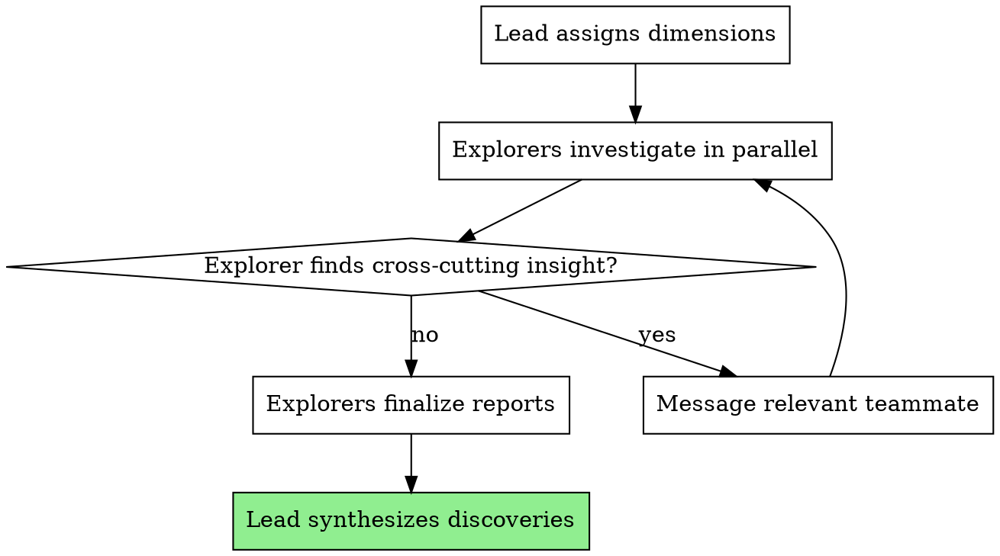
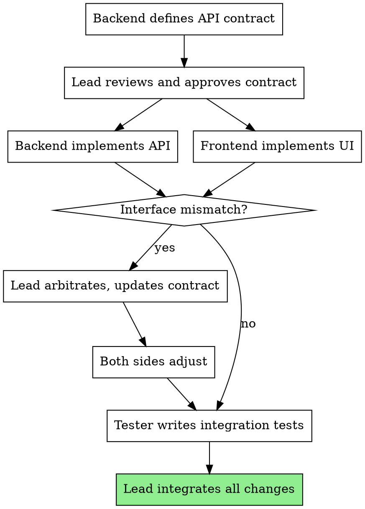
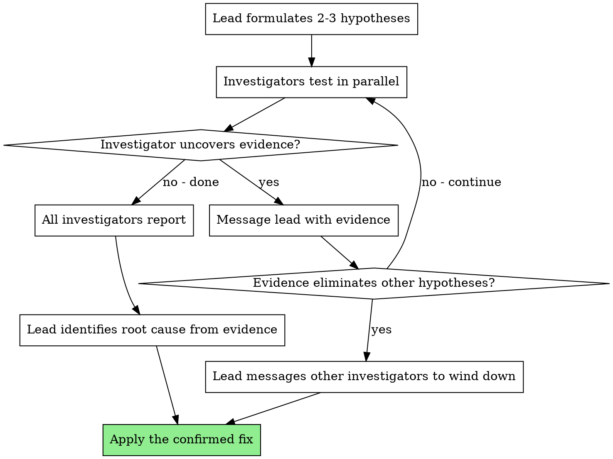
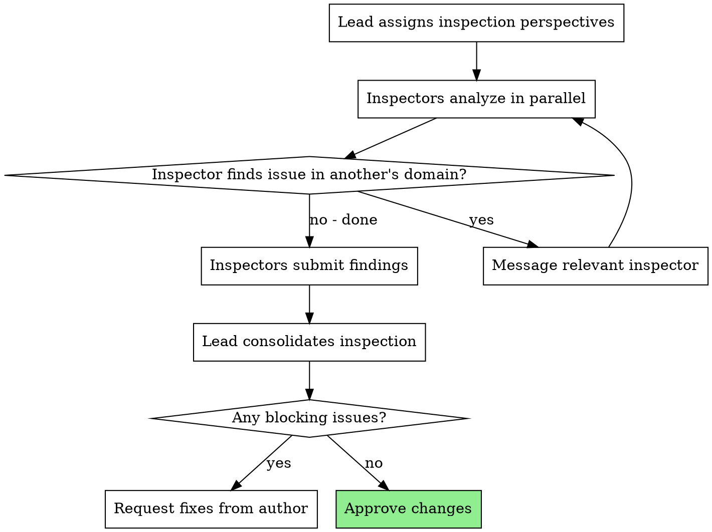
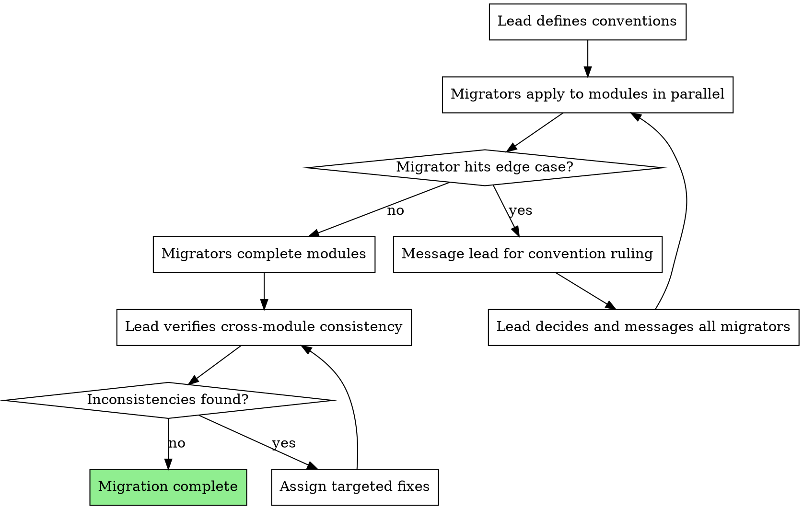
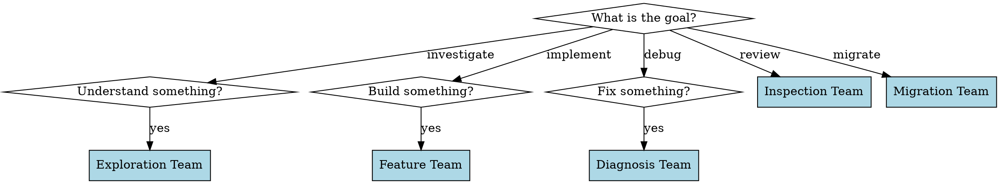

# Team Patterns

Five proven configurations for Agent Teams. Each pattern answers: when to deploy it, how to structure the team, how to design tasks, and how coordination flows.

---

## Pattern 1: Exploration Team

**When:** You need to research multiple dimensions of a problem concurrently and discoveries from one dimension may redirect another.

**Examples:**
- Evaluating a technology stack (throughput, security posture, ecosystem health, developer experience)
- Mapping a large unfamiliar codebase (module boundaries, data flow, test coverage, dependency graph)
- Investigating a production outage (application logs, system metrics, recent deployments, infrastructure changes)

### Team Structure

| Teammate | Role | Scope |
|----------|------|-------|
| lead | Coordinator, synthesizer | Assigns dimensions, collects discoveries |
| explorer-1 | Dimension investigator | One specific aspect |
| explorer-2 | Dimension investigator | Different aspect |
| explorer-3 | Dimension investigator (optional) | Third aspect |

### Task Design

```
Task per exploration dimension:
- "Investigate [dimension X] of [system/technology]"
- Success criteria: Report with discoveries, evidence, and recommendations
- No file ownership needed (read-only investigation)
- No blockedBy (parallel from start)
```

### Coordination Flow



**Key coordination:** When explorer-1 uncovers something relevant to explorer-2's dimension, they message explorer-2 directly. The lead synthesizes all discoveries at the end.

### Example

```
Team: "framework-evaluation-team"

Tasks:
1. "Evaluate runtime performance characteristics for our workload profile"
   - Benchmark scenarios, memory footprint, cold start latency
2. "Evaluate security surface area and vulnerability history"
   - Known CVEs, dependency audit trail, sandboxing capabilities
3. "Evaluate ecosystem maturity and community health"
   - Package quality, tooling support, documentation depth, contributor activity

Coordination moment:
  Explorer-1 discovers memory pressure triggers garbage collection pauses
  that could affect request latency under load.
  -> Messages Explorer-2: "GC pauses under memory pressure may create
     timing-based side channels. Worth investigating as a security concern."
```

---

## Pattern 2: Feature Team

**When:** Building a feature that spans multiple layers (frontend, backend, data layer, tests) where interfaces must be negotiated between layers.

**Examples:**
- Adding a new API endpoint with corresponding UI and tests
- Implementing authorization across frontend and backend
- Adding a new data entity with API, UI, and schema migration

### Team Structure

| Teammate | Role | Scope |
|----------|------|-------|
| lead | Coordinator, interface arbiter | Defines contracts, resolves disagreements |
| backend | Backend implementation | API routes, business logic, data access |
| frontend | Frontend implementation | UI components, state management, API integration |
| tester | Test implementation | Integration tests, end-to-end tests |

### Task Design

```
Phase 1 (no dependencies):
- "Define API contract for [feature]" - assigned to backend
  blockedBy: none
  Output: API schema/types that frontend will consume

Phase 2 (blocked by Phase 1):
- "Implement [feature] backend" - assigned to backend
  blockedBy: contract task
  File ownership: src/api/*, src/services/*, src/models/*

- "Implement [feature] frontend" - assigned to frontend
  blockedBy: contract task
  File ownership: src/components/*, src/hooks/*, src/pages/*

Phase 3 (blocked by Phase 2):
- "Write integration and E2E tests for [feature]" - assigned to tester
  blockedBy: backend + frontend tasks
  File ownership: tests/*
```

### Coordination Flow



**Key coordination:** Backend and frontend message each other when contract adjustments are needed. The lead arbitrates disagreements. The tester waits for both sides to finish before verifying the integration.

### Example

```
Team: "notification-preferences-team"

Tasks:
1. "Define API contract for notification preferences CRUD"
   - Request/response schemas, endpoint paths, error codes
   - Output: TypeScript interfaces shared between frontend and backend

2. "Implement notification preferences API endpoints" (blockedBy: 1)
   - Files: src/api/notifications.ts, src/services/preferences.ts, src/models/preference.ts

3. "Implement notification preferences UI" (blockedBy: 1)
   - Files: src/components/Notifications/*, src/hooks/usePreferences.ts

4. "Write integration tests for notification preferences" (blockedBy: 2, 3)
   - Files: tests/integration/preferences.test.ts, tests/e2e/notifications.test.ts

Coordination moment:
  Frontend discovers preferences need a "pending" state (save without activating).
  -> Messages backend: "Need a PATCH /preferences/pending endpoint for deferred changes."
  -> Backend adds endpoint, messages lead to update contract.
  -> Lead updates contract task, messages frontend with confirmation.
```

---

## Pattern 3: Diagnosis Team

**When:** A defect has multiple plausible root causes and testing hypotheses sequentially is too slow. Each hypothesis can be investigated independently.

**Examples:**
- Performance degradation with multiple potential causes
- Intermittent failure that could be timing, state, or environment
- Data inconsistency with multiple potential entry points

### Team Structure

| Teammate | Role | Scope |
|----------|------|-------|
| lead | Hypothesis coordinator, evidence collector | Assigns hypotheses, aggregates evidence |
| investigator-1 | Hypothesis tester | Tests one root cause theory |
| investigator-2 | Hypothesis tester | Tests different root cause theory |
| investigator-3 | Hypothesis tester (optional) | Tests third theory |

### Task Design

```
Task per hypothesis:
- "Investigate hypothesis: [specific root cause theory]"
  - What to look for: [specific evidence]
  - How to test: [specific experiment]
  - Report: evidence for/against, confidence level
  - No file changes (investigation only, unless fix is obvious)
  - No blockedBy (all hypotheses tested in parallel)
```

### Coordination Flow



**Key coordination:** When an investigator uncovers strong evidence, they message the lead immediately. If the evidence is conclusive, the lead redirects or stops other investigators to conserve resources.

### Example

```
Team: "latency-spike-diagnosis-team"

Defect: API response times increased 4x after latest deployment.

Tasks:
1. "Investigate hypothesis: N+1 query regression"
   - Check: Query logs before/after deployment, query count per request
   - Test: Run profiler on slow endpoint, count DB queries

2. "Investigate hypothesis: Cache misconfiguration after deploy"
   - Check: Cache hit rates, recent config diffs for cache settings
   - Test: Compare cache stats before/after, verify connection pool

3. "Investigate hypothesis: Payload serialization overhead from new fields"
   - Check: Response payload sizes, serialization duration
   - Test: Profile serialization, compare response sizes

Coordination moment:
  Investigator-2 discovers cache hit rate collapsed from 92% to 0%.
  -> Messages lead: "Cache completely cold. Redis config changed in deployment -
     CACHE_TTL set to 0 instead of 3600. High confidence this is root cause."
  -> Lead messages investigators 1 and 3: "Root cause likely found by
     investigator-2 (cache misconfiguration). Please wrap up and report
     any supplementary findings, but don't invest more time investigating."
```

---

## Pattern 4: Inspection Team

**When:** Code changes are significant enough to warrant review from multiple perspectives simultaneously (architecture, security, performance, usability).

**Examples:**
- Major feature PR affecting multiple subsystems
- Security-sensitive changes (authentication, payment processing, data handling)
- Performance-critical code (hot paths, data pipelines)

### Team Structure

| Teammate | Role | Scope |
|----------|------|-------|
| lead | Inspection coordinator, decision maker | Collects reviews, resolves conflicts |
| inspector-arch | Architecture inspector | Structure, patterns, maintainability |
| inspector-security | Security inspector | OWASP, input validation, auth |
| inspector-perf | Performance inspector (optional) | Complexity, caching, query efficiency |

### Task Design

```
Task per inspection perspective:
- "Inspect [PR/changes] for [perspective] concerns"
  - Files to inspect: [explicit list]
  - Focus areas: [perspective-specific checklist]
  - Report: Findings categorized as blocking/important/suggestion
  - No file changes (inspection only)
  - No blockedBy (all inspections in parallel)
```

### Coordination Flow



**Key coordination:** When the architecture inspector notices a security concern, they message the security inspector to ensure it receives proper scrutiny. The lead consolidates all findings and presents a unified set.

### Example

```
Team: "billing-inspection-team"

Changes: New billing module (14 files, 950 lines)

Tasks:
1. "Architecture inspection of billing module"
   - Files: src/billing/*.ts, src/models/invoice.ts
   - Focus: Separation of concerns, error handling, transaction patterns

2. "Security inspection of billing module"
   - Files: src/billing/*.ts, src/api/billing-routes.ts
   - Focus: PCI compliance patterns, input validation, auth checks, secrets handling

3. "Performance inspection of billing module"
   - Files: src/billing/processor.ts, src/models/invoice.ts
   - Focus: Query efficiency, connection pooling, timeout handling, retry logic

Coordination moment:
  Architecture inspector notices billing processor catches and swallows errors silently.
  -> Messages security inspector: "Examine error handling in processor.ts lines 50-65.
     Errors are caught but not logged - could mask fraudulent transaction attempts."
  -> Security inspector incorporates this into their findings with security-specific analysis.
```

---

## Pattern 5: Migration Team

**When:** A codebase-wide migration spans multiple subsystems that must all change consistently, following shared conventions that teammates must negotiate.

**Examples:**
- Migrating from callbacks to async/await across the codebase
- Renaming a core concept that touches many modules
- Extracting a shared library from duplicated code across services
- Migrating database schema with coordinated code changes across services

### Team Structure

| Teammate | Role | Scope |
|----------|------|-------|
| lead | Convention definer, consistency enforcer | Defines patterns, reviews consistency |
| migrator-1 | Module migrator | Specific module or subsystem |
| migrator-2 | Module migrator | Different module or subsystem |
| migrator-3 | Module migrator (optional) | Third module |

### Task Design

```
Phase 1 (no dependencies):
- "Define migration conventions and patterns"
  - Assigned to: lead
  - Output: Convention document (naming, patterns, migration approach)
  - All other tasks blockedBy this

Phase 2 (blocked by Phase 1):
- "Migrate [module A] following conventions" - assigned to migrator-1
  File ownership: src/module-a/*
  blockedBy: convention task

- "Migrate [module B] following conventions" - assigned to migrator-2
  File ownership: src/module-b/*
  blockedBy: convention task

Phase 3 (blocked by Phase 2):
- "Verify cross-module consistency" - assigned to lead
  blockedBy: all module tasks
```

### Coordination Flow



**Key coordination:** When migrator-1 encounters an edge case not covered by conventions, they message the lead. The lead makes a ruling and broadcasts to ALL migrators (this is a valid broadcast use case — convention changes affect everyone). This prevents inconsistent approaches across modules.

### Example

```
Team: "error-handling-migration-team"

Migration: Replace ad-hoc error handling with Result<T, E> pattern across 4 modules.

Tasks:
1. "Define Result pattern conventions"
   - Error type hierarchy, naming conventions, migration checklist
   - Output: Convention document all migrators follow

2. "Migrate auth module to Result pattern" (blockedBy: 1)
   - Files: src/auth/*.ts
   - Follow conventions from task 1

3. "Migrate billing module to Result pattern" (blockedBy: 1)
   - Files: src/billing/*.ts
   - Follow conventions from task 1

4. "Migrate messaging module to Result pattern" (blockedBy: 1)
   - Files: src/messaging/*.ts
   - Follow conventions from task 1

5. "Verify cross-module consistency" (blockedBy: 2, 3, 4)
   - Check: Same error types used consistently, same pattern applied

Coordination moment:
  Migrator-2 (billing) finds that billing errors require retry metadata
  that the convention doesn't address.
  -> Messages lead: "Billing errors need retryAfter and maxRetries fields.
     Should this be in the base error type or a BillingError subtype?"
  -> Lead decides: "BillingError subtype. Other modules may need similar -
     use DomainError<T> with generic metadata."
  -> Lead broadcasts: "Convention update: Use DomainError<T> for domain-specific
     error metadata. See billing module for reference. Check if your module
     needs domain-specific error fields."
```

---

## Selecting the Right Pattern


