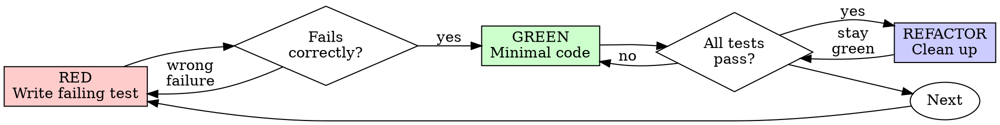

# Test-First Development

## Overview

Write the test first. Observe it fail. Write the minimum code to pass.

**Core principle:** If you did not watch the test fail, you have no evidence it validates the correct behavior.

**No exceptions. No workarounds. No shortcuts.**

## When to Use

**Required:**
- New features
- Bug fixes
- Refactoring
- Behavior modifications

**Exceptions (confirm with your human partner):**
- Disposable prototypes
- Generated code
- Configuration files

Tempted to think "skip test-first just this once"? Stop. That is rationalization.

## The Prime Directive

```
NO PRODUCTION CODE WITHOUT A FAILING TEST FIRST
```

Wrote code before the test? Delete it. Start over.

**Zero tolerance:**
- Do not keep it as "reference material"
- Do not "adjust" it while writing tests
- Do not glance at it
- Delete means delete

Build fresh from tests. Full stop.

## Red-Green-Refactor



### RED - Write the Failing Test

Write one minimal test that describes the expected behavior.

<Good>
```typescript
test('retries failed operations up to 3 times', async () => {
  let callCount = 0;
  const unstableOp = () => {
    callCount++;
    if (callCount < 3) throw new Error('transient failure');
    return 'done';
  };

  const outcome = await withRetry(unstableOp);

  expect(outcome).toBe('done');
  expect(callCount).toBe(3);
});
```
Descriptive name, tests actual behavior, single concern
</Good>

<Bad>
```typescript
test('retry works', async () => {
  const spy = jest.fn()
    .mockRejectedValueOnce(new Error())
    .mockRejectedValueOnce(new Error())
    .mockResolvedValueOnce('done');
  await withRetry(spy);
  expect(spy).toHaveBeenCalledTimes(3);
});
```
Vague name, validates mock interactions not real behavior
</Bad>

**Criteria:**
- One behavior per test
- Descriptive name
- Uses real code (mocks only when unavoidable)

### Verify RED - Watch It Fail

**MANDATORY. Never skip.**

```bash
npm test path/to/test.test.ts
```

Confirm:
- Test fails (not errors out)
- Failure message matches expectations
- Fails because the feature is missing (not due to typos)

**Test passes?** You are testing existing behavior. Rewrite the test.

**Test errors?** Fix the error, re-run until it fails correctly.

### GREEN - Minimal Code

Write the simplest possible code that makes the test pass.

<Good>
```typescript
async function withRetry<T>(fn: () => Promise<T>): Promise<T> {
  for (let attempt = 0; attempt < 3; attempt++) {
    try {
      return await fn();
    } catch (e) {
      if (attempt === 2) throw e;
    }
  }
  throw new Error('unreachable');
}
```
Just enough to pass
</Good>

<Bad>
```typescript
async function withRetry<T>(
  fn: () => Promise<T>,
  opts?: {
    maxAttempts?: number;
    backoffStrategy?: 'linear' | 'exponential';
    onAttempt?: (n: number) => void;
  }
): Promise<T> {
  // YAGNI
}
```
Over-engineered
</Bad>

Do not add features, refactor unrelated code, or "improve" beyond what the test requires.

### Verify GREEN - Watch It Pass

**MANDATORY.**

```bash
npm test path/to/test.test.ts
```

Confirm:
- Test passes
- Other tests still pass
- Output is clean (no errors, no warnings)

**Test fails?** Fix the code, not the test.

**Other tests fail?** Fix them now.

### REFACTOR - Clean Up

Only after green:
- Eliminate duplication
- Improve naming
- Extract helpers

Keep tests green. Do not add new behavior.

### Repeat

Next failing test for the next behavior.

## Quality Standards

| Quality | Good | Bad |
|---------|------|-----|
| **Focused** | One thing. "and" in the name? Split it. | `test('validates email and domain and whitespace')` |
| **Descriptive** | Name explains the behavior | `test('test1')` |
| **Intentional** | Demonstrates the desired API | Obscures what the code should do |

## Why Sequence Matters

**"I'll write tests afterward to confirm it works"**

Tests written after code pass immediately. Passing immediately proves nothing:
- May validate the wrong thing
- May verify implementation details instead of behavior
- May miss edge cases you overlooked
- You never watched it catch the failure

Test-first forces you to observe the failure, proving the test actually verifies something.

**"I already manually tested all the edge cases"**

Manual testing is ad hoc. You believe you covered everything but:
- No record of what you tested
- Cannot rerun when code changes
- Easy to skip cases under pressure
- "It worked when I tried it" is not comprehensive

Automated tests are systematic. They execute identically every time.

**"Deleting X hours of work is wasteful"**

Sunk cost fallacy. The time is already spent. Your choice now:
- Delete and rebuild with test-first (X more hours, high confidence)
- Keep it and bolt on tests (30 min, low confidence, probable defects)

The real waste is keeping code you cannot trust. Working code without legitimate tests is technical debt.

**"Test-first is dogmatic, being pragmatic means adapting"**

Test-first IS pragmatic:
- Catches defects before commit (faster than debugging later)
- Prevents regressions (tests catch breakage immediately)
- Documents behavior (tests demonstrate how code works)
- Enables refactoring (change freely, tests catch problems)

"Pragmatic" shortcuts = debugging in production = slower.

**"Tests after achieve the same goals - it's about the spirit not the ritual"**

No. Tests-after answer "What does this do?" Tests-first answer "What should this do?"

Tests-after are biased by your implementation. You verify what you built, not what is required. You check the edge cases you remember, not ones you discover.

Tests-first force edge case discovery before implementing. Tests-after verify you remembered everything (you did not).

30 minutes of tests after is not test-first. You get coverage, but lose proof that tests work.

## Cognitive Traps

| Rationalization | What Is Actually True |
|----------------|----------------------|
| "Too simple to test" | Simple code breaks. A test takes 30 seconds. |
| "I'll test afterward" | Tests passing immediately prove nothing. |
| "Tests after achieve the same thing" | Tests-after = "what does this do?" Tests-first = "what should this do?" |
| "I already tested manually" | Ad hoc is not systematic. No record, cannot rerun. |
| "Deleting X hours is wasteful" | Sunk cost fallacy. Keeping unverified code is technical debt. |
| "Keep as reference, write tests first" | You will adapt it. That is testing after. Delete means delete. |
| "Need to explore first" | Fine. Discard the exploration, then start with test-first. |
| "Hard to test = I should skip it" | Listen to the test. Hard to test = hard to use. Simplify the design. |
| "Test-first will slow me down" | Test-first is faster than debugging. Pragmatic = test-first. |
| "Manual testing is faster" | Manual testing does not prove edge cases. You retest every change. |
| "Existing code has no tests" | You are improving it. Add tests for what exists. |

## Guardrails - STOP and Start Over

- Code before test
- Test after implementation
- Test passes immediately
- Cannot explain why the test failed
- Tests added "later"
- Rationalizing "just this once"
- "I already tested it manually"
- "Tests after serve the same purpose"
- "It's about the spirit not the ritual"
- "Keep as reference" or "adapt existing code"
- "Already invested X hours, deleting is wasteful"
- "Test-first is dogmatic, I'm being pragmatic"
- "This is different because..."

**All of these mean: Delete the code. Start over with test-first.**

## Example: Bug Fix

**Bug:** Empty email accepted by form

**RED**
```typescript
test('rejects empty email', async () => {
  const result = await processForm({ email: '' });
  expect(result.error).toBe('Email required');
});
```

**Verify RED**
```bash
$ npm test
FAIL: expected 'Email required', got undefined
```

**GREEN**
```typescript
function processForm(data: FormData) {
  if (!data.email?.trim()) {
    return { error: 'Email required' };
  }
  // ...
}
```

**Verify GREEN**
```bash
$ npm test
PASS
```

**REFACTOR**
Extract a validation pipeline for multiple fields if needed.

## Completion Checklist

Before declaring work finished:

- [ ] Every new function/method has a test
- [ ] Watched each test fail before implementing
- [ ] Each test failed for the expected reason (feature missing, not typo)
- [ ] Wrote minimal code to pass each test
- [ ] All tests pass
- [ ] Output is clean (no errors, no warnings)
- [ ] Tests use real code (mocks only when unavoidable)
- [ ] Edge cases and error paths are covered

Cannot check every box? You skipped test-first. Start over.

## When Stuck

| Problem | Solution |
|---------|----------|
| Do not know how to write the test | Write the API you wish existed. Write the assertion first. Ask your human partner. |
| Test too complicated | Design too complicated. Simplify the interface. |
| Must mock everything | Code too coupled. Use dependency injection. |
| Test setup is enormous | Extract helpers. Still heavy? Simplify the design. |

## Debugging Integration

Bug found? Write a failing test that reproduces it. Follow the test-first cycle. The test both proves the fix and prevents regression.

Never fix bugs without a test.

## Testing Anti-Patterns

When adding mocks or test utilities, read @testing-anti-patterns.md to avoid common pitfalls:
- Validating mock behavior instead of real behavior
- Adding test-only methods to production classes
- Mocking without understanding dependency chains

## Final Rule

```
Production code -> test exists and failed first
Otherwise -> not test-first
```

No exceptions without your human partner's permission.
