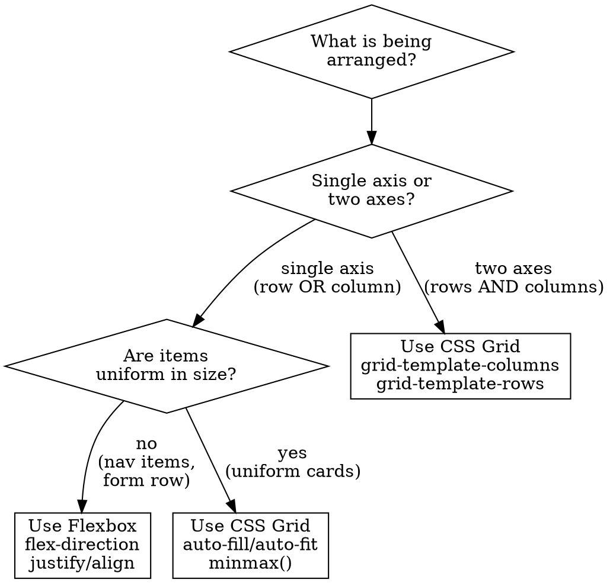
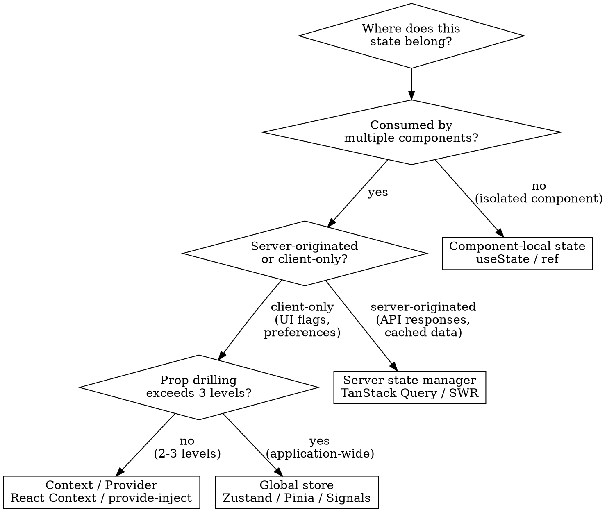

# UI Engineering

## Overview

Construct UI components with disciplined architecture, not improvised markup.

**Core principle:** Every component decision -- layout strategy, state ownership, accessibility posture, responsive behavior -- follows established patterns. The UX Patterns skill tells you WHAT to build. This skill tells you HOW to build it with structural integrity.

**PREREQUISITE:** Invoke ascension:ux-patterns first to identify applicable patterns and token values. This skill assumes tokens and patterns are already established.

## When to Use

**Mandatory when:**
- Constructing any frontend component
- Selecting between Grid and Flexbox
- Deciding where state should live
- Engineering responsive breakpoint behavior
- Building forms, data visualizations, navigation, or overlays
- Introducing motion or transitions

**Sequenced after:**
- Design tokens are established (ux-patterns)
- Target UI pattern is identified (ux-patterns)

## The Prime Directive

```
NO COMPONENT WITHOUT STRUCTURE, STATES, AND ACCESSIBILITY DEFINED FIRST
```

Before writing component code, establish: semantic structure (correct HTML elements), all visual states (empty, loading, error, populated, disabled), and accessibility requirements (ARIA attributes, keyboard interaction, contrast ratios).

## Component Architecture

### Composition Over Configuration

Assemble components from smaller, composable units rather than monolithic prop-heavy blocks.

<Good>
```
Dialog
  DialogHeader
    DialogTitle
    DialogDescription
  DialogBody
  DialogFooter
```
Each unit is independently useful and independently styleable.
</Good>

<Bad>
```
Dialog (title, description, body, footer, headerAlign, footerAlign,
       showCloseButton, variant, size, overlayOpacity, titleSize, ...)
```
Prop explosion, unmaintainable, impossible to extend.
</Bad>

### Pre-Implementation Checklist

Before writing any component:

1. **Semantics** -- Which HTML element is correct? (`button` not `div onClick`, `nav` not `div className="nav"`)
2. **Props** -- What is the minimal surface area? Can it be composed instead of configured?
3. **States** -- Default, hover, focus, active, disabled, loading, error, empty
4. **Variants** -- What visual variations are needed? (primary, secondary, ghost, destructive)
5. **Sizes** -- What size tiers exist? (sm, md, lg -- maximum 3-4)
6. **Responsive** -- How does it transform at each breakpoint?
7. **Accessibility** -- ARIA roles, keyboard navigation paths, screen reader announcements

## Layout Strategy Selection



### CSS Grid -- Appropriate When

- Page-level scaffolding (sidebar + main content + aside)
- Uniform card grids
- Dashboard arrangements (metric tiles, chart regions)
- Any layout requiring two-dimensional control
- Cross-row and cross-column alignment

**Example patterns:**
```css
/* Self-adjusting card grid */
.card-grid {
  display: grid;
  grid-template-columns: repeat(auto-fill, minmax(280px, 1fr));
  gap: var(--space-6);
}

/* Dashboard scaffold */
.dashboard {
  display: grid;
  grid-template-columns: 1fr 1fr 1fr;
  grid-template-rows: auto 1fr;
  gap: var(--space-6);
}
.dashboard .wide-chart { grid-column: span 2; }
```

### Flexbox -- Appropriate When

- Navigation items along a single row
- Form input + button inline grouping
- Centering content within a container
- Distributing variable-width items along one axis

**Example patterns:**
```css
/* Navigation row */
.nav-row {
  display: flex;
  align-items: center;
  gap: var(--space-4);
}

/* Inline form group */
.inline-group {
  display: flex;
  align-items: flex-end;
  gap: var(--space-3);
}
.inline-group .input-field { flex: 1; }
```

## State Ownership Strategy



**Governing principles:**
1. Begin with local state. Elevate only when evidence demands it.
2. Server data is NOT client state. Manage it with a dedicated server-state library.
3. Context is for dependency injection (themes, auth context), not for high-frequency updates.
4. Global stores are a last resort, not a starting point.

## Responsive Design Methodology

### Mobile-First Progression

Write mobile styles as the baseline, then layer complexity at wider breakpoints.

```css
/* Mobile baseline */
.wrapper {
  padding: var(--space-4);
}

/* Tablet tier */
@media (min-width: 768px) {
  .wrapper {
    padding: var(--space-6);
    max-width: 768px;
    margin: 0 auto;
  }
}

/* Desktop tier */
@media (min-width: 1024px) {
  .wrapper {
    padding: var(--space-8);
    max-width: 1280px;
  }
}
```

### Responsive Adaptation Reference

| Element | Mobile | Tablet | Desktop |
|---|---|---|---|
| **Navigation** | Hamburger or bottom sheet | Tab bar or collapsed sidebar | Expanded sidebar |
| **Card grid** | Single column | Two columns | Three to four columns |
| **Data table** | Stacked card view or horizontal scroll | Full table, fewer columns | Complete table |
| **Sidebar + Main** | Main only; sidebar in drawer | Icon-only sidebar | Fully expanded sidebar |
| **Form** | Single column, inputs stretch full width | Single column, max-width 560px | Two columns for paired fields |
| **Modal** | Full-screen sheet | Centered, 80% viewport width | Centered, max-width 480px |
| **Hero** | Stacked (image below headline) | Stacked, larger type | Side-by-side |

## Accessibility Standards

### Every Interactive Element

- [ ] Reachable via Tab key
- [ ] Focus ring visible (`:focus-visible`, 2px outline minimum)
- [ ] Activatable via Enter/Space (buttons) or Enter (links)
- [ ] Possesses an accessible name (visible text, `aria-label`, or `aria-labelledby`)
- [ ] Disabled state removes from tab order or applies `aria-disabled`
- [ ] Touch target meets 44x44px minimum on mobile

### Forms

- [ ] Every input has a visible `<label>` (placeholder alone is insufficient)
- [ ] Required fields indicated (asterisk plus `aria-required="true"`)
- [ ] Error messages connected to their input (`aria-describedby`)
- [ ] Error indication uses more than color alone (icon plus text)
- [ ] Submission outcomes announced to screen readers (`aria-live`)

### Images and Icons

- [ ] Meaningful images carry descriptive `alt` text
- [ ] Decorative images carry `alt=""` or `aria-hidden="true"`
- [ ] Icon-only buttons carry `aria-label`
- [ ] SVG icons use `role="img"` with `aria-label` or `aria-hidden="true"`

### Color and Contrast

- [ ] Normal text meets 4.5:1 contrast ratio (3:1 for large text: 18px+ bold or 24px+)
- [ ] Information is never conveyed by color alone (supplement with icons, patterns, text)
- [ ] Motion respects `prefers-reduced-motion`
- [ ] Color scheme respects `prefers-color-scheme` if dark mode is offered

## Animation and Motion

### When to Animate

- **State transitions:** Hover, focus, expand/collapse, reveal/hide
- **Feedback signals:** Success, error, loading progress
- **Spatial cues:** Communicating where content originated or departed

### When NOT to Animate

- Decoration with no functional purpose
- Durations exceeding 300ms for UI transitions
- Motion that blocks user interaction (forced wait)
- Continuous movement without user control

### Timing Reference

| Interaction | Duration | Easing |
|---|---|---|
| Hover response | 150ms | ease |
| Button press | 100ms | ease-out |
| Modal entrance | 200ms | ease-out |
| Modal exit | 150ms | ease-in |
| Drawer slide | 250ms | ease-out |
| Fade entrance | 200ms | ease |
| Page transition | 200-300ms | ease-in-out |

### Respect User Motion Preferences

```css
@media (prefers-reduced-motion: reduce) {
  *, *::before, *::after {
    animation-duration: 0.01ms !important;
    transition-duration: 0.01ms !important;
  }
}
```

## Form Architecture

### Validation Experience

1. **Do not validate on every keystroke.** Validate on blur (field exit) or on form submission.
2. **Display errors inline** beneath the offending field, not in a summary banner.
3. **Error text displaces helper text** -- never display both simultaneously.
4. **Error indication uses color plus icon** -- never color alone (accessibility).
5. **Retain valid-field indicators** (checkmark or green border) as the user progresses.
6. **Disable the submit button during submission** and show a loading indicator.

### Field Layout Guidelines

- Labels above inputs (never beside, never placeholder-only)
- Related fields grouped with `<fieldset>` and `<legend>`
- Required fields marked with asterisk AND `(required)` for screen readers
- Optional fields may display "(optional)" instead
- Maximum form width: 480-560px single-column
- Submit button left-aligned, not centered (exception: inside modals)

## Rendering Performance

### Critical Path Optimization

1. **Above-fold content loads first.** Defer below-fold assets and scripts.
2. **Prefer system fonts for body text** unless branding mandates a web font. Web fonts introduce layout shift.
3. **Image discipline:** Apply `width`/`height` attributes (prevents CLS), `loading="lazy"` for below-fold images, `srcset` for responsive delivery.
4. **Bundle awareness:** Every imported library is a cost. Measure bundle impact before adding dependencies.

### Lazy Loading Strategy

- Below-fold images: `loading="lazy"`
- Route modules: dynamic import / code splitting
- Heavy components (charts, rich editors): load on interaction or visibility
- Never lazy-load above-fold content

## Common Mistakes

| Mistake | Correction |
|---|---|
| `div` for everything | Use semantic HTML (`button`, `nav`, `main`, `section`, `article`) |
| Placeholder as sole label | Always provide visible `<label>` elements |
| Pixel literals everywhere | Use token variables from the design system |
| Fixed widths on containers | Use max-width + percentage or auto margins |
| Removing focus outlines | Style `:focus-visible` instead of eliminating outline |
| Click handlers on divs | Use `<button>` or `<a>` for interactive elements |
| Margins for layout spacing | Use `gap` with Grid or Flexbox |
| Importing entire icon libraries | Import individual icons; enable tree-shaking |
| Only implementing the happy path | Design all states before building the happy path |
| Testing only on desktop | Test mobile-first, verify desktop afterward |

## Integration

**Prerequisite:**
- **ascension:ux-patterns** -- Tokens and patterns must be established first

**Complementary skills:**
- **ascension:design-integration** -- When operating within an established design system
- **ascension:test-first** -- Component tests follow test-first methodology

**Supporting files:**
- `component-patterns.md` -- Reusable component blueprints with accessibility built in
