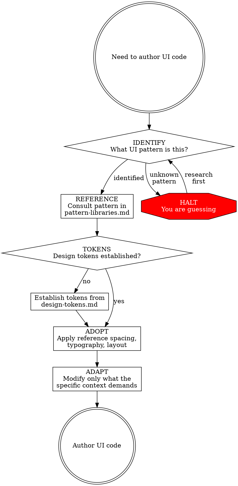
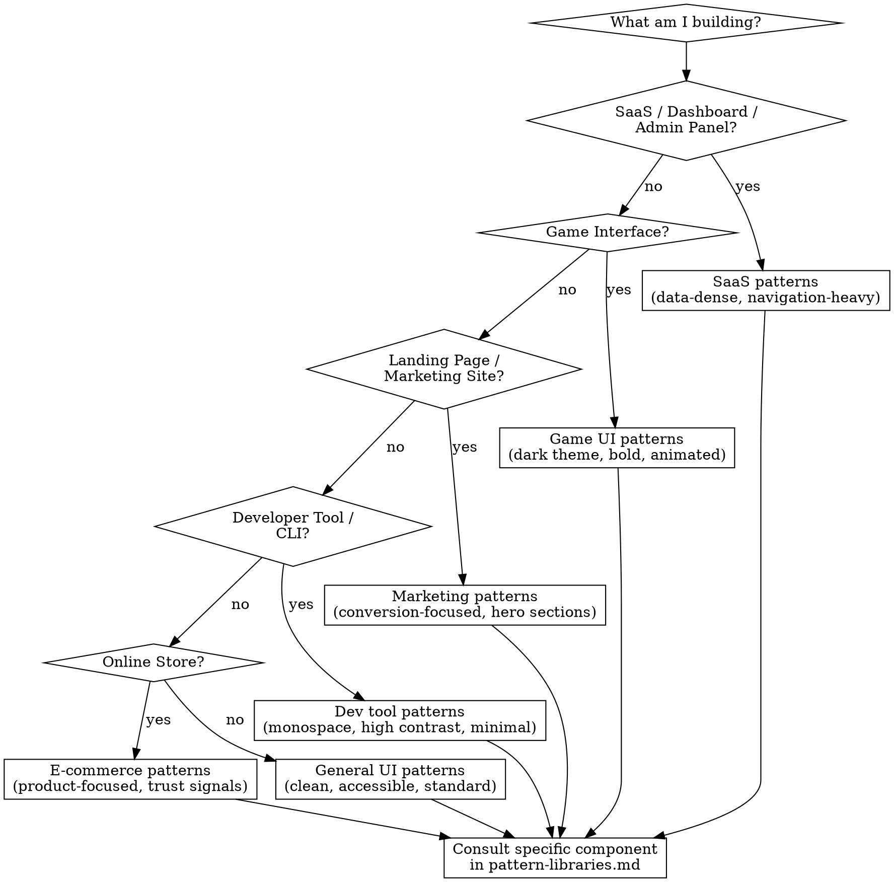

# UX Patterns

## Overview

Never generate UI from assumptions. Always consult documented patterns first.

**Core principle:** Every UI element must trace to a documented UX pattern or design system component. If you cannot cite your reference, you are guessing -- and guessing produces amateur results.

**No exceptions. No workarounds. No shortcuts.**

## The Prime Directive

```
NO UI CODE WITHOUT A UX REFERENCE FIRST
```

If you have not identified the applicable pattern, you are not authorized to write the component. Wrote UI code without a reference? Remove it. Begin again with a reference.

**No excuses:**
- Do not "quickly prototype" without tokens
- Do not "come back and polish the styling later"
- Do not use arbitrary pixel values "just to get it working"
- Do not bypass the entry protocol for "trivial" components
- "Quick and dirty" UI always ships. It always ships.

## When to Use

**Always:**
- Web applications (SaaS, dashboards, admin panels)
- Landing pages and marketing sites
- Game interfaces (menus, HUDs, inventories, shops)
- CLI interfaces (output formatting, interactive prompts)
- Mobile applications
- Component libraries
- Any visual output a human will perceive

**Including:**
- "It is just a prototype" (prototypes become products)
- "Nobody will see this" (someone always does)
- "I will polish it later" (you will not)

## The Entry Protocol



**BEFORE authoring ANY UI code, execute every phase:**

1. **IDENTIFY** -- What UI pattern is this? (navigation, form, data table, modal, card, etc.)
2. **REFERENCE** -- Consult the pattern in `pattern-libraries.md`
3. **TOKENS** -- Confirm design tokens are established for this project (see `design-tokens.md`)
4. **ADOPT** -- Apply the reference spacing, typography, layout, and interaction patterns
5. **ADAPT** -- Modify only what the specific context necessitates
6. **AUTHOR** -- Only then write the UI code

Skip any phase = guessing. Remove and restart.

## Design Token Requirements

Every UI project must define these tokens BEFORE any component code:

| Token Category | What to Define | Why It Matters |
|---|---|---|
| **Colors** | Primary, secondary, neutral scale (50-950), semantic (error, success, warning, info) | Eliminates "random color" syndrome |
| **Typography** | Font family (max 2), size scale (xs through 4xl), weight scale (normal, medium, semibold, bold), line heights | Typography is 95% of visual quality |
| **Spacing** | Base unit (4px or 8px), scale (xs: 4px through 3xl: 64px) | Systematic spacing produces a professional feel |
| **Border Radius** | Scale: none, sm, md, lg, full | Ensures consistent component shapes |
| **Shadows** | 3-4 elevation levels (sm, md, lg, xl) | Establishes clear depth hierarchy |
| **Breakpoints** | sm (640px), md (768px), lg (1024px), xl (1280px) minimum | Responsive behavior from the start |
| **Z-index** | Scale: dropdown(10), sticky(20), modal(30), popover(40), toast(50) | Prevents z-index conflicts |

Consult `design-tokens.md` for ready-to-use token templates by project classification.

## Pattern Lookup Methodology



Consult `pattern-libraries.md` for the complete reference organized by project classification and pattern category.

## Hallmarks of Amateur UI (Anti-Patterns)

These are the unmistakable signatures of AI-generated amateur UI. Every one represents a failure to consult references.

| Anti-Pattern | Why It Looks Amateur | What Professionals Do |
|---|---|---|
| **Erratic spacing** | No grid system, gaps feel random, padding varies between sibling elements | Consume spacing tokens. Every gap is a token value. |
| **Ad-hoc colors** | Colors selected per-component, no unified palette, too many distinct hues | Define the complete palette FIRST. Every color references a token. |
| **Disorganized typography** | Mismatched sizes, inconsistent line heights, too many weights, weak hierarchy | Maximum 2 font families. Adhere to the type scale. Heading hierarchy is deliberate. |
| **Flat visual hierarchy** | Everything identical in size and weight, nothing draws the eye, impossible to scan | Primary actions are visually dominant. Secondary elements are subdued. Vary size, weight, color, contrast. |
| **Inconsistent corners** | Mix of sharp and rounded corners, varying border widths on similar elements | Define a border-radius scale. Same component type = same radius. |
| **Placeholder content** | "Lorem ipsum", "User Name", "Description here", "Item 1" | Use realistic content that demonstrates actual data shapes and lengths. |
| **Missing interaction states** | Buttons ignore the cursor, links are ambiguous, no keyboard focus ring | Define interaction states (hover, focus, active, disabled) for ALL interactive elements. |
| **Center-everything layout** | Default AI behavior: center all text, content, and sections | Use left-aligned layouts with proper grid. Center only intentionally (hero headlines, CTAs). |
| **Uniform text walls** | Every paragraph, label, and description uses the same font-size and weight | Vary weight and size. Labels are smaller and lighter. Headings are larger and bolder. Descriptions use muted color. |
| **Missing non-happy states** | Only "populated" UI exists, no skeleton loaders, no error messages | Design all states: empty, loading (skeleton), error, partial, success. |
| **Oversized components** | Buttons too tall, inputs too wide, cards fill the entire viewport | Use standard sizing. Buttons: 36-44px height. Inputs: 36-40px. Cards: constrain max-width. |
| **No whitespace rhythm** | Content crammed together or floating in excessive space | Sections have consistent vertical rhythm. Related items are close. Unrelated items have clear separation. |
| **Gratuitous effects** | Random gradients, shadows on everything, unnecessary animations | Effects serve purpose. Shadows indicate elevation. Gradients are subtle. Animations are functional. |
| **Round-number spacing** | Using 10px, 20px, 30px instead of a system | Use 4px or 8px base unit. Spacing values: 4, 8, 12, 16, 24, 32, 48, 64. |

## Component Validation Checklist

Before authoring any component, verify ALL items:

- [ ] Design tokens established for this project (colors, typography, spacing, radii, shadows)
- [ ] Pattern identified from `pattern-libraries.md`
- [ ] Spacing consumes token scale (no arbitrary px values)
- [ ] Typography consumes type scale (no arbitrary font-size)
- [ ] Colors drawn from defined palette (no hex literals)
- [ ] Border radius drawn from defined scale
- [ ] Hover/focus/active/disabled states defined for all interactive elements
- [ ] Responsive behavior specified for at least mobile and desktop
- [ ] Realistic content used (no placeholder text)
- [ ] Accessibility verified: contrast ratios (4.5:1 body text, 3:1 large text), aria labels, keyboard navigation
- [ ] Empty state designed
- [ ] Loading state designed (skeleton preferred over spinner)
- [ ] Error state designed

Cannot satisfy all items? You are not ready to author the component.

## Cognitive Traps

| Rationalization | Truth |
|---|---|
| "It is just a prototype" | Prototypes become products. Professional prototypes use tokens too. |
| "I will fix the styling later" | You will not. "Later" never arrives. Every subsequent task takes priority. |
| "The user did not specify design requirements" | Absence of requirements is not permission to guess. Apply tokens by default. |
| "I need to get the logic working first" | Logic and presentation are not separate phases. Tokens take 5 minutes to establish. |
| "This component is too simple for all that" | Simple components are where inconsistency takes root. A button without tokens infects every page it touches. |
| "I will adopt a design system later" | Without tokens now, you will fight the design system later. Tokens make adoption trivial. |
| "Just one hardcoded color will not hurt" | One becomes ten. Then you have a palette of accidents. |
| "The AI can make it look acceptable" | "Acceptable" is the defining characteristic of amateur UI. Professional or amateur -- choose. |

## Guardrails -- HALT and Reference

If you catch yourself doing any of the following:
- Writing `color: #3b82f6` without it being a defined token value
- Using `padding: 10px` instead of a spacing token
- Choosing a font size not present in the type scale
- Building a component without consulting pattern-libraries.md
- Deferring hover/focus states "for now"
- Using "Lorem ipsum" or "Example text"
- Centering everything because "it looks fine"
- Adding a gradient or shadow "to make it pop"
- Writing CSS without design tokens established
- Building a form without consulting form patterns
- Creating a dashboard without consulting dashboard patterns

**Every item means: HALT. Remove. Return to the entry protocol.**

## Integration

**Invoked by:**
- **ascension:intent-discovery** -- When design involves UI, invoke this skill
- **ascension:task-planning** -- Plans involving UI work should reference this skill
- **ascension:delegated-execution** -- UI implementation subagents MUST use this

**Complementary skills:**
- **ascension:ui-engineering** -- This provides the reference system; that provides implementation patterns
- **ascension:design-integration** -- For adopting existing design systems

**Supporting files:**
- `pattern-libraries.md` -- Complete pattern reference by project classification and category
- `design-tokens.md` -- Ready-to-use token templates by project classification
